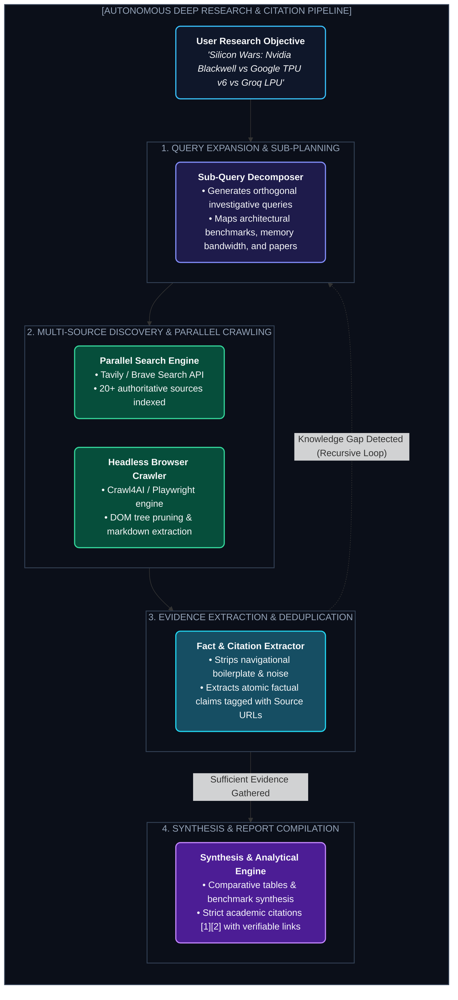

# Chapter 11: Blueprint 2 — Deep Research & Web Browsing Agent (ডিপ রিসার্চ এজেন্ট)

---

OpenAI Deep Research বা Perplexity Pro কীভাবে একটি মাত্র প্রম্পটে ৩০-৪০টি ওয়েব পেজ স্ক্র্যাপ করে, ডেটা ক্রস-ভেরিফাই করে এবং একটি ২০ পৃষ্ঠার নিখুঁত সাইটেশন-যুক্ত রিসার্চ রিপোর্ট তৈরি করে?

এই চ্যাপ্টারে আমরা একটি **Autonomous Deep Research & Web Browsing Agent**-এর আর্কিটেকচার উন্মোচন করব।

---

## ১. The Deep Research Pipeline Architecture



---

## ২. Query Expansion & Recursive Search

একটি ব্রড রিসার্চ টপিক পেলে এজেন্ট সরাসরি গুগলে একটিমাত্র কি-ওয়ার্ড সার্চ করে না। সে **Query Expansion** করে:

* মূল প্রশ্ন: *"Quantum Computing vs AI Accelerators"*
* সাব-কুয়েরি ১: *"Google Willow quantum chip benchmark 2025"*
* সাব-কুয়েরি ২: *"Nvidia Blackwell FP4 vs Quantum Annealing speedup"*
* সাব-কুয়েরি ৩: *"Error correction threshold logical qubits comparison"*

---

## ৩. Markdown-First Web Scraping (Crawl4AI & Trafilatura)

ওয়েব পেজের HTML-এ ৮০% থাকে অপ্রয়োজনীয় নেভবার, অ্যাড এবং জাভাস্ক্রিপ্ট। এজেন্টের জন্য পেজটিকে ক্লিন **LLM-Friendly Markdown**-এ কনভার্ট করতে হয়।

```python
from crawl4ai import AsyncWebCrawler

async def fetch_clean_page(url: str) -> str:
    async with AsyncWebCrawler(verbose=False) as crawler:
        result = await crawler.arun(url=url)
        # ক্লিন ফিট মার্কডাউন এক্সট্রাক্ট করা (No ads, no headers)
        return result.markdown
```

---

## ৪. Hallucination-Proof Citation Engine

প্রতিটি দাবির পেছনে নির্দিষ্ট সোর্স URL ট্যাগ করা হয়:

$$\text{Claim: "TPU v6 Trillium offers 4.7x performance improvement." } \longrightarrow \text{Source: [Google Cloud Blog, 2024]}$$

যদি কোনো তথ্যের পক্ষে ২টি স্বাধীন সোর্স না পাওয়া যায়, এজেন্ট রিপোর্টে লিখে দেয়: *"Unverified single-source claim"*.

---
Developer Perspective
রিসার্চ এজেন্টে কনটেক্সট ওভারফ্লো বন্ধ করার মূল টেকনিক হলো **Map-Reduce Summarization**। প্রতিটি স্ক্র্যাপ করা বড় পেজকে আগে একটি ছোট সামারাইজার এজেন্ট দিয়ে ২০০ শব্দের কি-পয়েন্টে কনভার্ট করো (Map Step)। তারপর সব সামারি একসাথে নিয়ে মূল সিন্থেসিস এজেন্টকে দাও (Reduce Step)।

---
Production Reality
প্রোডাকশনে ওয়েব স্ক্র্যাপিংয়ের সময় বট ব্লকিং ও ক্যাপচা বড় সমস্যা। প্রোডাকশন গ্রেড সিস্টেমে **Headless Browser Stealth Mode** এবং সার্চের জন্য ডেডিকেটেড **Tavily / Exa AI Search APIs** ব্যবহার করা হয় যা প্রি-ক্লিনড সার্চ রেজাল্ট সরাসরি JSON ফরম্যাটে সরবরাহ করে।

---
Common Mistake
ইউজারের রিকোয়েস্ট পাওয়ামাত্র র্যান্ডম ২৫টি পেজ একসাথে প্রম্পটে ঢুকিয়ে দেওয়া। এতে মডেল "Lost in the Middle" সিন্ড্রোমে ভুগে মূল পয়েন্ট মিস করবে। পেজগুলো থেকে শুধুমাত্র রেলেভেন্ট প্যারাগ্রাফগুলো ফিল্টার করে প্রম্পটে দিতে হবে।

---

## Interview Flashcards

#### Beginner Level
* **প্রশ্ন:** Deep Research Agent সাধারণ গুগলিং থেকে কীভাবে আলাদা?
* **উত্তর:** সাধারণ গুগল সার্চ শুধু লিংকের লিস্ট দেয়। Deep Research Agent প্রশ্নটিকে সাব-টাস্কে ভাগ করে, নিজে পেজগুলোতে ঢুকে তথ্য পড়ে, একাধিক সোর্স ক্রস-ভেরিফাই করে এবং সাইটেশনসহ স্ট্রাকচার্ড রিপোর্ট লিখে দেয়।

#### Intermediate Level
* **প্রশ্ন:** Query Expansion কেন রিসার্চ এজেন্টে অপরিহার্য?
* **উত্তর:** ব্রড প্রশ্নের সব তথ্য একটি সার্চে আসে না। Query Expansion মূল বিষয়টিকে একাধিক সুনির্দিষ্ট সাব-কুয়েরিতে রূপান্তর করে বিভিন্ন দিক থেকে গভীর তথ্য সংগ্রহ নিশ্চিত করে।

#### Advanced Level
* **প্রশ্ন:** এজেন্টে তথ্যের নির্ভুলতা প্রমাণের জন্য Citation মেকানিজম কীভাবে কাজ করে?
* **উত্তর:** প্রতিটি এক্সট্রাক্ট করা তথ্যের সাথে সোর্স ডকুমেন্টের URI ও প্যারাগ্রাফ হ্যাশ যুক্ত করা হয়। ফাইনাল রিপোর্টে প্রতিটি তথ্যের পাশে ফুটনোট হিসেবে লিংকটি ইনজেক্ট করা হয়।
