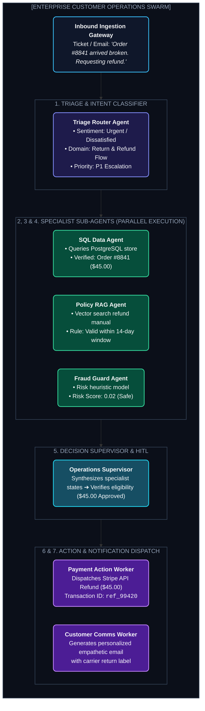

# Chapter 12: Blueprint 3 — Enterprise Multi-Agent Operations Swarm (এন্টারপ্রাইজ সোয়ার্ম)

---

একটি বড় ই-কমার্স কোম্পানিতে প্রতিদিন ৫০,০০০ কাস্টমার সাপোর্ট টিকিট, অর্ডার ক্যানসেলেশন ও রিফান্ড রিকোয়েস্ট আসে।

হাজার জন মানুষের একটি সাপোর্ট টিম রেখেও ২৪/৭ ইনস্ট্যান্ট নির্ভুল সার্ভিস দেওয়া প্রায় অসম্ভব।

এই চ্যাপ্টারে আমরা এমন একটি **Enterprise Multi-Agent Operations Swarm** ডিজাইন করব যা মানুষের সাহায্য ছাড়াই ৯২% কাস্টমার ইস্যু ৩০ সেকেন্ডের মধ্যে নিরাপদে সমাধান করতে পারে।

---

## ১. The Enterprise Swarm Architecture (সোয়ার্ম আর্কিটেকচার)

---

## ২. The 4 Specialized Roles in the Swarm

1. **Triage & Intent Classifier:** ইনপুট পড়ে সেন্টিমেন্ট, ইনটেন্ট এবং প্রায়োরিটি লেভেল নির্ধারণ করে।
2. **Data & Policy Lookup Workers:** সমান্তরালে (Parallel) ডাটাবেস থেকে ইউজারের হিস্ট্রি ও পলিসি গাইডলাইন চেক করে।
3. **Risk & Fraud Sentinel:** ব্যবহারকারীর অতীতে কোনো ফেক রিফান্ডের রেকর্ড আছে কি না তা যাচাই করে।
4. **Action & Communications Agent:** পেমেন্ট গেটওয়েতে রিফান্ড এক্সিকিউট করে এবং ক্লায়েন্টকে সহানুভূতিশীল মেসেজ পাঠায়।

---

## ৩. Human Escalation Fallback (এসকেলেশন গেট)

যদি:
* রিফান্ডের পরিমাণ $১০০-এর বেশি হয়, অথবা
* ফ্রড রিস্ক স্কোর ৫০% অতিক্রম করে,

সিস্টেমটি স্বয়ংক্রিয়ভাবে একটি **Human Escalation Ticket** তৈরি করে এবং সরাসরি সিনিয়র ম্যানেজারের অনুমোদনের জন্য পাঠিয়ে দেয়।

---
Developer Perspective
এন্টারপ্রাইজ সোয়ার্মে এজেন্টদের মধ্যে যোগাযোগ সবসময় **JSON Event-Driven Message Queue (যেমন Kafka, RabbitMQ বা Redis Streams)** দিয়ে করানো উচিত। এর ফলে যদি কোনো একটি সাব-এজেন্ট সাময়িক ডাউন থাকে, মেসেজ হারিয়ে যাবে না এবং সিস্টেম ব্যাকপ্রেশার সহ্য করতে পারবে।

---
Production Reality
প্রোডাকশনে প্রতিটি টুলের জন্য **Read-Only / Write Separation** বাধ্যতামূলক। `SQL Data Agent`-এর ডাটাবেস ইউজারকে কেবল `SELECT` পারমিশন দিতে হবে যাতে কোনো হ্যাকার প্রম্পট ইনজেকশন দিয়েও ডাটা ডিলিট করতে না পারে। আর `Payment Action Agent`-এ কঠোর পার-ট্রানজ্যাকশন লিমিট ($50 max per refund) বসাতে হবে।

---
Common Mistake
কাস্টমার সাপোর্টে হ্যালুসিনেট করা পলিসি বলা। পলিসি এজেন্টকে অবশ্যই স্ট্রিক্ট **RAG Grounding** দিয়ে কনফিগার করতে হবে: *"যদি পলিসি ডকুমেন্টে উত্তর স্পষ্টভাবে না থাকে, তবে কখনো অনুমান করবে না; সরাসরি হিউম্যান সাপোর্টে হ্যান্ডঅফ করবে।"*

---

## Interview Flashcards

#### Beginner Level
* **প্রশ্ন:** এন্টারপ্রাইজ কাস্টমার সাপোর্টে Multi-Agent Swarm কীভাবে সাহায্য করে?
* **উত্তর:** সোয়ার্মে ট্রায়াজ, ডাটাবেস লুকআপ, পলিসি ভেরিফিকেশন এবং পেমেন্ট অ্যাকশনের জন্য আলাদা বিশেষায়িত সাব-এজেন্ট থাকে। ফলে সিস্টেমটি নির্ভুলভাবে কাস্টমারের সমস্যা সেকেন্ডের মধ্যে সমাধান করতে পারে।

#### Intermediate Level
* **প্রশ্ন:** কেন SQL Agent-কে শুধুমাত্র Read-Only পারমিশন দেওয়া উচিত?
* **উত্তর:** সিকিউরিটির জন্য। যদি কোনো অ্যাটাকার ক্ষতিকর প্রম্পট ইনজেকশন দিয়ে এজেন্টকে টেবিল ডিলিট করার নির্দেশ দেয়, ডাটাবেস ইউজার পারমিশন `SELECT`-এ সীমাবদ্ধ থাকায় ডাটাবেস ১০০% সুরক্ষিত থাকবে।

#### Advanced Level
* **প্রশ্ন:** ফ্রড ডিটেকশন এবং হিউম্যান এসকেলেশন কীভাবে সোয়ার্মে ইন্টিগ্রেট করা হয়?
* **উত্তর:** ডিসিশন মেকিংয়ের আগে একটি ডেডিকেটেড ফ্রড গার্ড এজেন্ট ব্যবহারকারীর অতীতের রিস্ক স্কোর অ্যানালাইসিস করে। রিস্ক স্কোর বা ট্রানজ্যাকশন অ্যামাউন্ট নির্দিষ্ট থ্রেশহোল্ড অতিক্রম করলেই হিউম্যান ইন্টারাপশন ব্রেকপয়েন্ট ট্রিগার হয়।
