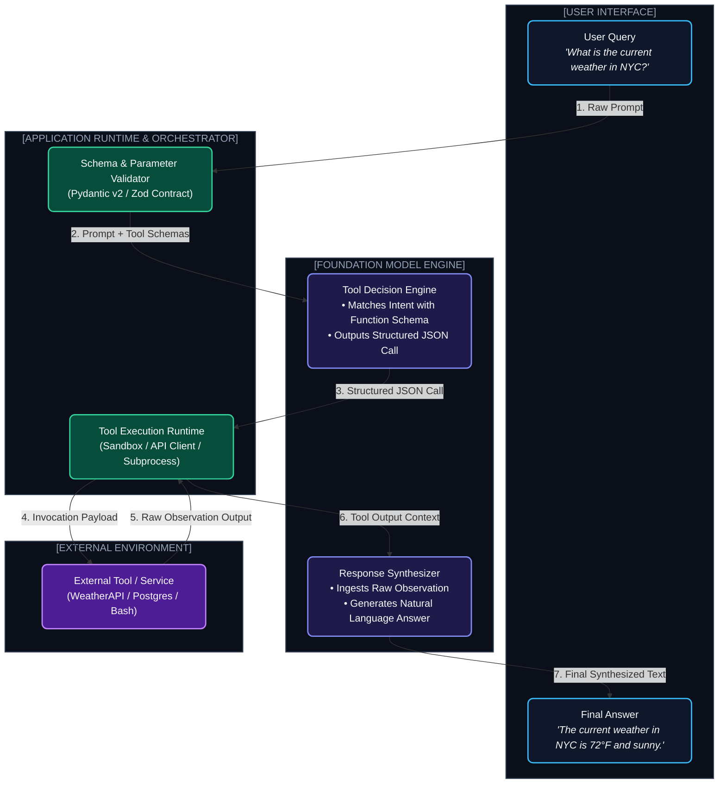

# Chapter 2: Function Calling & Tool Contracts (টুল কলিং ও কন্ট্রাক্ট ইঞ্জিনিয়ারিং)

---

একটি ল্যাঙ্গুয়েজ মডেল কেবল টোকেন জেনারেট করতে পারে— সে নিজে কোনো API রিকোয়েস্ট পাঠাতে পারে না বা ডাটাবেসে কুয়েরি চালাতে পারে না।

তাহলে কীভাবে একটি LLM সফটওয়্যার ইঞ্জিনের মতো রিয়েল ওয়ার্ল্ডে অ্যাকশন নেয়?

এর পেছনের গোপন রহস্য হলো **Structured Tool Calling & Contracts**।

মডেল কোনো সাধারণ টেক্সট না লিখে একটি নিখুঁত **JSON কন্ট্রাক্ট** আউটপুট দেয়, যা তোমার পাইথন/নোড.জেএস ব্যাকএন্ড ইন্টারপ্রেট করে ফাংশনটি রান করে এবং রেজাল্টটি আবার মডেলকে ফিড করে।

---

## ১. The Tool Calling Lifecycle (টুল কলিংয়ের পূর্ণাঙ্গ জীবনচক্র)



---

## ২. Defining Tool Contracts with Pydantic & JSON Schema

একটি টুল ডিফাইন করার সময় প্যারামিটারের নাম, টাইপ, ডেসক্রিপশন এবং ভ্যালিডেশন রুলস নিখুঁত হতে হয়। কারণ মডেল ডেসক্রিপশন পড়েই সিদ্ধান্ত নেয় টুলটি কখন কল করতে হবে।

### পাইথন Pydantic v2 দিয়ে প্রফেশনাল টুল কন্ট্রাক্ট:

```python
from pydantic import BaseModel, Field
from typing import Optional, Literal
import json

class DatabaseQueryArgs(BaseModel):
    table: Literal["users", "orders", "transactions"] = Field(
        description="The database table to query from."
    )
    user_id: Optional[str] = Field(
        default=None,
        description="Filter by specific user UUID. Format: user_XXXX"
    )
    limit: int = Field(
        default=10,
        ge=1,
        le=100,
        description="Maximum number of records to retrieve (1-100)."
    )

# OpenAI / DeepSeek কম্প্যাটিবল Tool Definition
db_tool_definition = {
    "type": "function",
    "function": {
        "name": "query_database",
        "description": "Safe, read-only query tool to retrieve customer records and order history.",
        "parameters": DatabaseQueryArgs.model_json_schema()
    }
}
```

---

## ৩. Robust Execution Sandboxing & Guardrails

এজেন্ট যখন কোড এক্সিকিউশন বা টার্মিনাল রান করে, তখন সরাসরি হোস্ট মেশিনের সাবপ্রসেস চালানো আত্মঘাতী।

### আইসোলেটেড এক্সিকিউশন প্যাটার্ন:

```python
import subprocess
import shlex

def safe_bash_executor(command_str: str, timeout_seconds: int = 5) -> str:
    # ১. ডেঞ্জারাস কমান্ড ব্লকলিস্ট ফিল্টার
    forbidden_tokens = ["rm -rf", "mkfs", ":(){ :|:& };:", "dd if=", "> /dev/sda", "chmod -R 777 /"]
    for token in forbidden_tokens:
        if token in command_str:
            return f"Security Violation: Command '{token}' is strictly forbidden by policy."
            
    # ২. লিমিটেড প্রিভিলেজ ও টাইমআউটে রান করা
    try:
        args = shlex.split(command_str)
        result = subprocess.run(
            args,
            capture_output=True,
            text=True,
            timeout=timeout_seconds,
            shell=False # Prevent shell injection
        )
        if result.returncode != 0:
            return f"STDERR: {result.stderr.strip()}"
        return result.stdout.strip() if result.stdout else "Success: No output returned."
        
    except subprocess.TimeoutExpired:
        return f"Execution Error: Command exceeded {timeout_seconds}s timeout limit."
    except Exception as e:
        return f"Execution Failure: {str(e)}"
```

---

## ৪. Tool Self-Healing & Error Recovery

মডেল ভুল আর্গুমেন্ট পাঠালে সরাসরি ক্র্যাশ না করে **Structured Error Feedback** এজেন্টের কনটেক্সটে ফিরিয়ে দেওয়া উচিত।

1. **Schema Validation Error:** Pydantic ভ্যালিডেশন ফেইল করলে এরর ডিটেইলস মডেলকে জানানো (যেমন: `"Validation Error: 'limit' must be <= 100, you provided 500"`).
2. **Auto-Retry with Guidance:** মডেল দ্বিতীয় ট্রায়ে নিজের আর্গুমেন্ট ঠিক করে কল করে।

---
Developer Perspective
টুলের `description` হলো মডেলের জন্য সিস্টেম প্রম্পটের চেয়েও পাওয়ারফুল। যদি মডেল ভুল সময়ে অপ্রয়োজনীয় টুল কল করে, তবে ডেসক্রিপশনে নেগেটিভ কনস্ট্রেইন্ট যোগ করো: *"Use this ONLY when the user explicitly asks for real-time live stock prices. DO NOT use for general company information."* এটি টুল মিস-ফায়ারিং ৯০% কমিয়ে দেয়।

---
Production Reality
প্রোডাকশনে একাধিক টুল একসাথে প্যারালালি কল করার প্রয়োজন হয় (Parallel Tool Calling)। যেমন: তিনটি কোম্পানির ডাটা একসাথে ফেচ করা। OpenAI ও Anthropic এখন একই সাথে `tool_calls: [call_1, call_2, call_3]` রিটার্ন করে। ব্যাকএন্ডে `asyncio.gather` দিয়ে তিনটি টুল একসাথে প্যারালালে এক্সেকিউট করলে লেটেন্সি ৩ গুণ কমে যায়।

---
Common Mistake
টুল আউটপুটে বিশাল JSON ডাটা বা সম্পূর্ণ ডাটাবেস ডাম্প সরাসরি মডেলের কাছে রিটার্ন করা। মডেল শুধু ফিল্ডের সামারি ও প্রয়োজনীয় আইটেম চায়। অতিরিক্ত মেটাডাটা ও নাল (Null) ফিল্ড স্ট্রিপ করে ক্লিন মিনিমাল পে-লোড রিটার্ন করো, নয়তো টোকেন লিমিট দ্রুত শেষ হয়ে যাবে।

---

## Interview Flashcards

#### Beginner Level
* **প্রশ্ন:** LLM-এর Function Calling কীভাবে কাজ করে?
* **উত্তর:** LLM নিজে কোনো কোড রান করে না। সে ইউজারের প্রম্পট ও টুলের স্কিমা দেখে সিদ্ধান্ত নেয় কোন ফাংশন কল করতে হবে এবং সঠিক আর্গুমেন্টসহ একটি JSON অবজেক্ট জেনারেট করে দেয়। অ্যাপ্লিকেশন ব্যাকএন্ড সেই ফাংশন রান করে রেজাল্ট আবার LLM-কে পাঠায়।

#### Intermediate Level
* **প্রশ্ন:** প্যারালাল টুল কলিং (Parallel Tool Calling) কী এবং কেন এটি দরকার?
* **উত্তর:** যখন কোনো কাজের জন্য একাধিক স্বাধীন টুলের তথ্য একসাথে লাগে (যেমন ৩টি আলাদা শহরের আবহাওয়া বা ৩টি স্টকের প্রাইস), তখন মডেল একসাথে একাধিক টুল কল ইস্যু করে। ব্যাকএন্ড অ্যাসিনক্রোনাসলি সবগুলো রান করে একসাথে রেজাল্ট দেয়, ফলে রেসপন্স টাইম নাটকীয়ভাবে কমে।

#### Advanced Level
* **প্রশ্ন:** একটি এজেন্টের টুল এক্সিকিউশন সিকিউর করার ৩টি বেস্ট প্র্যাকটিস কী কী?
* **উত্তর:** ১. কঠোর স্কিমা ভ্যালিডেশন (Pydantic/Zod), ২. আইসোলেটেড ডকার/ফায়ারক্র্যাকার মাইক্রোভিম স্যান্ডবক্সিং এবং ৩. কমান্ড স্যানিটাইজেশন ও ডেঞ্জারাস টাস্কে হিউম্যান কনফার্মেশন গেট।
