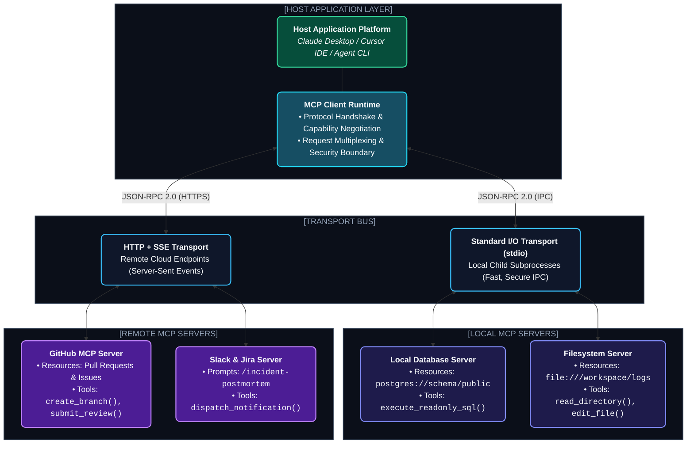

# Chapter 3: Model Context Protocol (MCP) Deep Dive (ইউনিভার্সাল এজেন্ট স্ট্যান্ডার্ড)

---

ভাবো তো, যদি প্রতিটি USB ডিভাইসের জন্য কম্পিউটারে আলাদা আলাদা পোর্ট বানাতে হতো— মাউসের জন্য একরকম পোর্ট, কিবোর্ডের জন্য আরেকরকম, পেনড্রাইভের জন্য আরেক রকম— তাহলে কেমন দুর্বিষহ হতো পৃথিবী?

AI এজেন্ট ইন্ডাস্ট্রিতে এতদিন ঠিক এই সমস্যাটাই ছিল!

প্রতিটি AI ফ্রেমওয়ার্ক (LangChain, CrewAI, AutoGen, Custom Apps) নিজস্ব কাস্টম স্টাইলে ডাটাবেস, ফাইল সিস্টেম আর API-এর সাথে কানেক্ট হতো। এর ফলে প্রতিবার নতুন কোডবেস বানাতে হতো।

২০২৪ সালের শেষভাগে Anthropic ওপেন-সোর্স করে **Model Context Protocol (MCP)** — যা হলো **"AI এজেন্টের জন্য ইউনিভার্সাল USB-C পোর্ট"**।

---

## ১. The 3-Tier MCP Architecture (MCP আর্কিটেকচার)



MCP আর্কিটেকচারে ৩টি মূল অংশ থাকে:
1. **Host:** মূল অ্যাপ্লিকেশন যা ব্যবহারকারী চালান (যেমন Claude Desktop, Cursor, Custom Agent CLI)।
2. **Client:** হোস্টের ভেতর থাকা কানেক্টর যা MCP সার্ভারের সাথে সেশন বজায় রাখে।
3. **Server:** একটি স্বাধীন প্রোগ্রাম (Python/TypeScript) যা নির্দিষ্ট ডেটা বা টুলের অ্যাক্সেস এক্সপোজ করে।

---

## ২. The Three Core MCP Primitives (৩টি মূল ক্ষমতা)

MCP সার্ভার মেইনলি ৩ ধরণের সার্ভিস অফার করে:

| Primitive | কী করে? | বাস্তব উদাহরণ |
| :--- | :--- | :--- |
| **Tools** | মডেলকে অ্যাকশন নেওয়ার ক্ষমতা দেয় (Executable Functions) | `run_sql_query`, `send_slack_message`, `create_github_pr` |
| **Resources** | মডেলকে প্যাসিভ রিড-অনলি ডেটা দেয় (Direct context ingestion) | `file:///var/logs/app.log`, `postgres://schema/public` |
| **Prompts** | ইউজারের জন্য প্রি-বিল্ট ওয়ার্কফ্লো প্রম্পট টেমপ্লেট দেয় | `/code-review`, `/generate-sql-migration` |

---

## ৩. Building a Production MCP Server with FastMCP

অফিসিয়াল Python `FastMCP` লাইব্রেরি দিয়ে কয়েক লাইনেই একটি পাওয়ারফুল MCP সার্ভার তৈরি করা সম্ভব।

### কোড উদাহরণ: Custom PostgreSQL & System Analytics MCP Server

```python
# server.py
from mcp.server.fastmcp import FastMCP
import psutil
import json

# Initialize FastMCP Server
mcp = FastMCP("System & Postgres Analytics Server")

# 1. MCP Tool: System Health Analyzer
@mcp.tool()
def get_system_metrics() -> str:
    """Returns real-time CPU, RAM and Disk usage of the host server."""
    cpu_percent = psutil.cpu_percent(interval=0.5)
    memory = psutil.virtual_memory()
    disk = psutil.disk_usage('/')
    
    return json.dumps({
        "cpu_usage_percent": cpu_percent,
        "memory_used_gb": round(memory.used / (1024**3), 2),
        "memory_total_gb": round(memory.total / (1024**3), 2),
        "memory_percent": memory.percent,
        "disk_free_gb": round(disk.free / (1024**3), 2)
    }, indent=2)

# 2. MCP Resource: Application Log Stream
@mcp.resource("app://logs/recent")
def get_recent_app_logs() -> str:
    """Provides direct read-only stream of the latest 50 lines of server logs."""
    try:
        with open("/tmp/app.log", "r") as f:
            lines = f.readlines()
            return "".join(lines[-50:])
    except FileNotFoundError:
        return "Log file not found."

# 3. MCP Prompt: Incident Diagnosis
@mcp.prompt()
def diagnose_server_incident() -> str:
    """Pre-configured prompt to guide the AI in diagnosing high memory/CPU alerts."""
    return "Analyze the system metrics via `get_system_metrics` and recent logs at `app://logs/recent`. Identify anomalies and suggest an immediate mitigation strategy."

if __name__ == "__main__":
    mcp.run(transport="stdio")
```

---

## ৪. Connecting MCP Server to Your Agent

তোমার এজেন্টের কনফিগারেশন ফাইলে (`mcp_config.json`):

```json
{
  "mcpServers": {
    "system-diagnostics": {
      "command": "python",
      "args": ["/absolute/path/to/server.py"],
      "env": {
        "ENVIRONMENT": "production"
      }
    }
  }
}
```

---
Developer Perspective
MCP-এর সবচেয়ে চমৎকার ব্যাপার হলো **Decoupling**। আগে যদি তুমি একটি Slack Tool বানাতে, সেটা শুধু একটি ফ্রেমওয়ার্কে চলত। এখন যদি একটি স্ট্যান্ডার্ড MCP Server বানাও, সেই একই সার্ভার Claude Desktop, Cursor IDE, LangGraph এবং তোমার নিজস্ব কাস্টম এজেন্টে কোনো কোড পরিবর্তন ছাড়াই সরাসরি কাজ করবে।

---
Production Reality
প্রোডাকশনে যখন রিমোট MCP সার্ভার চালানো হয় (Server-Sent Events / SSE), তখন **Authentication & RBAC (Role-Based Access Control)** অত্যন্ত জরুরি। প্রতিটি MCP রিকোয়েস্টে বেয়ারার টোকেন বা mTLS ভেরিফিকেশন থাকতে হবে যাতে অন্য কোনো অননুমোদিত ক্লায়েন্ট তোমার ইন্টারনাল সার্ভারে অ্যাকশন না নিতে পারে।

---
Common Mistake
STDIO ট্রান্সপোর্টে পাইথন সার্ভার চালানোর সময় কোডের ভেতর সাধারণ `print()` স্টেটমেন্ট রাখা। মনে রাখবে, STDIO মোডে Stdin/Stdout হলো প্রটোকল কমিউনিকেশন চ্যানেল। অসাবধানতাবশত কোনো `print("debug log")` দিলে JSON-RPC প্রটোকল ভেঙে যাবে এবং কানেকশন ড্রপ করবে। লগিংয়ের জন্য সবসময় `sys.stderr` বা স্ট্যান্ডার্ড `logging` মডিউল ব্যবহার করতে হবে।

---

## Interview Flashcards

#### Beginner Level
* **প্রশ্ন:** Model Context Protocol (MCP) কী এবং কেন এটি তৈরি করা হয়েছে?
* **উত্তর:** MCP হলো Anthropic-এর একটি ওপেন স্ট্যান্ডার্ড যা AI মডেল ও বাহ্যিক ডেটা/টুলের মধ্যে যোগাযোগের ইউনিভার্সাল ইন্টারফেস হিসেবে কাজ করে। এর মাধ্যমে একবার টুল বানালে যেকোনো MCP কম্প্যাটিবল অ্যাপ্লিকেশনে তা প্লাগ-অ্যান্ড-প্লে করা যায়।

#### Intermediate Level
* **প্রশ্ন:** MCP-এর ৩টি মূল উপাদান কী কী?
* **উত্তর:** ১. **Tools** (মডেল যেসব অ্যাকশন রান করতে পারে), ২. **Resources** (রিড-অনলি ডেটা ও ডকুমেন্টস যা কনটেক্সটে অ্যাটাচ করা যায়), এবং ৩. **Prompts** (ইউজারের জন্য প্রি-ডিফাইন্ড টাস্ক টেমপ্লেট)।

#### Advanced Level
* **প্রশ্ন:** STDIO এবং SSE ট্রান্সপোর্টের মধ্যে পার্থক্য কী?
* **উত্তর:** STDIO হলো লোকাল সাবপ্রসেস কমিউনিকেশন যা স্ট্যান্ডার্ড ইনপুট/আউটপুটের মাধ্যমে জিরো-নেটওয়ার্ক ওভারহেডে চলে। আর SSE (Server-Sent Events) হলো রিমোট HTTP ট্রান্সপোর্ট যা ক্লাউড বা ডিস্ট্রিবিউটেড সার্ভারে হোস্টেড MCP সার্ভারের সাথে নেটওয়ার্ক দিয়ে কানেক্ট হওয়ার জন্য ব্যবহৃত হয়।
