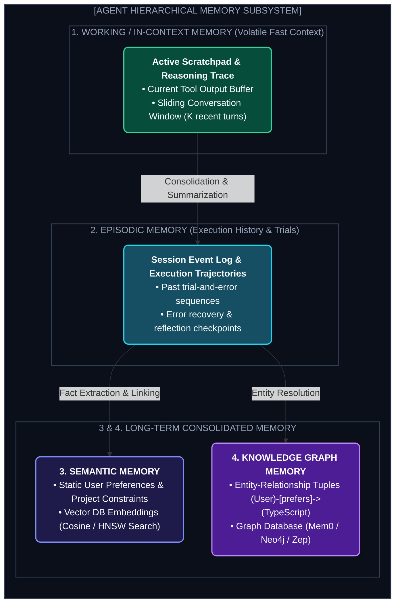
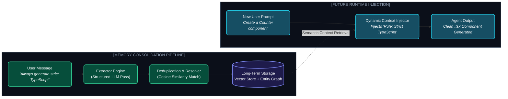

# Chapter 4: Multi-Layer Agent Memory (এজেন্টের মেমোরি সিস্টেম)

---

একটি সাধারণ LLM হলো সম্পূর্ণ **Stateless**। তুমি যদি তাকে বলো, *"আমার নাম আসিফ, আমি পাইথন পছন্দ করি"*, পরের দিন নতুন চ্যাটে এসে সে তোমাকে আর চিনবে না।

একটি সত্যিকার স্বয়ংক্রিয় এজেন্টের জন্য মেমোরি হলো তার সবচেয়ে বড় শক্তি। 

মেমোরি ছাড়া এজেন্ট:
* একই ভুল বারবার করবে।
* ইউজারের পার্সোনাল প্রেফারেন্স মনে রাখতে পারবে না।
* দীর্ঘদিনের প্রজেক্টে আগের সেশনের কনটেক্সট হারিয়ে ফেলবে।

মানুষের মস্তিষ্কের মতোই এজেন্টের মেমোরিকে ৪টি স্তরে বিন্যস্ত করা হয়।

---

## ১. The 4 Layers of Agent Memory (৪ স্তরের মেমোরি আর্কিটেকচার)



---

## ২. Memory Extraction, Consolidation & Retrieval Lifecycle

একটি প্রোডাকশন মেমোরি ইঞ্জিন কীভাবে কাজ করে?



### পাইথনে মেমোরি এক্সট্রাকশন লজিক:

```python
import json

MEMORY_EXTRACTION_PROMPT = """
You are a Memory Management Sub-Agent. Analyze the following conversation and extract permanent user preferences, project facts, or operational constraints.
Ignore temporary small talk.

Output JSON format:
{
  "new_facts": ["fact 1", "fact 2"],
  "updated_facts": [{"old": "...", "new": "..."}],
  "entities": [{"name": "...", "type": "...", "relation": "..."}]
}
"""

def extract_and_save_memory(chat_history: str, memory_db):
    response = llm.generate(f"{MEMORY_EXTRACTION_PROMPT}\nConversation:\n{chat_history}")
    memory_data = json.loads(response)
    
    for fact in memory_data.get("new_facts", []):
        # Embed and store in Vector DB
        embedding = get_embedding(fact)
        memory_db.insert(content=fact, vector=embedding, timestamp=time.time())
```

---

## ৩. Memory Architectures: Vector vs. Knowledge Graphs

| মেমোরি টাইপ | স্টোরেজ প্রযুক্তি | কীসে সবচেয়ে ভালো? | সীমাবদ্ধতা |
| :--- | :--- | :--- | :--- |
| **Vector Memory** | Pinecone, Qdrant, Chroma | আনস্ট্রাকচার্ড টেক্সট ও সিমিলারিটি সার্চ | জটিল সম্পর্ক (Relationship) বুঝতে পারে না |
| **Graph Memory** | Neo4j, Mem0 Graph, Zep | এনটিটি রিলেশনশিপ (Entity A $\to$ relation $\to$ Entity B) | সেটআপ ও আপডেট করা তুলনামূলক জটিল |
| **Hybrid Memory** | Vector + Graph Fusion | ফ্যাক্ট ও রিলেশন একসাথে রিট্রিভ করা | কস্ট ও লেটেন্সি কিছুটা বেশি |

---
Developer Perspective
সব মেমোরি একবারে প্রম্পটে ইনজেক্ট করা যাবে না। যদি ব্যবহারকারীর ১,০০০টি অতীতের মেমোরি আইটেম থাকে, তাহলে বর্তমান প্রম্পটের সাথে সবচেয়ে রিলেভেন্ট শীর্ষ ৩-৫টি মেমোরি ফেচ করে ইনজেক্ট করতে হবে (Semantic Retrieval)। নয়তো অপ্রয়োজনীয় তথ্যে কনটেক্সট নয়েজি হয়ে যাবে যাকে বলে **Context Poisoning**।

---
Production Reality
প্রোডাকশন এজেন্টে মেমোরি ম্যানেজমেন্টের একটি জটিল অংশ হলো **Memory Invalidation / Decay**। ধরা যাক, ৬ মাস আগে ইউজার বলেছিলেন *"I use Python 3.9"*, কিন্তু আজ বলছেন *"We upgraded to Python 3.12"*. মেমোরি সিস্টেমে পুরানো কনফ্লিক্টিং মেমোরি খুঁজে ডিলিট বা ওভাররাইট করার লজিক (Memory Deduplication & Conflict Resolution) থাকতে হবে।

---
Common Mistake
ইউজারের সেনসিটিভ ডেটা (যেমন API Key, Password, Credit Card) মেমোরি ডাটাবেসে সেভ করা। মেমোরি এক্সট্রাকশন পাইপলাইনে সবসময় একটি **PII Scrubber (Personally Identifiable Information Redactor)** ফিল্টার থাকতে হবে যাতে কোনো সিক্রেট পার্মানেন্ট মেমোরিতে স্টোর না হয়।

---

## Interview Flashcards

#### Beginner Level
* **প্রশ্ন:** এজেন্টে Short-Term এবং Long-Term মেমোরির তফাত কী?
* **উত্তর:** Short-Term মেমোরি হলো বর্তমান চ্যাটের কনটেক্সট উইন্ডো বা স্ক্র্যাচপ্যাড (সেশন শেষ হলে মুছে যায়)। আর Long-Term মেমোরি হলো এক্সটার্নাল ডাটাবেসে (ভেক্টর বা গ্রাফ) সংরক্ষিত অতীত অভিজ্ঞতা, ফ্যাক্ট ও প্রেফারেন্স যা পরবর্তী সব সেশনেও পাওয়া যায়।

#### Intermediate Level
* **প্রশ্ন:** Episodic Memory কীভাবে এজেন্টের পারফর্মেন্স বাড়ায়?
* **উত্তর:** এপিসোডিক মেমোরিতে পূর্ববর্তী টাস্কের ট্রায়াল-অ্যান্ড-এরর লগ সংরক্ষিত থাকে। ফলে পরবর্তীতে একই ধরনের টাস্ক পেলে এজেন্ট আগে যা ফেইল করেছিল তা এড়িয়ে চলে এবং সফল সমাধান দ্রুত প্রয়োগ করে।

#### Advanced Level
* **প্রশ্ন:** Graph-backed Memory কীভাবে সাধারণ Vector Memory-র চেয়ে উন্নত?
* **উত্তর:** ভেক্টর মেমোরি কেবল সিমিলার টেক্সট খুঁজে পায় কিন্তু একাধিক এনটিটির সম্পর্ক বোঝে না। Graph Memory (Knowledge Graph) "আসিফ $\to$ কাজ করে $\to$ BrainTech $\to$ ব্যবহার করে $\to$ AWS us-east-1" এই ধরণের মাল্টি-হপ রিলেশনশিপ নিখুঁতভাবে সংরক্ষণ ও রিট্রিভ করতে পারে।
