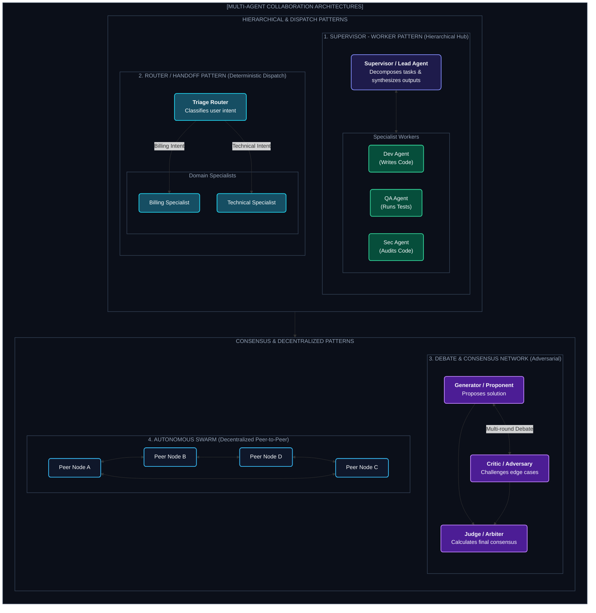

# Chapter 6: Multi-Agent Collaboration Patterns (মাল্টি-এজেন্ট সিস্টেম ও সোয়ার্ম)

---

একটিমাত্র এজেন্টের মাথায় যদি ডাটাবেস ডিজাইন, ফ্রন্টএন্ড কোডিং, সাইবার সিকিউরিটি অডিট এবং মার্কেটিং কনটেন্ট রাইটিং— সব দায়িত্ব একসাথে দেওয়া হয়, তবে সে কী করবে?

সে সব কিছুতে একটু একটু ভালো করবে, কিন্তু কোনোটাই নিখুঁত হবে না। তার প্রম্পট বিশাল হবে, কনটেক্সট উইন্ডো জ্যাম হয়ে যাবে এবং হ্যালুসিনেশন বেড়ে যাবে।

ঠিক যেমন একটি সফটওয়্যার কোম্পানিতে আলাদা আলাদা স্পেশালাইজড টিম থাকে (Backend Dev, QA Engineer, DevOps, Security Auditor), আধুনিক AI সিস্টেমেও **Multi-Agent Swarm** তৈরি করা হয়।

---

## ১. The 4 Multi-Agent Topologies (৪টি প্রধান মাল্টি-এজেন্ট প্যাটার্ন)



---

## ২. Deep Dive into Topologies

### ১. Supervisor-Worker (হায়ারার্কিক্যাল প্যাটার্ন)
* **ম্যানেজার এজেন্ট:** ইউজার রিকোয়েস্ট বুঝে কাজ ভাগ করে দেয় এবং কর্মীদের কাজ রিভিউ করে।
* **ওয়ার্কার এজেন্ট:** স্পেশালাইজড টুল ব্যবহার করে কাজ শেষ করে সুপারভাইজারকে রিপোর্ট করে।
* **ব্যবহার:** সফটওয়্যার ডেভেলপমেন্ট পাইপলাইন (Coder $\to$ Reviewer $\to$ Tester).

### ২. Debate & Consensus Network
* দুটি এজেন্ট বিপরীত দৃষ্টিকোণ থেকে যুক্তি দেয় (যেমন: একজন কোড লেখে, আরেকজন হ্যাকার সেজে সিকিউরিটি হোল খুঁজে বের করে)।
* ৩-৪ রাউন্ড বিতর্কের পর যে সমাধানটিতে উভয়ই একমত হয়, সেটাই চূড়ান্ত উত্তর হিসেবে গ্রহণ করা হয়।
* এটি হ্যালুসিনেশন ও লজিক্যাল এরর ৯৫% কমিয়ে দেয়।

---

## ৩. Implementation: Minimal Multi-Agent System in Python

```python
class ResearchAgent:
    def execute(self, topic: str) -> str:
        return f"Research facts on {topic}: Market size is $50B, growing at 25% CAGR."

class WriterAgent:
    def execute(self, research_data: str) -> str:
        return f"Executive Summary Article:\n{research_data}\nConclusion: High ROI opportunity."

class SupervisorAgent:
    def __init__(self):
        self.researcher = ResearchAgent()
        self.writer = WriterAgent()

    def run_pipeline(self, user_goal: str) -> str:
        print(" Supervisor: Delegating research...")
        raw_data = self.researcher.execute(user_goal)
        
        print(" Supervisor: Delegating writing...")
        final_doc = self.writer.execute(raw_data)
        
        return final_doc
```

---
Developer Perspective
মাল্টি-এজেন্ট আর্কিটেকচারে সবচেয়ে বড় ভুল হলো সব এজেন্টকে একই গ্লোবাল কনটেক্সট হিস্ট্রি শেয়ার করানো। প্রতিটি এজেন্টের কনটেক্সট উইন্ডো **আইসোলেটেড** রাখতে হবে। রিসার্চ এজেন্ট যে হাজার লাইনের ওয়েব পেজ স্ক্র্যাপ করেছে, রাইটার এজেন্টের সেটা দেখার দরকার নেই; রাইটার এজেন্ট শুধু রিসার্চারের ৫ লাইনের সামারিটুকু কনটেক্সটে পাবে।

---
Production Reality
মাল্টি-এজেন্ট সিস্টেমে ইন্টার-এজেন্ট চ্যাটিংয়ের কারণে টোকেন খরচ খুব দ্রুত বাড়ে। যদি এজেন্ট এ এবং এজেন্ট বি নিজেদের মধ্যে অসীম কথা বলা শুরু করে (Chatter Loop), বিল কয়েক মিনিটে হাজার ডলারে পৌঁছে যেতে পারে। প্রোডাকশনে প্রতিটি সাব-টাস্কের জন্য কঠোর **Token Quota** এবং **Max Agent-to-Agent Message Limit (Max 3-5 Handoffs)** বসাতে হবে।

---
Common Mistake
ছোট এবং সাধারণ কাজের জন্য জোর করে ৫টি মাল্টি-এজেন্ট সোয়ার্ম বানানো (Over-engineering)। যদি একটিমাত্র প্রম্পট বা একক ReAct এজেন্টেই কাজটি ১০০% নির্ভুলভাবে করা সম্ভব হয়, তবে অযথা মাল্টি-এজেন্ট বানালে লেটেন্সি ও সিস্টেম কমপ্লেক্সিটি অপ্রয়োজনীয়ভাবে বেড়ে যায়।

---

## Interview Flashcards

#### Beginner Level
* **প্রশ্ন:** Single Agent-এর চেয়ে Multi-Agent আর্কিটেকচার কেন বেশি কার্যকর?
* **উত্তর:** একক এজেন্টের কনটেক্সট জটিল টাস্কে ভারাক্রান্ত হয়ে যায়। মাল্টি-এজেন্ট সিস্টেমে কাজগুলোকে বিশেষায়িত সাব-এজেন্টে ভাগ করে দেওয়া হয়, ফলে প্রতিটি এজেন্টের প্রম্পট ছোট, ফোকাসড এবং কার্যকারিতা অনেক বেশি নিখুঁত হয়।

#### Intermediate Level
* **প্রশ্ন:** Debate Pattern কীভাবে কোড বা রিসার্চের মান উন্নত করে?
* **উত্তর:** ডিবেট প্যাটার্নে একটি জেনারেটর এজেন্ট কোড বা ড্রাফট তৈরি করে এবং একটি ক্রিটিক এজেন্ট তাতে ভুল বা নিরাপত্তা ত্রুটি খুঁজে বিতর্ক করে। কয়েক দফা রিফ্লেকশন ও বিতর্কের পর চূড়ান্ত ফলাফল বের হওয়ায় ভুল নাটকীয়ভাবে কমে যায়।

#### Advanced Level
* **প্রশ্ন:** মাল্টি-এজেন্ট সিস্টেমে স্টেট কনফ্লিক্ট বা রেস কন্ডিশন কীভাবে প্রতিরোধ করা হয়?
* **উত্তর:** ১. মেসেজ কিউ বা সেন্ট্রাল স্টেট লক ব্যবহার করে, ২. স্টেট আপডেটের জন্য অ্যাপেন্ড-অনলি রিডিউসার ফাংশন প্রয়োগ করে এবং ৩. সুপারভাইজার এজেন্টের মাধ্যমে একক অর্কেস্ট্রেশন বজায় রেখে।
