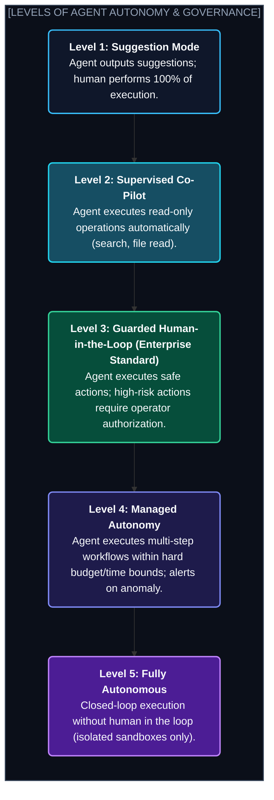
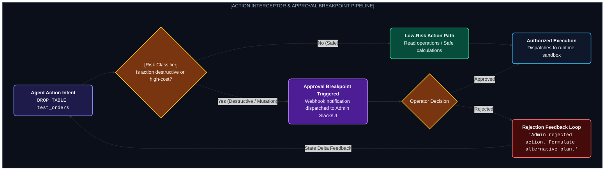

# Chapter 8: Human-in-the-Loop (HITL) & Safety Guardrails (এজেন্ট সেফটি ও গার্ডরেইল)

---

একটি AI এজেন্টকে যখন রিয়েল-ওয়ার্ল্ড অ্যাকশন নেওয়ার ক্ষমতা দেওয়া হয়, তখন সবচেয়ে ভীতিজনক দৃশ্য কোনটি?

এজেন্ট হ্যালুসিনেট করে প্রোডাকশন ডাটাবেসের `users` টেবিল ড্রপ করে দিল, অথবা ভুলবশত কোনো ক্লায়েন্টকে $৫০,০০০ রিফান্ড পাঠিয়ে দিল!

সম্পূর্ণ আনসুপারভাইজড স্বয়ংক্রিয়তা যেমন ক্ষমতাবান, তেমনি ঝুঁকিপূর্ণ। 

এজন্য প্রোডাকশন সিস্টেমে **Human-in-the-Loop (HITL)** এবং **Action Interceptors** হলো এজেন্টের সবচেয়ে বিশ্বস্ত এয়ারব্যাগ।

---

## ১. The 5 Levels of Agent Autonomy (এজেন্ট স্বায়ত্তশাসনের স্তর)



---

## ২. Implementing Approval Breakpoints & Interceptors



### পাইথনে সেফটি ইন্টারসেপ্টর কোড:

```python
class ActionSafetyGuardrail:
    def __init__(self, human_approver_callback):
        self.dangerous_tools = ["delete_file", "drop_table", "process_refund", "send_external_email"]
        self.approver = human_approver_callback

    def validate_and_execute(self, tool_name: str, tool_args: dict, tool_func) -> str:
        if tool_name in self.dangerous_tools:
            print(f" HIGH-RISK ACTION DETECTED: {tool_name}({tool_args})")
            
            # হিউম্যান অ্যাপ্রুভাল চাওয়া
            approved = self.approver(tool_name, tool_args)
            if not approved:
                return "Action Aborted: Human supervisor rejected this operation."
                
        # অ্যাকশন নিরাপদ হলে এক্সেকিউট করা
        return tool_func(**tool_args)
```

---

## ৩. Runaway Protection & Circuit Breakers (কস্ট ও লুপ গার্ড)

1. **Step Budget:** কোনো অবস্থাতেই একটি সেশনে এজেন্ট ১৫টির বেশি টুল কল করতে পারবে না।
2. **Token & Cost Cap:** প্রতিটি এজেন্টের জন্য সর্বোচ্চ কস্ট সিলিং (যেমন: `$0.50 per task`). কস্ট পার হলে স্বয়ংক্রিয়ভাবে প্রসেস টার্মিনেট হবে।
3. **Loop Detection Algorithm:** যদি এজেন্ট পরপর ৩ বার একই টুল একই প্যারামিটার দিয়ে রান করে, ইন্টারসেপ্টর অ্যাকশন আটকে রিপ্ল্যানিং ট্রিগার করবে।

---
Developer Perspective
হিউম্যান ইন্টারাপশন বাস্তবায়নের সেরা উপায় হলো অ্যাসিনক্রোনাস ওয়েবহুক। এজেন্ট স্টেট গ্রাফে স্টেট চেকপয়েন্ট সেভ করে এক্সিকিউশন পজ করবে এবং একটি `approval_token` সহ ইউজারের স্ল্যাক বা ড্যাশবোর্ডে পুশ পাঠাবে। ইউজার যখন অ্যাপ্রুভ বাটনে ক্লিক করবে, ব্যাকএন্ড সেই টোকেন ভ্যালিডেট করে এজেন্টকে ঠিক সেই স্টেট থেকে রিজিউম করাবে।

---
Production Reality
প্রোডাকশনে প্রতিটি এজেন্ট অ্যাকশনের একটি অপরিবর্তনীয় **Audit Trail (Immutable Log)** থাকতে হবে। কে কখন কোন প্রম্পটে কোন টুল কল করেছিল এবং কোন আইপি থেকে হিউম্যান অ্যাপ্রুভাল দেওয়া হয়েছিল— তা সিকিউরিটি কমপ্লায়েন্সের জন্য ডাটাবেসে সেভ থাকা বাধ্যতামূলক।

---
Common Mistake
কেবল ক্লায়েন্ট-সাইড (UI) গার্ডরেইল রাখা। যদি এজেন্ট কোনো ব্যাকএন্ড ক্রন-জব বা মেসেজ কিউ থেকে সরাসরি সার্ভারে রান করে, তবে ক্লায়েন্ট UI থাকে না। তাই সব সেফটি ইন্টারসেপ্টর এবং বাজেট সার্কিট ব্রেকার সার্ভার-সাইড কোর রানটাইমে ইমপ্লিমেন্ট করতে হবে।

---

## Interview Flashcards

#### Beginner Level
* **প্রশ্ন:** Human-in-the-Loop (HITL) কেন এজেন্টের জন্য গুরুত্বপূর্ণ?
* **উত্তর:** এজেন্ট সম্পূর্ণ স্বায়ত্তশাসিত হলেও হ্যালুসিনেশন বা ভুল লজিকের কারণে ক্ষতিকর পদক্ষেপ নিতে পারে (যেমন ডাটা ডিলিট বা ভুল লেনদেন)। HITL ঝুঁকিপূর্ণ স্টেপে মানুষের অনুমোদন নিশ্চিত করে সিস্টেমকে নিরাপদ রাখে।

#### Intermediate Level
* **প্রশ্ন:** Circuit Breaker এজেন্টে কীভাবে কাজ করে?
* **উত্তর:** সার্কিট ব্রেকার হলো একটি অটোমেটিক সেফটি সুইচ যা টোকেন বাজেট অতিক্রম করলে, অতিরিক্ত লেটেন্সি দেখা দিলে বা ইনফিনিট লুপ ডিটেক্ট হলে তাৎক্ষণিকভাবে এজেন্টের রান বন্ধ করে দেয়।

#### Advanced Level
* **প্রশ্ন:** এজেন্টে L3 এবং L4 অটোনমির মধ্যে মূল পার্থক্য কী?
* **উত্তর:** L3 অটোনমিতে এজেন্ট নিজে থেকে শুধু সেফ অ্যাকশন নেয় এবং যেকোনো ক্রিটিক্যাল অ্যাকশনে হিউম্যান অ্যাপ্রুভালের জন্য অপেক্ষা করে। আর L4 অটোনমিতে এজেন্ট পূর্বনির্ধারিত বাজেটের ভেতর সম্পূর্ণ নিজে কাজ শেষ করে এবং কেবল এনোমালি বা অস্বাভাবিক ঘটনা ঘটলেই মানুষকে নোটিফাই করে।
