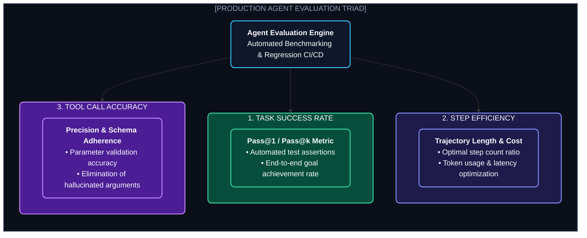

# Chapter 9: Agent Observability & Evals (এজেন্ট ট্র্যাকিং ও মূল্যায়ন)

---

একটি সাধারণ ওয়েব অ্যাপ্লিকেশনে যদি এরর আসে, আমরা সেন্ট্রি বা ডেটাডগে স্ট্যাকট্রেস দেখে সাথে সাথে বুঝতে পারি ৫ নম্বর লাইনে `NullPointerException` এসেছে।

কিন্তু একটি AI এজেন্ট যখন ফেইল করে— সে হয়তো ৩ নম্বর স্টেপে একটি অপ্রয়োজনীয় সার্চ করেছে, ৪ নম্বর স্টেপে ভুল ডাটা ফিল্টার করেছে এবং ৬ নম্বর স্টেপে গিয়ে ভুল কনক্লুশনে পৌঁছেছে।

এখানে কোনো সাধারণ কোড ক্র্যাশ নেই; আছে **কগনিটিভ লজিক্যাল ফেইলিউর (Cognitive Failure)**।

এজন্য এজেন্টের জন্য প্রয়োজন বিশেষায়িত **Distributed Agent Tracing & Evaluation Frameworks**।

---

## ১. The Anatomy of an Agent Trace (ট্রেসের স্তরবিন্যাস)

```mermaid
flowchart TD
    subgraph ROOT["[ROOT TRACE: Task Execution — 'Fix DB Connection Pool Exhaustion']"]
        ROOT_META["<b>Total Duration:</b> 3.42s &bull; <b>Total Cost:</b> $0.024 &bull; <b>Status:</b> Success"]

        subgraph SPAN1["Span 1: LLM Inference (Planning & Root Cause Analysis)"]
            S1_META["<b>Model:</b> Claude 3.7 Sonnet &bull; <b>Tokens:</b> 450 &bull; <b>Latency:</b> 1.1s<br/><b>Output:</b> Tool Call <code>read_log_file(path='/var/log/db.err')</code>"]
        end

        subgraph SPAN2["Span 2: Tool Runtime Execution (Filesystem)"]
            S2_META["<b>Tool:</b> <code>read_log_file</code> &bull; <b>Latency:</b> 0.2s &bull; <b>Exit Code:</b> 0<br/><b>Observation:</b> <code>'ERROR: Connection pool exhausted at max 20'</code>"]
        end

        subgraph SPAN3["Span 3: LLM Inference (Patch Formulation)"]
            S3_META["<b>Model:</b> Claude 3.7 Sonnet &bull; <b>Tokens:</b> 820 &bull; <b>Latency:</b> 1.5s<br/><b>Output:</b> Tool Call <code>edit_config(pool_size=50)</code>"]
        end

        subgraph SPAN4["Span 4: Tool Runtime Execution (Config Patch)"]
            S4_META["<b>Tool:</b> <code>edit_config</code> &bull; <b>Latency:</b> 0.1s &bull; <b>Exit Code:</b> 0<br/><b>Observation:</b> <code>'Config updated successfully. Connection pool set to 50.'</code>"]
        end

        ROOT_META --> SPAN1 --> SPAN2 --> SPAN3 --> SPAN4
    end

    classDef rootStyle fill:#0f172a,stroke:#38bdf8,stroke-width:2px,color:#f8fafc,rx:8px,ry:8px;
    classDef llmStyle fill:#1e1b4b,stroke:#818cf8,stroke-width:2px,color:#f8fafc,rx:8px,ry:8px;
    classDef toolStyle fill:#064e3b,stroke:#34d399,stroke-width:2px,color:#f8fafc,rx:8px,ry:8px;
    classDef subStyle fill:#0b0f19,stroke:#334155,stroke-width:1.5px,color:#94a3b8;

    class ROOT_META rootStyle;
    class S1_META,S3_META llmStyle;
    class S2_META,S4_META toolStyle;
    class ROOT,SPAN1,SPAN2,SPAN3,SPAN4 subStyle;
```



---

## ২. The 3 Golden Metrics of Agent Evals (এজেন্ট মূল্যায়নের ৩ স্তম্ভ)



1. **Task Success Rate (Pass@1 / Pass@k):** প্রদত্ত ১০০টি টেস্ট টাস্কের মধ্যে কয়টি টাস্ক স্বয়ংক্রিয়ভাবে পাস করেছে।
2. **Step Efficiency (Trajectory Length):** কাজটি কি ৩ স্টেপে শেষ করা গেছে নাকি এজেন্ট অপ্রয়োজনীয়ভাবে ১২ স্টেপ ঘোরাঘুরি করেছে।
3. **Tool Calling Precision:** সঠিক প্যারামিটারে সঠিক সময়ে টুল কল হয়েছে কি না।

---

## ৩. Open-Source Tracing with OpenInference & Phoenix

### কোড উদাহরণ: এজেন্টে অটো-ইনস্ট্রুমেন্টেশন যোগ করা

```python
from phoenix.otel import register
from openinference.instrumentation.openai import OpenAIInstrumentor
from openinference.instrumentation.langchain import LangChainInstrumentor

# ১. লোকাল ফিনিক্স ট্রেসার ইনিশিয়ালাইজ করা (UI on http://localhost:6006)
tracer_provider = register(
    project_name="autonomous-agent-production",
    endpoint="http://localhost:6006/v1/traces"
)

# ২. ওপেনএআই ও ল্যাংগ্রাফ অটো-ইন্সট্রুমেন্ট করা
OpenAIInstrumentor().instrument(tracer_provider=tracer_provider)
LangChainInstrumentor().instrument(tracer_provider=tracer_provider)

# এখন এজেন্ট যা কিছু রান করবে, প্রতি স্টেপের ইনপুট, আউটপুট, টোকেন ও কস্ট স্বয়ংক্রিয়ভাবে ফিনিক্সে ভিজ্যুয়ালাইজ হবে!
```

---
Developer Perspective
এজেন্ট মূল্যায়নের জন্য সবচেয়ে শক্তিশালী টেকনিক হলো **LLM-as-a-Judge with Ground Truth Trajectory**। শুধু ফাইনাল আউটপুট চেক না করে, এজেন্টের পুরো `Action Sequence` ভেরিফাই করো। যেমন: ডাটাবেস ফিক্স করার আগে সে ব্যাকআপ নিয়েছিল কি না— এই ইন্টারমিডিয়েট স্টেপগুলো ইভ্যালুয়েট করা প্রোডাকশন কোয়ালিটি নিশ্চিত করে।

---
Production Reality
প্রোডাকশনে ১ কোটি রিকোয়েস্ট আসলে সবগুলোর পূর্ণ ট্রেস সেভ করলে ক্লাউড স্টোরেজ বিল বিশাল হতে পারে। এজন্য প্রোডাকশন সিস্টেমে **Trace Sampling (যেমন ১০% র্যান্ডম ট্র্যাকিং)** এবং **Error-First Sampling (এরর বা ফেইল হওয়া টাস্কগুলো ১০০% ক্যাপচার করা)** পলিসি ব্যবহার করা হয়।

---
Common Mistake
ইভ্যালুয়েশন ডেটাসেট তৈরি না করে অন্ধের মতো এজেন্টের প্রম্পট পরিবর্তন করা। প্রম্পটে সামান্য ১ লাইন চেঞ্জ করলে কোনো একটি ক্ষেত্রে পারফর্মেন্স বাড়লেও অন্য ১০টি ক্ষেত্রে এজেন্টের আচরণ নষ্ট হতে পারে (Regression)। সবসময় একটি ফিক্সড ৫০-১০০ টাস্কের গোল্ডেন বেঞ্চমার্ক সেটে অটোমেটেড টেস্ট চালিয়ে তারপর নতুন প্রম্পট ডিপ্লয় করতে হবে।

---

## Interview Flashcards

#### Beginner Level
* **প্রশ্ন:** Agent Tracing সাধারণ লগিংয়ের চেয়ে কীভাবে আলাদা?
* **উত্তর:** সাধারণ লগিং কেবল প্লেইন টেক্সট দেখায়। Agent Tracing একটি হায়ারার্কিক্যাল স্প্যান ট্রির মাধ্যমে মডেলের থট, কোন প্রম্পট গিয়েছিল, কোন টুল কল হয়েছিল, কত টোকেন ও কত মিলি-সেকেন্ড খরচ হয়েছিল— পুরো এক্সিকিউশন ট্র্যাজেক্টরি ভিজ্যুয়ালাইজ করে।

#### Intermediate Level
* **প্রশ্ন:** Step Efficiency বলতে কী বোঝায়?
* **উত্তর:** একটি টাস্ক সফলভাবে সম্পন্ন করতে এজেন্টের সর্বনিম্ন প্রয়োজনীয় পদক্ষেপের সংখ্যা। কম স্টেপে নির্ভুল কাজ শেষ করা মানে কম লেটেন্সি ও কম টোকেন কস্ট।

#### Advanced Level
* **প্রশ্ন:** এজেন্টে Trajectory-level Evaluation কীভাবে করা হয়?
* **উত্তর:** শুধু ফাইনাল রেজাল্ট না দেখে এজেন্টের সম্পূর্ণ ডিসিশন পাথ (Step 1 $\to$ Step 2 $\to$ Step 3) নিরীক্ষা করা হয়। এতে কোনো অপ্রয়োজনীয় লুপ বা বিপজ্জনক স্টেপ নেওয়া হয়েছিল কি না তা নির্ধারণ করা যায়।
