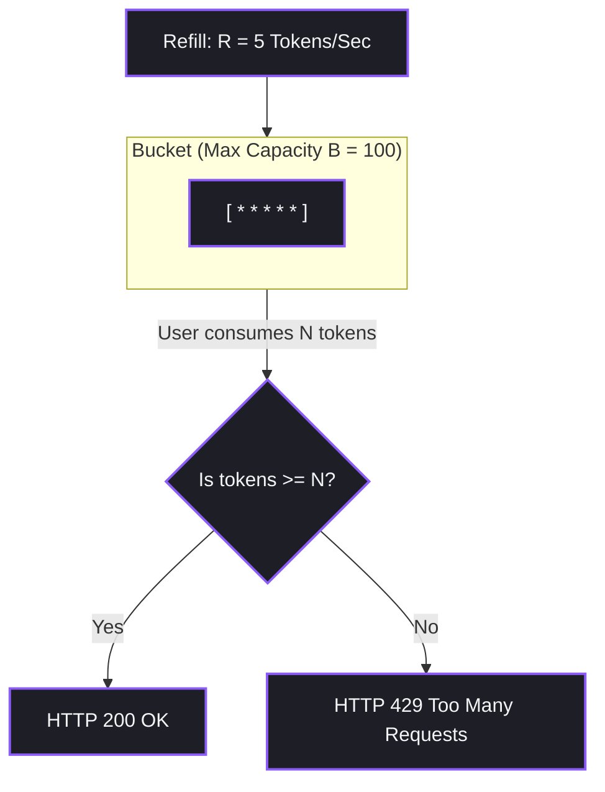

# Chapter 29: Blueprint 4 — Production AI SaaS with Rate Limiting & Usage Billing

---

তুমি কি কখনো ভেবেছ — তোমার বানানো দারুণ একটা AI Product যদি হুট করে ভাইরাল হয়ে যায়, তাহলে কী হবে?

যদি সেখানে কোনো Rate Limiting বা সাবস্ক্রিপশন চার্জ না থাকে, তবে একটা বড় বিপদ হতে পারে।

কোনো দুষ্টু হ্যাকার হয়তো বট দিয়ে প্রতি সেকেন্ডে লাখ লাখ Token-এর কুয়েরি পাঠাবে।

আর মাত্র এক দিনেই তোমার হাজার হাজার ডলারের API বিল তুলে তোমাকে একবারে দেউলিয়া বানিয়ে দেবে!

AI-এর দুনিয়ায় এটা কিন্তু আসলেই একটা বড় দুঃস্বপ্ন।

তো চলো, এই চ্যাপ্টারে আমরা এই সমস্যার সমাধান খুঁজি।

আমরা এমন একটা সিস্টেম ডিজাইন করব, যা তোমার AI কোডকে বাঁচাবে আর এটাকে একটা সত্যিকারের বিজনেসে রূপ দেবে।

আমরা দেখব কীভাবে Redis ব্যবহার করে Token Bucket Rate Limiting করা যায়।

আর কীভাবে Stripe Metered Billing দিয়ে ইউজারের ব্যবহার অনুযায়ী বিলিং সেট করা যায়।

চলো, খুব সহজে পুরো ব্যাপারটা ধাপে ধাপে বুঝে নিই। Deal?


## ১. কুয়েরি বোমার আসল সমস্যা

সাধারণ সফটওয়্যারে আমরা কীভাবে Rate Limit হিসেব করি?

খুব সহজ, হয়তো মিনিটে ৬০টি Request-এর লিমিট দিয়ে দিলাম।

কিন্তু AI-এর দুনিয়ায় কি এটা কাজ করবে?

একেবারেই না!

ধরো, একজন ইউজার মিনিটে মাত্র ১টি মেসেজ পাঠাল। কিন্তু সেই মেসেজে সে এক লাখ Token-এর বিশাল কোড ফাইল দিয়ে দিল। এতে তোমার খরচ হতে পারে $০.৫০$।

আবার আরেকজন ইউজার একই মিনিটে ৬০টি ছোট ছোট মেসেজ পাঠাল। কিন্তু তার সব মেসেজ মিলিয়ে Token খরচ হলো মাত্র ২০০টি, যার দাম হয়তো মাত্র $০.০০০১$।

তাহলে দেখছ তো? শুধু রিকোয়েস্টের সংখ্যা দিয়ে AI-তে লিমিট করা সম্ভব না।

তাহলে উপায় কী?

এই জন্য AI প্রোডাকশনে আমরা দুই ধরনের রেট লিমিট ব্যবহার করি।

প্রথমটি হলো RPM বা Requests Per Minute। এটা কী কাজ করে? এটি মূলত স্প্যামিং ঠেকায়।

আর দ্বিতীয়টি হলো TPM বা Tokens Per Minute। এটার কাজ কী? এটি মেমরি আর অতিরিক্ত API Cost-এর বোমা ব্লক করে।

আমরা এই সমস্যার সমাধান করব দুইটা লেয়ার বা ধাপে।

প্রথম ধাপ হলো Redis Token Bucket। এটা কীভাবে কাজ করে?

আমরা Redis ব্যবহার করে একটি ডাইনামিক বাকেট বানাব। প্রতিবার ইউজার রিকোয়েস্ট পাঠালে বাকেট থেকে Token কমতে থাকবে।

আবার প্রতি সেকেন্ডে সেখানে অটোমেটিক নতুন Token রিফিল হবে। বাকেট খালি হয়ে গেলেই ইউজার `HTTP 429 Too Many Requests` এরর পাবে।

দ্বিতীয় ধাপ হলো Stripe Usage Billing। এটা কী?

ইউজারকে আগে থেকে রিচার্জ করতে হবে না। সে পুরো মাসে যতটুকু ব্যবহার করবে, মাস শেষে ঠিক ততটুকুর বিল দেবে।

যেমন প্রতি ১০০০ Token ব্যবহারের জন্য $০.০০৫$।


## ২. মূল আইডিয়াগুলো কী কী?

প্রথমেই জানা যাক Token Bucket Algorithm সম্পর্কে।

প্রশ্ন হলো, এটা কীভাবে কাজ করে?

ধরো, আমাদের একটা বাকেট বা বালতি আছে। এর একটা সর্বোচ্চ ধারণক্ষমতা আছে, যাকে আমরা $B$ বলতে পারি।

প্রতি সেকেন্ডে এই বাকেটে $R$ হারে নতুন Token রিফিল হতে থাকে।

ইউজার যখনই কোনো API কল করে, বাকেট থেকে $N$ সংখ্যক Token তুলে নেওয়া হয়।

যদি বাকেটে পর্যাপ্ত Token না থাকে বা রিকোয়েস্টের সাইজ বাকেটের চেয়ে বড় হয়, তবে সেই কল ব্লক হয়ে যায়।

সহজ না?

এবার আসি Stripe Metered Billing-এর কথায়。

গ্রাহকের ব্যবহার অনুযায়ী বিল নেওয়ার সুবিধা দেয় এই সিস্টেম।

এখানে ইউজারকে স্বাধীনভাবে ব্যবহার করতে দেওয়া হয়। আর মাস শেষে সে যতটুকু ব্যবহার করেছে, তার ক্রেডিট কার্ড থেকে ঠিক ততটুকু চার্জ কাটা হয়।

প্রশ্ন হলো, Stripe কীভাবে জানবে ইউজার কতটুকু ব্যবহার করেছে?

এর জন্য প্রতিবার AI Response শেষ হলে ব্যাকগ্রাউন্ডে আমরা একটা Stripe Usage Event পাঠাই।

যেমন: `stripe.SubscriptionItem.create_usage_record(subscription_item_id, quantity=1500, timestamp=now)`।


## ৩. ছবিতে বাকেটের রিফিল সিস্টেম

Token বাকেটের Math-এর রিফিল Mechanism ভিজুয়ালি দেখো:



যদি কোনো ইউজার ১ সেকেন্ডে একসাথে ২০০ Token নিতে চায়, তবে কী হবে?

বাকেটের সর্বোচ্চ সাইজ তো ১০০। তাই আমাদের গেট সাথে সাথে বন্ধ হয়ে যাবে এবং সেই রিকোয়েস্ট ব্লক করে দেবে।


## ৪. Midjourney কীভাবে কাজ করে?

তুমি কি কখনো Midjourney বা Runway ব্যবহার করেছ?

সেখানে সাবস্ক্রিপশন নেওয়ার পর কী হয়?

ধরো, তুমি শুরুতেই ২৫টি ফাস্ট ক্রেডিট পেলে।

তুমি যখন নতুন ছবি তৈরি করতে থাকবে, তখন তোমার ফাস্ট ক্রেডিট কমতে থাকবে।

ক্রেডিট শূন্য হয়ে গেলে AI তোমাকে স্লো লাইনে পাঠিয়ে দেবে।

মজার ব্যাপার হলো, এই পুরো ক্রেডিট কমানো এবং ফাস্ট ও স্লো ট্র্যাফিক কন্ট্রোল করার কাজটি কিন্তু ব্যাকগ্রাউন্ডে Redis দিয়ে করা হয়।

Redis-এর মেমরি key-value কমানোর সিস্টেম ব্যবহার করে খুব সহজেই এই পুরো প্রসেস হ্যান্ডেল করা যায়।


## ৫. চলো কোড লিখে ফেলি!
Developer Perspective

চলো, পাইথনে একটি রানিং, প্রোডাকশন-গ্রেড AI SaaS ব্যাকঅ্যান্ড লজিক ডিজাইন করি।

এটি একই সাথে Redis দিয়ে TPM এবং RPM চেক করবে।

আবার একই সাথে Token ব্যবহার সরাসরি Stripe API-তে পুশ করে দেবে।

```python
import os
import time
import redis
import stripe
from openai import OpenAI

# ১. এনভায়রনমেন্ট ও ক্লায়েন্ট সেটআপ
os.environ["OPENAI_API_KEY"] = "your-openai-api-key"
stripe.api_key = "your-stripe-secret-key"
client = OpenAI()

# Redis Setup (Windows/Local running Redis)
r = redis.Redis(host='localhost', port=6379, db=0, decode_responses=True)

# ২. Redis Token Bucket Rate Limiter (RPM & TPM Checker)
def check_rate_limit(user_id, token_cost, max_tokens=10000, refill_rate=50):
    key_tokens = f"rate_limit:{user_id}:tokens"
    key_last_update = f"rate_limit:{user_id}:last_update"
    
    now = time.time()
    
    # বাকেটের ওল্ড Data রিড করো
    last_update = r.get(key_last_update)
    current_tokens = r.get(key_tokens)
    
    if last_update is None or current_tokens is None:
        # ফার্স্ট টাইম ইউজার: ফুল বাকেট এলোকেট করো
        r.set(key_tokens, max_tokens)
        r.set(key_last_update, now)
        current_tokens = max_tokens
    else:
        last_update = float(last_update)
        current_tokens = float(current_tokens)
        
        # রিফিল Calculation: সময় ব্যবধান * রিফিল রেট
        elapsed = now - last_update
        refilled = elapsed * refill_rate
        current_tokens = min(max_tokens, current_tokens + refilled)
        
        r.set(key_tokens, current_tokens)
        r.set(key_last_update, now)
        
    # রেট লিমিট Validation
    if current_tokens >= token_cost:
        # Token কেটে নিয়ে অ্যাক্সেস গ্র্যান্ট করো
        r.set(key_tokens, current_tokens - token_cost)
        return True, current_tokens - token_cost
    else:
        return False, current_tokens

# ৩. স্ট্রাইপ মিটারড বিলিং রিপোর্টার
def report_usage_to_stripe(stripe_sub_item_id, tokens_used):
    print(f"[💳 Stripe API] Reporting {tokens_used} tokens used for subscription item {stripe_sub_item_id}...")
    try:
        # মিটারড ইভেন্ট রেকর্ড সাবমিট
        stripe.SubscriptionItem.create_usage_record(
            stripe_sub_item_id,
            quantity=tokens_used,
            timestamp=int(time.time()),
            action="increment"
        )
        print("[ Stripe API] Usage reported successfully!")
    except Exception as e:
        print("[ Stripe Error] Failed to report usage:", e)

# ৪. প্রোডাকশন SaaS API রিকোয়েস্ট হ্যান্ডলার Loop
def process_saas_ai_request(user_id, stripe_sub_item_id, user_prompt):
    # কাল্পনিক এস্টিমেটেড Token কস্ট (যেমন Prompt সাইজ)
    estimated_cost = len(user_prompt.split()) * 3 # ৩ Token পার শব্দ গড়ে
    
    # Step A: Rate Limit Check
    allowed, remaining = check_rate_limit(user_id, token_cost=estimated_cost)
    
    if not allowed:
        print(f"\n[🛑 HTTP 429 Too Many Requests] User {user_id} is rate limited! Remaining tokens in bucket: {remaining:.2f}")
        return "Error: Rate Limit Exceeded. Please slow down."
        
    print(f"\n[🟢 Request Allowed] Processing AI query for {user_id}. Tokens Remaining: {remaining:.2f}")
    
    # Step B: Run AI Generation
    response = client.chat.completions.create(
        model="gpt-4o-mini",
        messages=[{"role": "user", "content": user_prompt}]
    )
    
    reply = response.choices[0].message.content
    
    # Step C: Real Token Count Calculation
    prompt_tokens = response.usage.prompt_tokens
    completion_tokens = response.usage.completion_tokens
    total_tokens = response.usage.total_tokens
    print(f"[ Token Log] Prompt: {prompt_tokens}, Completion: {completion_tokens}, Total: {total_tokens}")
    
    # Step D: Report to Stripe Billing
    report_usage_to_stripe(stripe_sub_item_id, total_tokens)
    
    return reply

# --- ৫. MOCK VALIDATION RUN ---
user_id = "cus_rahim_99"
stripe_sub_item = "si_12345_mock" # Mock Stripe Subscription Item ID

# ১ম রিকোয়েস্ট: সাকসেসফুলি রান হবে
reply1 = process_saas_ai_request(user_id, stripe_sub_item, "আমাদের কোম্পানির জন্য একটি রেট লিমিটিং প্রোটোকল লিখে দাও।")
print("SaaS AI Response:", reply1)

# ২য় রিকোয়েস্ট (তাত্ক্ষণিকভাবে): বাকেটে Token রিফিলের টাইম না পাওয়ায় রেট লিমিট ট্র্যাপ হবে
reply2 = process_saas_ai_request(user_id, stripe_sub_item, "বাকি ডিটেইলস আরও ৩০০ শব্দে বুঝিয়ে দাও তো প্লিজ।" * 20)
print("SaaS AI Response:", reply2)
```


## ۶. প্রোডাকশনে ক্যাশ ও ডাটাবেস ডিজাইন
Production Reality

যখন তুমি বড় স্কেলে তোমার AI SaaS ডেপ্লয় করবে, তখন তোমাকে ক্যাশ ডিজাইন নিয়ে একটু ভাবতে হবে।

প্রশ্ন হলো, কী কী বিষয় আমাদের মাথায় রাখতে হবে?

প্রথমত, Redis Cluster Replication নিয়ে কাজ করতে হবে।

যদি রেট লিমিটের ডাটা হঠাৎ হারিয়ে যায়, তবে তোমার পুরো সার্ভিস ডাউন হয়ে যেতে পারে।

তাই প্রোডাকশনে Redis মেমরি ক্লাস্টার মাস্টার-স্ল্যাভ সিস্টেমে রান করানো দরকার।

দ্বিতীয়ত, Stripe Idempotency Key ব্যবহার করতে হবে।

প্রশ্ন হলো, এটা কী কাজ করে?

অনেক সময় নেটওয়ার্কের সমস্যার কারণে স্ট্রাইপে একই বিলিং ডাটা ভুল করে দুই বার চলে যেতে পারে।

এটি ঠেকানোর জন্য প্রতি রিকোয়েস্টে Stripe API-তে অবশ্যই একটি ইউনিক Idempotency-Key হেডার হিসেবে পাঠাতে হবে।


## ৭. কিছু সাধারণ ভুল ধারণা
Common Mistake

যেমন অনেকে মনে করেন, রেট লিমিটিং অ্যালগরিদম Postgres বা MongoDB-এর মতো Database দিয়ে তৈরি করা যায়।

কিন্তু বাস্তবতা কী?

রিলেশনাল ডাটাবেসগুলো ডিস্ক স্টোরেজ বা ফাইল রিড-রাইট স্পিডে চলে।

যদি প্রতি মিলিসেকেন্ডে প্রতি রিকোয়েস্টের জন্য ডাটাবেসে রিড-রাইট হিট পড়ে, তবে ডাটাবেস লক হয়ে যাবে।

আর তোমার পুরো ওয়েবসাইট ডাউন হয়ে যাবে!

তাই রেট লিমিটের মান ক্যাশ করার জন্য সবসময় মাইক্রো-সেকেন্ড গতির ইন-মেমরি Redis ব্যবহার করাই বুদ্ধিমানের কাজ।


## ৮. বোঝার সহজ উপায়

চল, মিটারড বিলিং আর রেট লিমিট বোঝার জন্য একটা সুন্দর উদাহরণ দেখি।

> **"রেট লিমিট হলো পার্কিং লটের এন্ট্রি গেট, যেখানে একটা বাকেটে নির্দিষ্ট সময় পরপর নতুন Token জমা হয়। তোমার কাছে যথেষ্ট Token থাকলে গেট খুলে যায় আর তুমি ঢুকতে পারো।"**

> **"আর মিটারড বিলিং হলো ট্যাক্সির মিটারের মতো—তুমি যতটুকু পথ চলবে, ঠিক ততটুকুর জন্য মাসের শেষে বিল কাটা হবে।"**


## ৯. চলো বানাই Token Bucket

কোনো Database ছাড়াই পাইথনে একটি সম্পূর্ণ বাকেট রিফিল ক্লাস কোড করে ফেলি।

আমরা সেকেন্ডের ব্যবধানে বাকেটের ডাইনামিক রিফিল রেট টেস্ট করে সরাসরি দেখব।

```python
import time

class TokenBucket:
    def __init__(self, capacity, refill_rate):
        self.capacity = capacity
        self.refill_rate = refill_rate # Tokens per second
        self.tokens = capacity
        self.last_update = time.time()
        
    def consume(self, amount):
        now = time.time()
        elapsed = now - self.last_update
        
        # রিফিল Token যোগ
        self.tokens = min(self.capacity, self.tokens + elapsed * self.refill_rate)
        self.last_update = now
        
        if self.tokens >= amount:
            self.tokens -= amount
            return True
        return False

# Test রান
bucket = TokenBucket(capacity=10, refill_rate=2)
print("Consuming 8 tokens...", bucket.consume(8)) # True
print("Consuming 5 tokens...", bucket.consume(5)) # False (only 2 left)
print("Waiting 2 seconds for refill...")
time.sleep(2)
print("Consuming 5 tokens...", bucket.consume(5)) # True (refilled 4 tokens)
```


## ১০. ইন্টারভিউতে যেসব প্রশ্ন আসতে পারে

### Beginner Level

**প্রশ্ন:** প্রথাগত সফটওয়্যারের চেয়ে AI SaaS-এ রেট লিমিটিং কেন অন্যভাবে ডিজাইন করতে হয়?

**উত্তর:** প্রথাগত সফটওয়্যারে শুধু রিকোয়েস্টের সংখ্যা বা RPM হিসাব করলেই চলে।

কিন্তু AI-এর বেলায় প্রতিটি রিকোয়েস্টের সাইজ ভিন্ন হতে পারে।

তাই খরচ নিয়ন্ত্রণে রাখতে RPM-এর পাশাপাশি TPM বা Token পার মিনিট রেট লিমিটিং ডিজাইন করা খুব জরুরি।


### Intermediate Level

**প্রশ্ন:** Token Bucket Algorithm কীভাবে কাজ করে আর এর সুবিধা কী?

**উত্তর:** এই অ্যালগরিদমে একটা বাকেট থাকে, যা সর্বোচ্চ ক্ষমতা পর্যন্ত Token জমা রাখতে পারে।

এটি নির্দিষ্ট সময় পরপর অটোমেটিক রিফিল হয়।

এর বড় সুবিধা হলো—এটি ট্র্যাফিকের হঠাৎ বেড়ে যাওয়া চাপ সামলাতে পারে।

আর স্প্যামিং বন্ধ করতে রিফিল রেট অনুযায়ী স্পিড কন্ট্রোল করতে পারে।


### Advanced Level

**প্রশ্ন:** Stripe Metered Billing-এ Idempotency Key ব্যবহার না করলে কী বিপদ হতে পারে?

**উত্তর:** ধরো, AI Response সফল হওয়ার পর বিলিং ডাটা পাঠানোর সময় নেটওয়ার্কের সমস্যা হলো।

রেকর্ডটি ড্রপ করল এবং ব্যাকঅ্যান্ড আবার ট্রাই করল।

যদি Idempotency Key না থাকে, তবে Stripe ভাববে এটি দুটি আলাদা রিকোয়েস্ট।

এর ফলে গ্রাহকের একই ব্যবহারের জন্য দুই বার বা ডবল বিল চার্জ হয়ে যাবে!

যা বিজনেস এবং কাস্টমারের বিশ্বাসের জন্য বড় একটা বিপর্যয় ডেকে জানবে।


## ১১. পুরো চ্যাপ্টারের সারসংক্ষেপ

তো এই চ্যাপ্টার থেকে আমরা কী শিখলাম?

সহজ কথায়:

RPM আর TPM হলো আমাদের AI SaaS প্ল্যাটফর্মের পাহারাদার। এরা প্ল্যাটফর্মকে আর্থিকভাবে নিরাপদ রাখে।

Redis Token Bucket দিয়ে খুব সহজেই স্প্যামিং বন্ধ করা যায় আর ট্র্যাফিক কন্ট্রোল করা যায়।

আর Stripe Metered Billing দিয়ে ইউজারের সঠিক ব্যবহার ট্র্যাক করে গ্লোবাল পেমেন্ট সিস্টেম সেটআপ করা যায়।


## १२. এরপরে কী?

অভিনন্দন! আমরা সব এডভান্সড কমার্শিয়াল AI Project Blueprint সাফল্যের সাথে শেষ করে ফেলেছি।

এখন আমাদের সামনে কেবল শেষ এবং সবচেয়ে গুরুত্বপূর্ণ চ্যাপ্টার: **Chapter 30: Transitioning to an AI Engineer / AI Architect**।

সেখানে আমরা দেখব কীভাবে একজন ট্র্যাডিশনাল ডেভেলপার তার আগের সব স্কিল নিয়ে AI ওয়ার্ল্ডে পা রাখতে পারে।

চলো, এক ক্লিকে সরাসরি ক্যারিয়ার গাইডলাইন ম্যাপটা আমরা নিজের হাতে আনলক করে ফেলি!

**চ্যাপ্টার ২৭ শেষ!**
