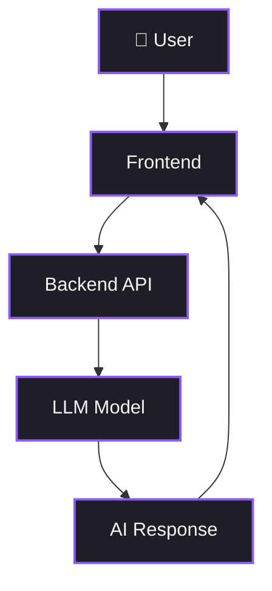
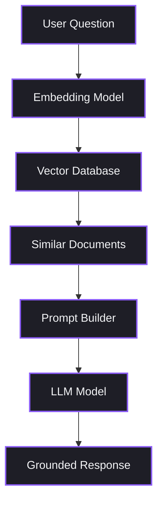
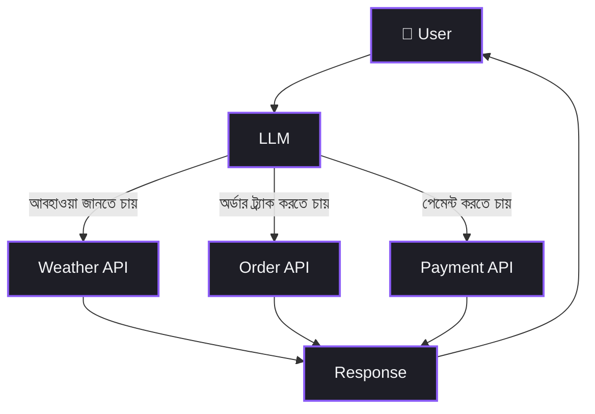
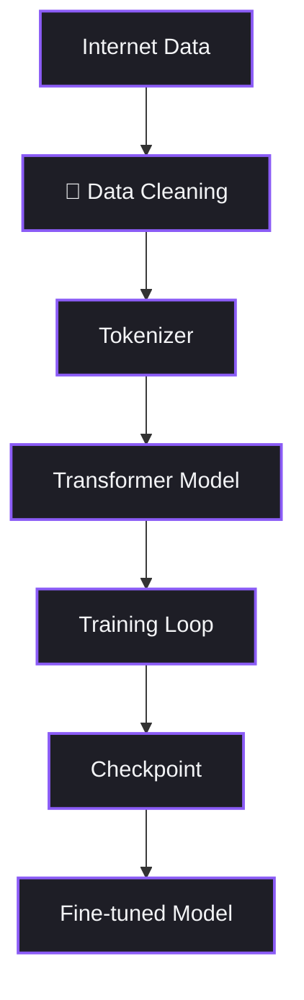
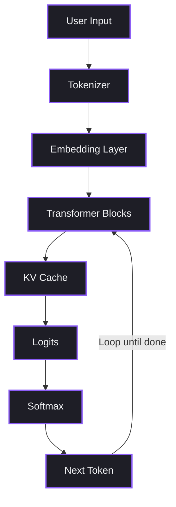

# Chapter 32: AI System Architectures — সিস্টেম আর্কিটেকচার ফান্ডামেন্টালস

বেশিরভাগ মানুষ যখন AI Application-এর কথা ভাবে, তখন মাথায় একটাই ছবি আসে — User একটা প্রশ্ন করলো, ChatGPT API-তে গেলো, উত্তর চলে এলো। ব্যস, কাজ শেষ!

কিন্তু বাস্তবটা একটু অন্যরকম।

তুমি যখন ChatGPT, GitHub Copilot, Cursor, বা Perplexity ব্যবহার করো — এগুলোর পেছনে শুধু একটা LLM বসে নেই। APIs আছে, Databases আছে, Vector DBs আছে, Tool Calling আছে, Authentication আছে, Memory আছে, Monitoring আছে, Caching আছে, Logging আছে। LLM হলো এই পুরো সিস্টেমের শুধু **একটা** Component।

এটা অনেকটা বাড়ি বানানোর মতো। তুমি শুধু ইট (LLM) দিয়ে বাড়ি বানাতে পারো না — তোমার দরকার পুরো Blueprint। কোথায় দরজা হবে, কোথায় পানির পাইপ যাবে, ইলেকট্রিক ওয়্যারিং কীভাবে হবে, ফাউন্ডেশন কতটা গভীর হবে — এই পুরো পরিকল্পনাটাই হলো **Architecture**।

আজকের Chapter-এ আমরা ঠিক এই জিনিসটাই শিখবো — AI System-এর Architecture আসলে কী, কেন এটা এত গুরুত্বপূর্ণ, এবং Real-World-এ কোন কোন Pattern ব্যবহার হয়।

---

## ১. কেন Architecture বুঝতে হবে?

ধরো, তোমার একটা E-Commerce Chatbot আছে। একজন User এসে জিজ্ঞেস করলো:

> "আমার অর্ডারটা কোথায়?"

এখন তোমাকে একজন Engineer হিসেবে সিদ্ধান্ত নিতে হবে:

- LLM কি সরাসরি উত্তর দেবে? (সে তো Order Database জানে না!)
- একটা API Call করবে Order System-এ?
- Vector Database-এ Search করবে?
- SQL Database-তে Query চালাবে?
- User-কে আগে Authenticate করবে?
- Result কি Cache করে রাখবে পরের বার দ্রুত দেওয়ার জন্য?

এই প্রতিটা সিদ্ধান্তই হলো **Architectural Decision**।

যদি তুমি Architecture না বোঝো, তাহলে তুমি হয়তো একটা Demo বানাতে পারবে — কিন্তু সেটা কখনো Production-এ টিকবে না। প্রথম ১০০ জন User আসলেই সিস্টেম ভেঙে পড়বে।

Architecture হলো সেই জ্ঞান যেটা একজন "Demo Developer"-কে "Production Engineer"-এ রূপান্তরিত করে।

---

## ২. AI Architecture আসলে কী?

AI Architecture হলো তোমার পুরো AI System-এর **Complete Blueprint**। এটা বলে দেয়:

- User কীভাবে Interact করবে
- Request কোন পথে Flow করবে
- Data কোথা থেকে আসবে
- Tools কীভাবে Call হবে
- LLM কীভাবে Reason করবে
- Response কীভাবে Generate হবে
- তথ্য কোথায় Store হবে
- Security কীভাবে কাজ করবে
- System কীভাবে Scale করবে

একটা শহরের Map-এর কথা ভাবো। Map ছাড়া তুমি হয়তো একটা রাস্তা চেনো, কিন্তু পুরো শহর Navigate করতে পারবে না। Architecture হলো তোমার AI System-এর সেই Map — যেটা দেখে তুমি বুঝতে পারো কোন Component কোথায় আছে, কে কার সাথে কথা বলছে, এবং Data কোন পথে যাচ্ছে।

>  **Remember:** Architecture কোনো Specific Technology না — এটা হলো একটা Design Philosophy। তুমি যেকোনো Tool বা Framework দিয়ে এটা Implement করতে পারো।

---

## ৩. Architecture বুঝলে কী কী লাভ?

Architecture ভালোভাবে বুঝলে তুমি:

- **Scalable Systems** বানাতে পারবে যেটা মিলিয়ন User Handle করে
- **Response Time** কমাতে পারবে Caching আর Optimization দিয়ে
- **Cost** কমাতে পারবে অপ্রয়োজনীয় LLM Call বাদ দিয়ে
- **Accuracy** বাড়াতে পারবে সঠিক Data Source ব্যবহার করে
- **Security** নিশ্চিত করতে পারবে Authentication আর Authorization দিয়ে
- **Multiple Services** Integrate করতে পারবে একটা Unified System-এ
- **সহজে Maintain** করতে পারবে কারণ প্রতিটা Component আলাদা
- **Production Issues** দ্রুত Debug করতে পারবে Monitoring আর Logging দিয়ে
- **Enterprise-Grade Apps** Deploy করতে পারবে Confidence-এর সাথে

সংক্ষেপে বললে — Architecture হলো সেই পার্থক্য যেটা একটা Toy Project আর একটা Real Product-এর মধ্যে তৈরি করে।

---

## ৪. Basic LLM Architecture

সবচেয়ে সহজ Architecture দিয়ে শুরু করি। এটা হলো একদম Demo-Level — যেখানে User সরাসরি LLM-এর সাথে কথা বলে:

এই Architecture-এ চারটা Component:

1. **User** — যে প্রশ্ন করছে
2. **Frontend** — Web বা Mobile UI যেখানে User Type করে
3. **Backend API** — যেটা Request নিয়ে LLM-এ পাঠায়
4. **LLM Model** — যেটা উত্তর Generate করে

**কোথায় ব্যবহার হয়?**
- ChatGPT-এর মতো Simple Demo
- Basic AI Assistant
- Text Generation Tool
- Quick Prototype বা Hackathon Project

 **Developer View:** এটাই সেই Architecture যেটা তুমি প্রথমবার `openai.chat.completions.create()` Call করে বানাও। কিন্তু এখানে কোনো Memory নেই, কোনো Context নেই, কোনো Data Source নেই — তাই এটা Production-এ যথেষ্ট না।

---

## ৫. RAG (Retrieval-Augmented Generation) Architecture

এবার একটু Advanced Level-এ যাই। RAG হলো আজকের Industry Standard — যখন তুমি চাও LLM তোমার নিজের Data-র উপর ভিত্তি করে উত্তর দিক:

**এটা কীভাবে কাজ করে?**

1. **User Question** — User একটা প্রশ্ন করে
2. **Embedding Model** — প্রশ্নটাকে Vector-এ রূপান্তরিত করে
3. **Vector Database** — সেই Vector দিয়ে Similar Documents খুঁজে বের করে
4. **Similar Documents** — সবচেয়ে Relevant Documents পাওয়া যায়
5. **Prompt Builder** — Documents আর Question মিলিয়ে একটা Rich Prompt তৈরি হয়
6. **LLM Model** — সেই Prompt দেখে Informed উত্তর দেয়
7. **Grounded Response** — Real Data-র উপর ভিত্তি করে তৈরি উত্তর

**কোথায় ব্যবহার হয়?**
- PDF বা Document Search
- Company Knowledge Base
- Enterprise Chatbot
- Legal বা Medical Document Analysis
- Customer Support Automation

 **Production Reality:** RAG System-এ সবচেয়ে বেশি সময় যায় Data Pipeline-এ — Documents কিভাবে Chunk করবে, কিভাবে Embed করবে, কোন Vector Database ব্যবহার করবে। LLM Call টা আসলে সবচেয়ে সহজ অংশ।

---

## ৬. Tool Calling Architecture

কখনো কখনো LLM-কে বাইরের দুনিয়ার সাথে কথা বলতে হয় — Weather জানতে হয়, Order Track করতে হয়, Payment Process করতে হয়। এই জায়গায় Tool Calling আসে:

**এটা কীভাবে কাজ করে?**

LLM নিজে থেকে API Call করে না। বরং সে বলে — "আমার Weather API Call করা দরকার, Parameter হবে city=Dhaka"। তারপর Backend সেই Call Execute করে এবং Result আবার LLM-কে দেয়।

মজার বিষয় হলো — LLM নিজেই **সিদ্ধান্ত নেয়** কোন Tool Call করতে হবে। তুমি শুধু Available Tools-এর List দাও, LLM User-এর প্রশ্ন বুঝে সঠিক Tool Select করে।

**কোথায় ব্যবহার হয়?**
- Live Weather, News, Sports Data
- Banking আর Financial Services
- E-Commerce Shopping Assistant
- Travel Booking System
- Any System যেখানে Real-Time Data দরকার

---

## ৭. LLM Training Architecture

এবার দেখি একটা LLM কীভাবে তৈরি হয়। এটা তোমার সরাসরি কাজে নাও লাগতে পারে, কিন্তু বুঝলে LLM-এর Limitation আর Capability দুটোই পরিষ্কার হবে:

**প্রতিটা Step সংক্ষেপে:**

1. **Internet Data** — Books, Wikipedia, Websites, Code থেকে বিশাল পরিমাণ Text সংগ্রহ
2. **Data Cleaning** — Duplicate, Toxic, Low-Quality Content বাদ দেওয়া
3. **Tokenizer** — Text-কে Numerical Token-এ ভাঙা
4. **Transformer Model** — Neural Network Architecture যেটা Pattern শেখে
5. **Training Loop** — GPU Cluster-এ সপ্তাহ বা মাসব্যাপী Training চলে
6. **Checkpoint** — Training-এর মাঝে মাঝে Model Save করা
7. **Fine-tuned Model** — Final Model যেটা Deploy করা হয়

>  **Remember:** GPT-4 Level-এর একটা Model Train করতে Millions of Dollars খরচ হয়। তাই বেশিরভাগ Engineer Training করে না — বরং API দিয়ে ব্যবহার করে।

---

## ৮. AI Inference Architecture

Training হলো Model শেখানো। আর Inference হলো সেই শেখা Model ব্যবহার করে উত্তর দেওয়া। যখন তুমি ChatGPT-তে কিছু লেখো, ভেতরে এটা হয়:

**ভেতরে কী হচ্ছে?**

1. **User Input** — তোমার লেখা Text
2. **Tokenizer** — Text-কে Token-এ ভাঙে (যেমন "Hello" → [15496])
3. **Embedding Layer** — Token-কে High-Dimensional Vector-এ পরিবর্তন করে
4. **Transformer Blocks** — Attention Mechanism দিয়ে Context বোঝে
5. **KV Cache** — আগের Token-এর Information Cache করে রাখে দ্রুত Generation-এর জন্য
6. **Logits** — প্রতিটা সম্ভাব্য পরবর্তী Token-এর Score বের করে
7. **Softmax** — Score-কে Probability-তে রূপান্তরিত করে
8. **Next Token** — সবচেয়ে সম্ভাব্য Token Select করে Output-এ যোগ করে

এই Process টা **প্রতিটা Token-এর জন্য আলাদাভাবে চলে** — তাই LLM একটু একটু করে উত্তর দেয়, একবারে পুরোটা না।

---

## ৯. Modern AI System-এর Common Components

একটা Real-World AI System-এ অনেকগুলো Component মিলে কাজ করে। এখানে সবচেয়ে Common গুলো দেখো:

| Component | Purpose | Example |
|-----------|---------|---------|
| **Frontend** | User Interface — Web, Mobile, Desktop | React, Next.js, Flutter |
| **Backend/API** | Request Coordination আর Business Logic | FastAPI, Express, Django |
| **API Gateway** | Entry Point, Routing, Rate Limiting | Kong, AWS API Gateway |
| **Authentication** | User Identity Verify করা | OAuth, JWT, Firebase Auth |
| **LLM** | Natural Language Understanding আর Generation | GPT-4, Claude, Gemini |
| **Embedding Model** | Text-কে Vector-এ রূপান্তর | text-embedding-3-small |
| **Vector Database** | Semantic Search for Documents | Pinecone, Weaviate, Qdrant |
| **SQL Database** | Structured Transactional Data | PostgreSQL, MySQL |
| **Cache** | Repeated Request দ্রুত করা | Redis, Memcached |
| **Object Storage** | PDFs, Images, Videos Store করা | S3, GCS, Azure Blob |
| **Tool/API Layer** | External Services-এর সাথে Connect করা | REST APIs, gRPC |
| **Queue** | Background Jobs Process করা | RabbitMQ, Kafka, SQS |
| **Monitoring** | System Health আর Performance Track | Prometheus, Datadog |
| **Logging** | Events Record করা Debugging-এর জন্য | ELK Stack, CloudWatch |
| **Analytics** | Usage আর Quality Measure করা | Mixpanel, PostHog |

 **Developer View:** তোমার প্রতিটা Project-এ এই সব Component লাগবে না। কিন্তু Architecture বুঝলে তুমি জানবে **কখন কোনটা যোগ করতে হবে**। একটা Prototype-এ হয়তো Frontend + Backend + LLM যথেষ্ট। কিন্তু Production-এ যেতে হলে বাকিগুলোও আস্তে আস্তে যোগ করতে হবে।

---

## ১০. সচরাচর ভুলগুলো

 **Common Mistake:** অনেক নতুন Engineer মনে করে শুধু LLM-ই সব। তারা পুরো সময় ব্যয় করে Prompt Engineering আর Model Selection-এ — কিন্তু বাকি System-এর কথা ভাবেই না।

**বাস্তবতা হলো:**

Production-এ LLM হয়তো পুরো কাজের **২০%**। বাকি **৮০%** হলো:

- Data Pipeline — ডাটা কিভাবে আসবে, Clean হবে, Store হবে
- Infrastructure — Server, Load Balancer, Auto-Scaling
- Security — Authentication, Authorization, Data Encryption
- Monitoring — System কি ঠিকমতো কাজ করছে?
- Error Handling — LLM ভুল উত্তর দিলে কী হবে?
- Cost Optimization — প্রতিটা API Call-এর পেছনে টাকা যাচ্ছে
- Testing — Evaluation, Regression Testing, A/B Testing

এটা অনেকটা একটা রেস্তোরাঁর মতো — Chef (LLM) গুরুত্বপূর্ণ, কিন্তু Kitchen, Supply Chain, Waiters, Billing, Hygiene ছাড়া রেস্তোরাঁ চলবে না।

---

## ১১. ইন্টারভিউতে সাধারণ কিছু প্রশ্ন

###  Beginner Level

**প্রশ্ন:** Basic LLM Architecture আর RAG Architecture-এর মধ্যে মূল পার্থক্য কী?

**উত্তর:** Basic LLM Architecture-এ User সরাসরি LLM-এর সাথে কথা বলে — LLM শুধু তার Training Data থেকে উত্তর দেয়। RAG Architecture-এ একটা অতিরিক্ত Step যোগ হয় — LLM-কে উত্তর দেওয়ার আগে Relevant Documents খুঁজে এনে দেওয়া হয় Vector Database থেকে। এতে উত্তর অনেক বেশি Accurate আর Up-to-date হয়, কারণ LLM-এর নিজের Training Data-র বাইরের Information-ও ব্যবহার হচ্ছে।

###  Intermediate Level

**প্রশ্ন:** কখন Tool Calling ব্যবহার করবে আর কখন RAG?

**উত্তর:** RAG ব্যবহার করবে যখন তোমার কাছে Static Documents আছে — PDFs, Knowledge Base, Policy Documents — যেগুলো থেকে Information Retrieve করতে হবে। Tool Calling ব্যবহার করবে যখন Real-Time Data দরকার — Live Weather, Order Status, Account Balance — যেগুলো কোনো Database বা Document-এ Pre-stored নেই, বরং একটা External API Call করে আনতে হবে। অনেক Production System-এ দুটোই একসাথে ব্যবহার হয়।

###  Advanced Level

**প্রশ্ন:** একটা E-Commerce Chatbot-এর জন্য RAG আর Tool Calling দুটো মিলিয়ে কীভাবে System Design করবে?

**উত্তর:** একটা Hybrid Architecture বানাবো। LLM প্রথমে User-এর Intent বুঝবে। যদি User Product-এর Feature বা Policy সম্পর্কে জিজ্ঞেস করে — RAG Pipeline Activate হবে, Product Documentation আর Policy Documents থেকে Information আনবে। যদি User তার Order Track করতে চায় বা Return Request করতে চায় — Tool Calling Activate হবে, Order Management API বা Return API Call করবে। একটা Router Layer থাকবে যেটা LLM-এর Decision-এর ভিত্তিতে সঠিক Pipeline-এ Request Forward করবে। সাথে Caching Layer, Auth Layer, আর Fallback Mechanism থাকবে Production Reliability নিশ্চিত করতে।

---

## ১২. যা শিখলাম

এই Chapter-এ আমরা কিছু গুরুত্বপূর্ণ জিনিস শিখলাম:

- **AI System Architecture** হলো তোমার পুরো System-এর Blueprint — শুধু LLM না, বরং সবকিছু মিলিয়ে।

- **Basic LLM Architecture** হলো সবচেয়ে সহজ Pattern — User → Backend → LLM → Response। Demo-র জন্য যথেষ্ট, Production-এর জন্য না।

- **RAG Architecture** হলো Industry Standard — যেখানে LLM-কে Relevant Documents দিয়ে সাহায্য করা হয় যেন সে Grounded উত্তর দিতে পারে।

- **Tool Calling Architecture** LLM-কে বাইরের দুনিয়ার সাথে Connect করে — APIs, Databases, External Services।

- **Training Architecture** দেখায় কীভাবে Internet Data থেকে একটা LLM তৈরি হয়।

- **Inference Architecture** দেখায় কীভাবে LLM Token by Token উত্তর Generate করে।

- একটা Modern AI System-এ **১৫+ Components** থাকতে পারে — Frontend থেকে Monitoring পর্যন্ত।

- Production-এ LLM হলো মাত্র **২০%** — বাকি ৮০% হলো Infrastructure, Security, Data Pipeline, আর Monitoring।

>  **Remember:** Architecture বোঝা মানে তুমি শুধু Code লেখো না — তুমি System Design করো। এটাই একজন Junior Developer আর Senior Engineer-এর মধ্যে সবচেয়ে বড় পার্থক্য।

---

## ১৩. এরপর কী?

এই Chapter-এ আমরা Foundation তৈরি করলাম — Basic Architecture Patterns শিখলাম।

পরবর্তী **Chapter 33**-তে আমরা এক ধাপ এগিয়ে যাবো — **Production আর Enterprise-Level Architectures** নিয়ে কথা বলবো। সেখানে দেখবো:

- Multi-Agent Architecture কীভাবে কাজ করে
- Microservices vs Monolith AI Systems
- Enterprise Security আর Compliance Patterns
- High-Availability আর Disaster Recovery
- Real-World Case Studies — কীভাবে বড় বড় Company তাদের AI Systems Design করে

Architecture-এর ভিত্তি তো হলো — এবার আসল Building শুরু হবে! 
