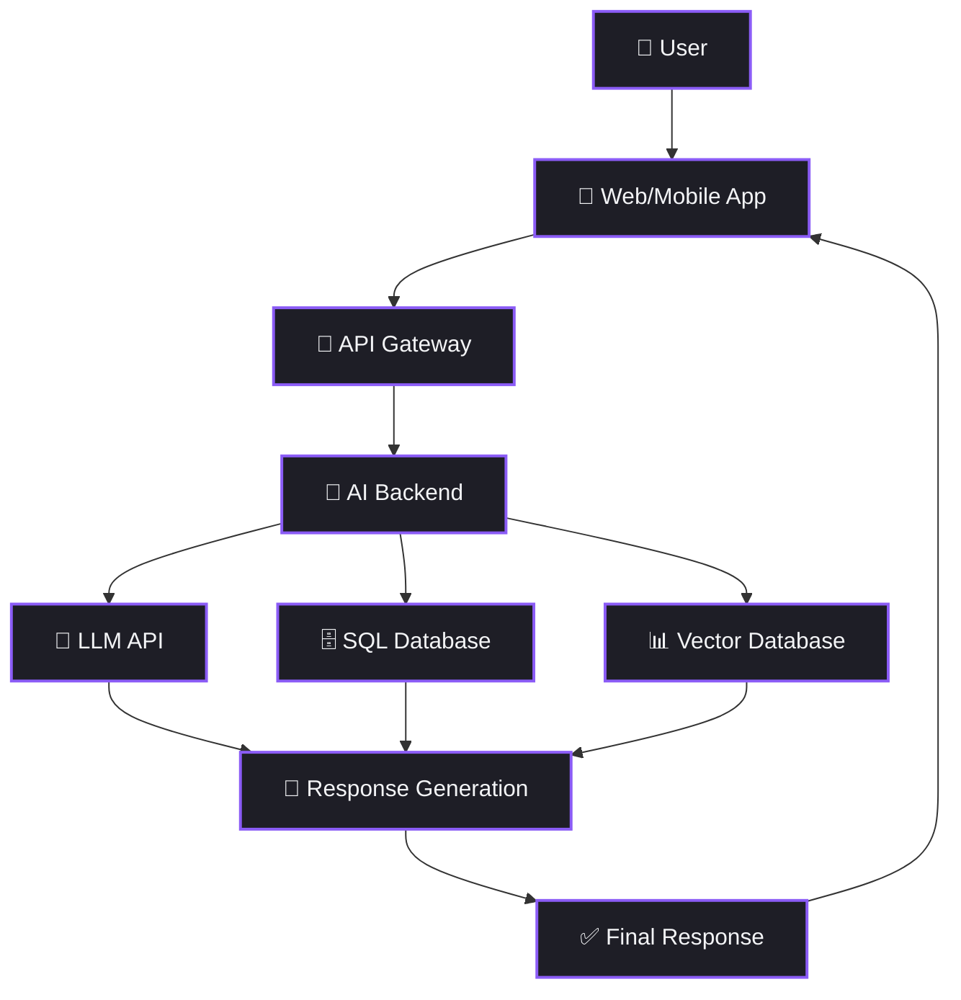
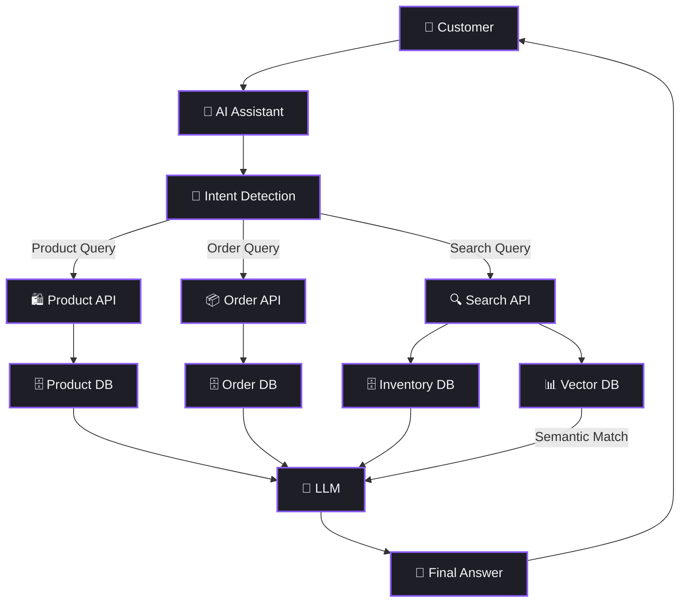
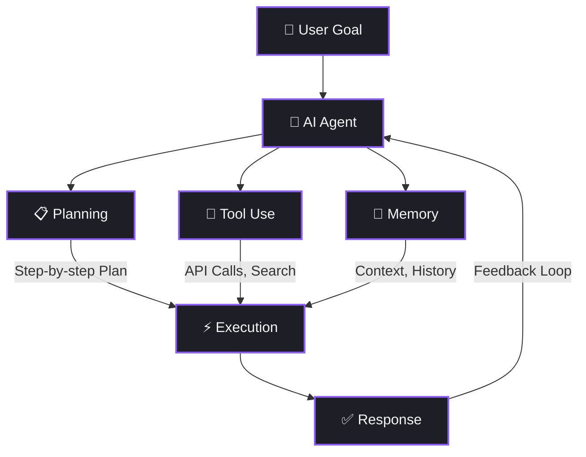
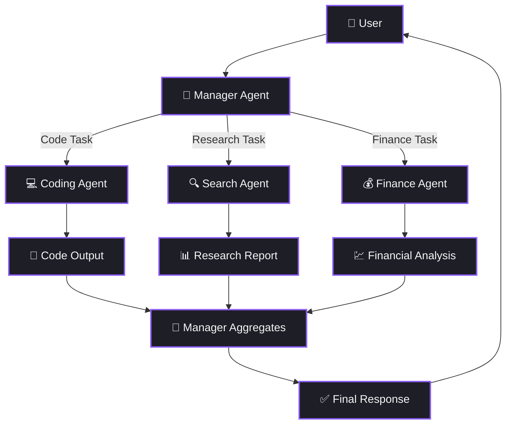
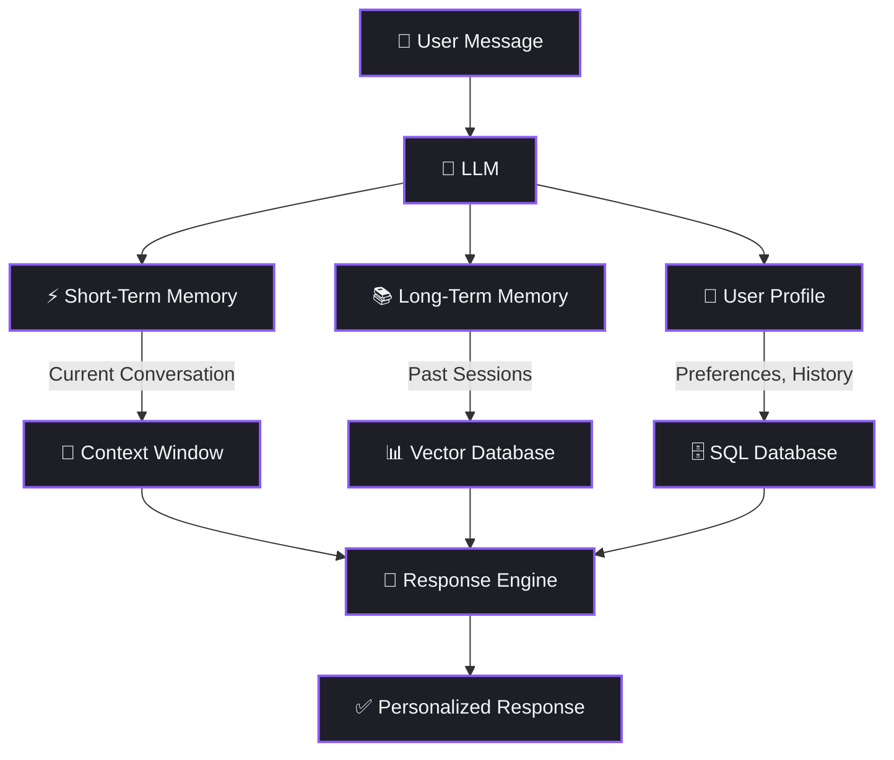
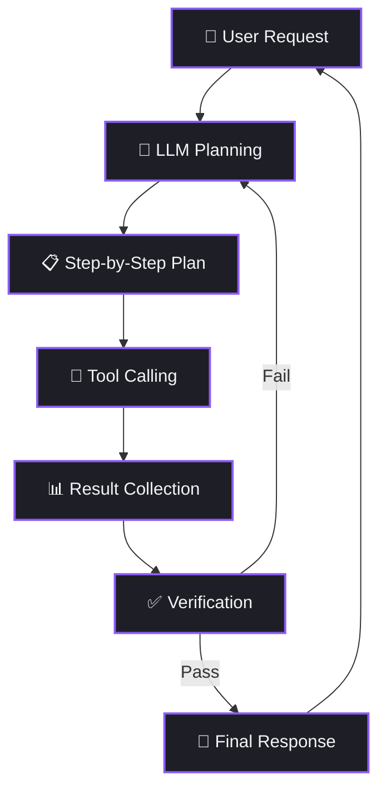
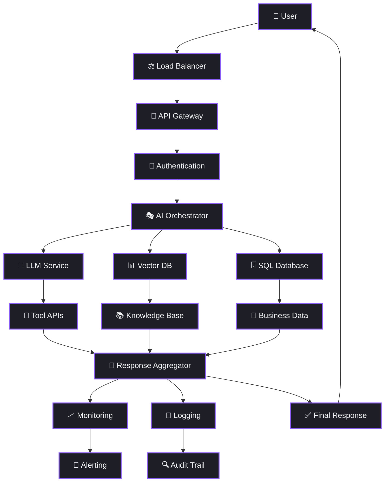

# Chapter 33: AI System Architectures — প্রোডাকশন ও এন্টারপ্রাইজ

আগের Chapter-এ আমরা শিখেছিলাম AI System-এর মৌলিক Architecture গুলো — Basic RAG, Chatbot, Simple Agent। কিন্তু বাস্তব কোম্পানিগুলোতে — Amazon, Shopify, Microsoft — AI System অনেক বেশি Complex। সেখানে লক্ষ লক্ষ User Handle করতে হয়, একাধিক Database থাকে, ডজনখানেক API কাজ করে, আর Real-time Monitoring চলে ২৪/৭।

এই Chapter-এ আমরা দেখবো Production আর Enterprise-grade AI System আসলে কীভাবে তৈরি হয়।

তোমাকে একটা কথা মনে রাখতে হবে — Demo Project আর Production System-এর মধ্যে আকাশ-পাতাল পার্থক্য। Demo-তে তুমি একটা Python Script চালাও, Production-এ তোমাকে হাজারটা Edge Case Handle করতে হয়।

---

## ১. Production AI Architecture

প্রথমেই দেখি একটা Real Production AI System দেখতে কেমন হয়। এটা কোনো Tutorial-এর `app.py` না — এটা একটা পুরোদস্তুর System।

লক্ষ্য করো — User সরাসরি LLM-এর সাথে কথা বলে না। মাঝখানে API Gateway আছে, AI Backend আছে, আর Backend থেকে তিনটা আলাদা Service-এ Call যায়:

| Component | কাজ |
|-----------|-----|
| API Gateway | Authentication, Rate Limiting, Routing |
| AI Backend | Business Logic, Orchestration |
| LLM API | Text Generation, Reasoning |
| SQL Database | Structured Data — Users, Orders, Config |
| Vector Database | Semantic Search — Embeddings, Documents |

এই Architecture-ই বেশিরভাগ কোম্পানি ব্যবহার করে। Demo Architecture থেকে মূল পার্থক্য হলো — প্রতিটা Component আলাদা Service হিসেবে চলে, আর প্রতিটার নিজস্ব Scaling Strategy আছে।

এটাকে ভাবো একটা হাসপাতালের মতো। Reception (API Gateway) তোমাকে Receive করে, তারপর তোমাকে সঠিক Doctor-এর (AI Backend) কাছে পাঠায়। Doctor প্রয়োজনে Lab Test (SQL DB), X-Ray (Vector DB), বা Specialist Consultation (LLM API) করায়। সবকিছুর Result মিলিয়ে তারপর Final Prescription তৈরি হয়।

Production System-এ আরেকটা গুরুত্বপূর্ণ বিষয় হলো **Horizontal Scaling**। User বাড়লে তুমি AI Backend-এর আরো Instance চালু করতে পারো, LLM API-র জন্য আলাদা Queue রাখতে পারো। প্রতিটা Component স্বাধীনভাবে Scale করা যায় — এটাই Production Architecture-এর শক্তি।

---

## ২. E-commerce AI Architecture

ধরো তুমি একটা E-commerce Platform-এর জন্য AI Assistant বানাচ্ছো — ঠিক যেমন Amazon Rufus বা Shopify AI। User এসে বলবে "আমার গতকালের Order-টা কোথায়?" অথবা "লাল রঙের জুতা দেখাও"। দুটো সম্পূর্ণ আলাদা Intent — দুটো আলাদা Service Handle করবে।

এখানে সবচেয়ে গুরুত্বপূর্ণ Component হলো **Intent Detection**। এটাই ঠিক করে User কী চাইছে — Product দেখতে চাইছে, Order Track করতে চাইছে, নাকি কিছু Search করতে চাইছে।

Intent Detection সাধারণত দুইভাবে করা হয়:
- **Classification Model** — একটা Fine-tuned Model যেটা User Message-এর Intent Classify করে (Fast, Cheap)
- **LLM-based Routing** — LLM নিজেই User-এর Message পড়ে সিদ্ধান্ত নেয় কোন API Call করতে হবে (Flexible, Expensive)

Intent অনুযায়ী আলাদা আলাদা API Call হয়। প্রতিটা API-র পেছনে নিজস্ব Database আছে। আর সবশেষে LLM সব তথ্য নিয়ে User-Friendly ভাষায় উত্তর তৈরি করে।

Amazon Rufus ঠিক এই Pattern-এই কাজ করে — তোমার প্রশ্ন বুঝে, সঠিক Backend Service-এ Route করে, আর LLM দিয়ে উত্তর Generate করে। Shopify-ও তাদের AI Shopping Assistant-এ একই ধরনের Architecture ব্যবহার করে — Product Recommendation, Order Tracking, আর Customer Support সব আলাদা Service-এ Route হয়।

---

## ৩. AI Agent Architecture

AI Agent হলো এমন একটা System যেটা শুধু উত্তর দেয় না — নিজে থেকে সিদ্ধান্ত নেয়, Plan করে, Tool ব্যবহার করে, আর Memory-তে তথ্য সংরক্ষণ করে। (বিস্তারিত জানতে Chapter 20: AI Agents দেখো।)

AI Agent-এর তিনটি স্তম্ভ:

| স্তম্ভ | কাজ | উদাহরণ |
|--------|------|--------|
| Planning | কাজকে ছোট ছোট Step-এ ভাগ করা | "প্রথমে Search করবো, তারপর Analyze করবো" |
| Tool Use | বাইরের Tool এবং API ব্যবহার | Calculator, Web Search, Database Query |
| Memory | আগের কথোপকথন মনে রাখা | Previous Context, User Preferences |

লক্ষ্য করো Diagram-এ একটা **Feedback Loop** আছে — Agent তার নিজের Output দেখে আবার Plan Update করতে পারে। এটাই Agent-কে একটা সাধারণ Chatbot থেকে আলাদা করে।

---

## ৪. Multi-Agent Architecture

একটা Agent ভালো — কিন্তু কিছু কাজ এতটাই Complex যে একটা Agent-এর পক্ষে সব করা সম্ভব না। তখন দরকার হয় একাধিক Specialized Agent, যারা একজন Manager Agent-এর অধীনে কাজ করে।

এটাকে বলা হয় **Orchestration Pattern**। Manager Agent পুরো কাজটাকে ভাগ করে বিভিন্ন Specialized Agent-এর কাছে পাঠায়, তারপর সবার Output একত্রিত করে Final Response তৈরি করে।

Orchestration ছাড়াও আরেকটা Pattern আছে — **Collaboration Pattern**। এখানে কোনো Manager নেই, Agent-রা নিজেদের মধ্যে কথা বলে সিদ্ধান্ত নেয়। তবে বেশিরভাগ Production System-এ Orchestration Pattern-ই ব্যবহার হয় কারণ এটা Debug করা সহজ আর Predictable।

Multi-Agent System কোথায় ব্যবহার হয়?

- **Research** — একটা Agent Paper খোঁজে, আরেকটা Summarize করে, তৃতীয়টা Analyze করে
- **Autonomous Workflows** — Software Development, Testing, Deployment সব আলাদা Agent
- **Enterprise AI** — Customer Service, Sales, HR — প্রতিটা Department-এর জন্য আলাদা Agent
- **Code Generation** — একটা Agent Code লেখে, আরেকটা Review করে, তৃতীয়টা Test লেখে

---

## ৫. AI Memory Architecture

তুমি যদি একটা AI System বানাও যেটা User-এর আগের কথা মনে রাখতে পারে না — সেটা একটা খুবই হতাশাজনক Experience হবে। Memory Architecture ঠিক এই সমস্যার সমাধান করে। (বিস্তারিত জানতে Chapter 26: Multi-Session Memory দেখো।)

তিন ধরনের Memory:

| Memory Type | Storage | কী রাখে |
|------------|---------|---------|
| Short-Term | Context Window | চলমান কথোপকথনের Messages |
| Long-Term | Vector Database | আগের Session-এর গুরুত্বপূর্ণ তথ্য |
| User Profile | SQL Database | User-এর পছন্দ, Settings, History |

Short-Term Memory হলো তোমার Working Memory — এই মুহূর্তে তুমি কী নিয়ে কথা বলছো। Long-Term Memory হলো তোমার আগের সব কথোপকথনের সারাংশ। আর User Profile হলো তোমার সম্পর্কে Structured Data — নাম, পছন্দ, Subscription Plan।

---

## ৬. AI Workflow Architecture

কিছু AI Task একটা নির্দিষ্ট ক্রমে হতে হয় — প্রথমে Plan, তারপর Execute, তারপর Verify। এটাকে বলে Sequential Workflow Pattern।

এই Pattern-এ প্রতিটা Step-এর Output পরের Step-এর Input হয়। আর Verification Step-এ যদি Result সন্তোষজনক না হয়, তাহলে আবার শুরু থেকে Plan করা হয়।

উদাহরণ — তুমি বললে "আমার Blog-এর জন্য SEO Optimized Article লেখো":
1. **Planning** — Topic Research, Keyword Selection
2. **Tool Calling** — Google Search API, Keyword Tool API
3. **Result Collection** — সব Data একসাথে করা
4. **Verification** — SEO Score Check, Readability Check
5. **Final Response** — সম্পূর্ণ Article

---

## ৭. Enterprise AI Architecture

এবার আসি সবচেয়ে বড় Diagram-এ — একটা পূর্ণাঙ্গ Enterprise AI Architecture। বড় কোম্পানিগুলো — Bank, Insurance, Healthcare — এই ধরনের Architecture ব্যবহার করে।

এটাকে ভাবো একটা বিশাল কারখানার মতো। কারখানায় যেমন Gate Security (Authentication) আছে, Supervisor (Orchestrator) আছে, বিভিন্ন বিভাগ (LLM, Vector DB, SQL DB) আছে, Quality Check (Monitoring) আছে, আর সব কিছুর Record (Logging) রাখা হয় — Enterprise AI Architecture-ও ঠিক তেমনি।

প্রতিটা Component-এর ভূমিকা:

| Component | ভূমিকা |
|-----------|--------|
| Load Balancer | Traffic ভাগ করে Multiple Server-এ পাঠায় |
| API Gateway | Request Routing, Rate Limiting, Throttling |
| Authentication | JWT, OAuth, API Key Verification |
| AI Orchestrator | কোন LLM, কোন Tool, কোন DB — সব Decision নেয় |
| LLM Service | Text Generation, Reasoning |
| Vector DB | Semantic Search, Document Retrieval |
| SQL Database | Structured Business Data |
| Tool APIs | External Service Integration |
| Knowledge Base | Company Documents, FAQs, Policies |
| Business Data | Customer Records, Transactions |
| Monitoring | Latency, Error Rate, Token Usage Tracking |
| Logging | Request/Response Log, Debug Information |
| Alerting | Threshold Breach-এ Notification |
| Audit Trail | Compliance, Security Audit |

Enterprise Architecture-এ সবচেয়ে গুরুত্বপূর্ণ বিষয় হলো — প্রতিটা Layer-এ Security আর Observability থাকতে হবে। Bank-এর AI System-এ যদি কোনো Unauthorized Access হয়, সেটা মুহূর্তে ধরতে হবে।

আরেকটা গুরুত্বপূর্ণ বিষয় হলো **Compliance**। Healthcare-এ HIPAA, Finance-এ SOC 2, Europe-তে GDPR — প্রতিটা Industry-র নিজস্ব Regulation আছে। তোমার Architecture-কে এসব Regulation মেনে চলতে হবে। এই কারণেই Audit Trail আর Logging এতটা গুরুত্বপূর্ণ।

Enterprise Architecture Design করার সময় একটা ভালো Practice হলো — প্রতিটা Component-এর জন্য "What if this fails?" প্রশ্ন করা। LLM Down গেলে কী হবে? Database Slow হলে কী হবে? এই প্রশ্নগুলোর উত্তর তোমার Architecture-তে থাকতে হবে।

---

## ৮. 🏭 Production Reality

> বাস্তব Production-এ Architecture Diagram-ই শেষ কথা না। তোমাকে আরো অনেক কিছু Handle করতে হবে:

- **Rate Limiting** — প্রতি User-এর জন্য Request সীমিত করা
- **Retry Logic** — কোনো API Fail করলে আবার চেষ্টা করা
- **Circuit Breakers** — কোনো Service Down থাকলে পুরো System যেন Crash না করে
- **Fallback Models** — Primary LLM Down থাকলে Secondary LLM ব্যবহার করা
- **A/B Testing** — দুটো Model-এর Performance তুলনা করা Live Traffic-এ
- **Canary Deployments** — নতুন Version মাত্র ৫% Traffic-এ Test করা
- **Blue-Green Deployments** — দুটো Identical Environment রেখে Instant Switch করা

Architecture Static কিছু না — এটা ক্রমাগত Evolve করে। তোমার আজকের Architecture ৬ মাস পরে আলাদা দেখাবে। আর সেটাই স্বাভাবিক।

---

## ৯. AI Architect-এর Learning Roadmap

তুমি যদি AI Architect হতে চাও, তাহলে এই ক্রমে শেখো:

১. **Client-Server Architecture** — কীভাবে Frontend আর Backend কথা বলে
২. **REST APIs and Backend Services** — HTTP Methods, Endpoints, JSON
৩. **SQL and NoSQL Databases** — Data Storage-এর ভিত্তি
৪. **Embeddings and Vector Databases** — Semantic Search-এর Core
৫. **LLM Inference Pipeline** — Prompt থেকে Response পর্যন্ত পুরো Journey
৬. **Retrieval-Augmented Generation (RAG)** — Knowledge-Grounded AI
৭. **Tool Calling and Function Calling** — LLM-কে বাইরের Tool ব্যবহার শেখানো
৮. **AI Agents** — Autonomous Decision Making
৯. **Multi-Agent Systems** — Multiple Agent Orchestration
১০. **Memory Architectures** — Short-Term, Long-Term, Profile Memory
১১. **Event-Driven and Queue-Based Systems** — Kafka, RabbitMQ, Pub/Sub
১২. **Microservices** — Service Decomposition, API Communication
১৩. **Kubernetes and Cloud Deployment** — Container Orchestration, Scaling
১৪. **AI Security and Authentication** — Prompt Injection Prevention, Access Control
১৫. **Monitoring, Logging, and Observability** — System Health Tracking
১৬. **Production Scaling and Cost Optimization** — Token Cost Management, Caching

এই ক্রম কেন গুরুত্বপূর্ণ? কারণ প্রতিটা Topic আগেরটার ওপর নির্ভর করে। তুমি RAG বুঝবে না যদি Vector Database না বোঝো। Multi-Agent বুঝবে না যদি Single Agent না বোঝো। Monitoring করবে কীভাবে যদি Microservices-ই না জানো?

প্রথম ১-৭ শিখতে ২-৩ মাস লাগবে। ৮-১২ শিখতে আরো ৩-৪ মাস। আর ১৩-১৬ শিখতে Production Experience লাগবে — যেটা শুধু Real Project করেই আসবে।

> 🧠 **Remember:** প্রতিটা Step-এ একটা ছোট Project বানাও। Client-Server শিখলে একটা Simple API বানাও। RAG শিখলে একটা Document Q&A App বানাও। শুধু পড়ে গেলে ভুলে যাবে — Build করলে মনে থাকবে।

---

## ১০. 🔴 Common Mistake

> **ভুল:** সরাসরি Complex Enterprise Architecture দিয়ে শুরু করা — Kubernetes, Multi-Agent, Event-Driven সব একসাথে।
>
> **বাস্তবতা:** Simple Architecture দিয়ে শুরু করো। Complexity যোগ করো শুধু তখনই যখন সত্যিই দরকার হয়। Over-engineering Startup-কে মেরে ফেলে।
>
> একটা Simple Monolith দিয়ে শুরু করো। যখন User বাড়বে, তখন ধীরে ধীরে Microservices-এ যাও। যখন একটা Agent যথেষ্ট না, তখন Multi-Agent করো। "Premature optimization is the root of all evil" — এটা Architecture-এর ক্ষেত্রেও সত্য।

---

## ১১. 💻 Developer View

> যেকোনো AI System Design করার আগে — **প্রথমে Architecture Diagram আঁকো**, তারপর Code লেখো।
>
> তুমি Excalidraw ব্যবহার করতে পারো, draw.io ব্যবহার করতে পারো, এমনকি কাগজ-কলমেও আঁকতে পারো। মূল বিষয় হলো — Code লেখার আগে তোমার System-এর সম্পূর্ণ ছবিটা পরিষ্কার থাকা উচিত।
>
> এটা তোমাকে সপ্তাহের পর সপ্তাহ Refactoring থেকে বাঁচাবে। আমি নিজে এই ভুল অনেকবার করেছি — সরাসরি Code-এ ঝাঁপ দিয়েছি, পরে গিয়ে বুঝেছি Architecture-ই ভুল ছিল। তখন পুরো Code ফেলে দিয়ে আবার শুরু করতে হয়েছে।

---

## ১২. ইন্টারভিউতে সাধারণ কিছু প্রশ্ন

### Beginner Level

**প্রশ্ন:** Single-Agent আর Multi-Agent Architecture-এর মধ্যে পার্থক্য কী?

**উত্তর:** Single-Agent Architecture-তে একটি মাত্র AI Agent সব কাজ নিজে করে — Planning, Tool Use, Memory সব সে Handle করে। Multi-Agent Architecture-তে একাধিক Specialized Agent থাকে, প্রতিটি নির্দিষ্ট কাজের জন্য Expert, আর একটি Manager Agent তাদের Coordinate করে। Multi-Agent System Complex Task-এর জন্য বেশি কার্যকর কারণ কাজ ভাগ করে Parallel-এ করা যায়।

### Intermediate Level

**প্রশ্ন:** এমন একটা AI Memory System কীভাবে Design করবে যেটা Session-এর পরেও তথ্য মনে রাখে?

**উত্তর:** তিন Layer-এর Memory System ব্যবহার করবো। প্রথমত, Short-Term Memory হিসেবে Current Conversation Context Window-তে রাখবো। দ্বিতীয়ত, প্রতিটি Session শেষে গুরুত্বপূর্ণ তথ্য Summarize করে Vector Database-এ Long-Term Memory হিসেবে Store করবো। তৃতীয়ত, User-এর Preferences আর Profile Data SQL Database-এ রাখবো। নতুন Session শুরু হলে, Vector DB থেকে Relevant Past Context Retrieve করে আর User Profile থেকে Preferences নিয়ে LLM-এর Context-এ যোগ করবো।

### Advanced Level

**প্রশ্ন:** একটি Bank-এর Customer Service Chatbot-এর জন্য সম্পূর্ণ Enterprise AI Architecture Design করো। কোন কোন Component থাকবে এবং কেন?

**উত্তর:** Bank-এর জন্য Architecture-তে থাকবে: Load Balancer — High Availability নিশ্চিত করতে। API Gateway — Rate Limiting আর Request Routing-এর জন্য। Authentication Layer — OAuth 2.0 এবং MFA, কারণ Financial Data অত্যন্ত সংবেদনশীল। AI Orchestrator — Intent অনুযায়ী সঠিক Service-এ Route করতে। LLM Service — Guardrails সহ, যাতে Financial Advice দেওয়ার সময় Hallucination না হয়। Vector DB — Bank-এর Policy Documents, FAQ Search-এর জন্য। SQL Database — Customer Account Data, Transaction History। Audit Trail — Regulatory Compliance-এর জন্য প্রতিটি Interaction Log করতে হবে। PII Masking — Customer-এর Personal Data LLM-এ পাঠানোর আগে Mask করতে হবে। Fallback System — AI Fail করলে Human Agent-এ Handoff। Monitoring — Latency, Error Rate, Hallucination Detection সব Track করতে হবে।

---

## ১৩. যা শিখলাম

Chapter 32 আর 33 মিলিয়ে আমরা যে Architecture গুলো শিখলাম সেগুলো একনজরে:

| Architecture | মূল বৈশিষ্ট্য | কখন ব্যবহার করবে |
|-------------|---------------|------------------|
| Basic LLM App | LLM + Prompt | Simple Q&A, Prototyping |
| RAG Architecture | LLM + Vector DB + Retrieval | Knowledge-based AI |
| Chatbot Architecture | LLM + Memory + UI | Conversational AI |
| Production AI | API Gateway + Backend + Multiple DBs | Real-world Applications |
| E-commerce AI | Intent Detection + Multiple APIs | Shopping Assistants |
| AI Agent | Planning + Tool Use + Memory | Autonomous Tasks |
| Multi-Agent | Manager + Specialized Agents | Complex Workflows |
| Memory Architecture | Short + Long + Profile Memory | Personalized AI |
| Workflow Architecture | Sequential Step Execution | Structured Tasks |
| Enterprise AI | Full Stack with Security + Monitoring | Large Organizations |

মনে রাখো — তোমাকে সব Architecture একসাথে ব্যবহার করতে হবে না। তোমার Problem অনুযায়ী সঠিক Architecture বেছে নাও। Simple Problem-এ Complex Architecture ব্যবহার করা যেমন ভুল, তেমনি Complex Problem-এ Simple Architecture দিয়ে কাজ চালাতে গেলেও সমস্যা হবে।

---

## ১৪. এরপর কী?

এতক্ষণে তুমি AI System-এর Theory আর Architecture — দুটোই বুঝে গেছো। তুমি জানো কীভাবে একটা Simple Chatbot থেকে শুরু করে Enterprise-grade AI System পর্যন্ত Design করতে হয়।

এখন সময় এসেছে তোমার Career Path ঠিক করার। তুমি কি AI Engineer হতে চাও? নাকি AI Architect? নাকি ML Engineer? Chapter 30 (AI Career Roadmap)-এ আমরা বিস্তারিত আলোচনা করেছি কোন পথে গেলে কী কী শিখতে হবে, কোন দক্ষতা দরকার, আর কোন ধরনের কোম্পানিতে কোন Role-এ কাজ করতে পারবে।

> 🧠 **Remember:** একটি ভালো AI System শুধু একটি শক্তিশালী Model নয়। এটি হলো সঠিক Architecture, সঠিক Infrastructure, আর সঠিক Engineering Decision-এর সমষ্টি।
