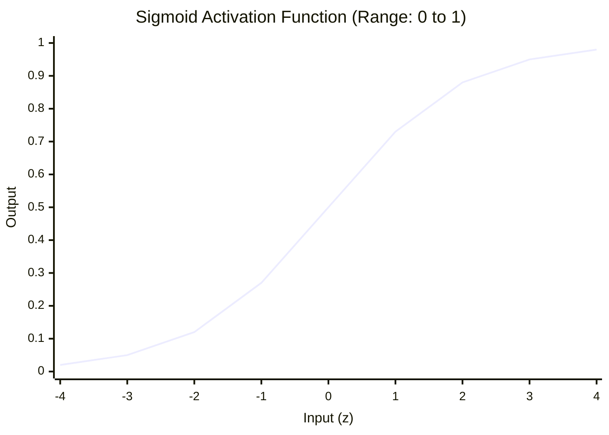
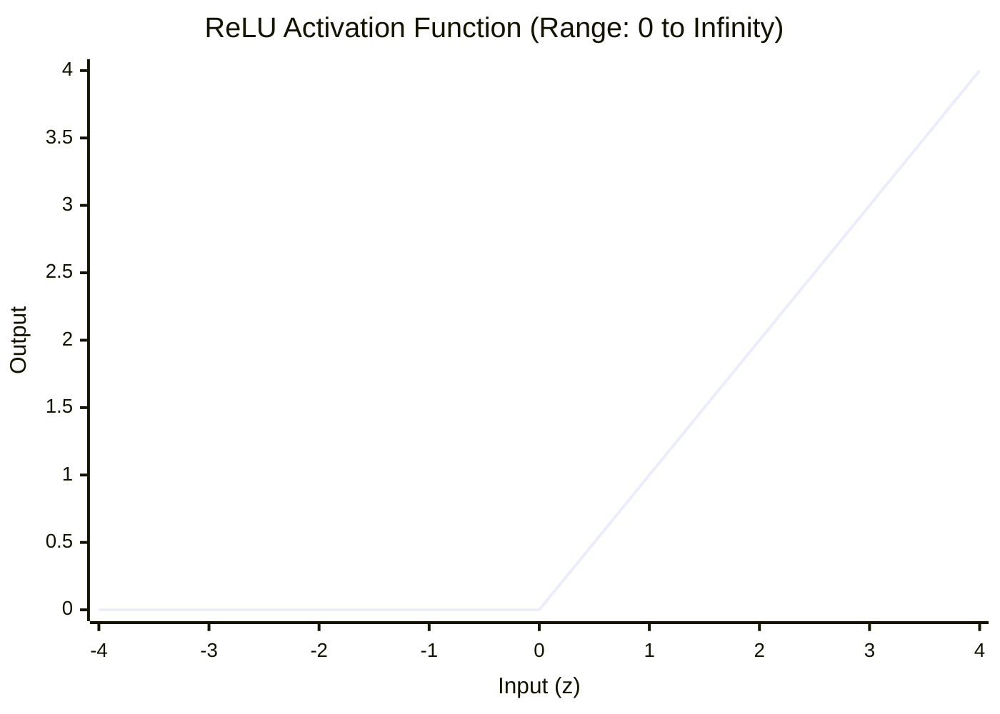
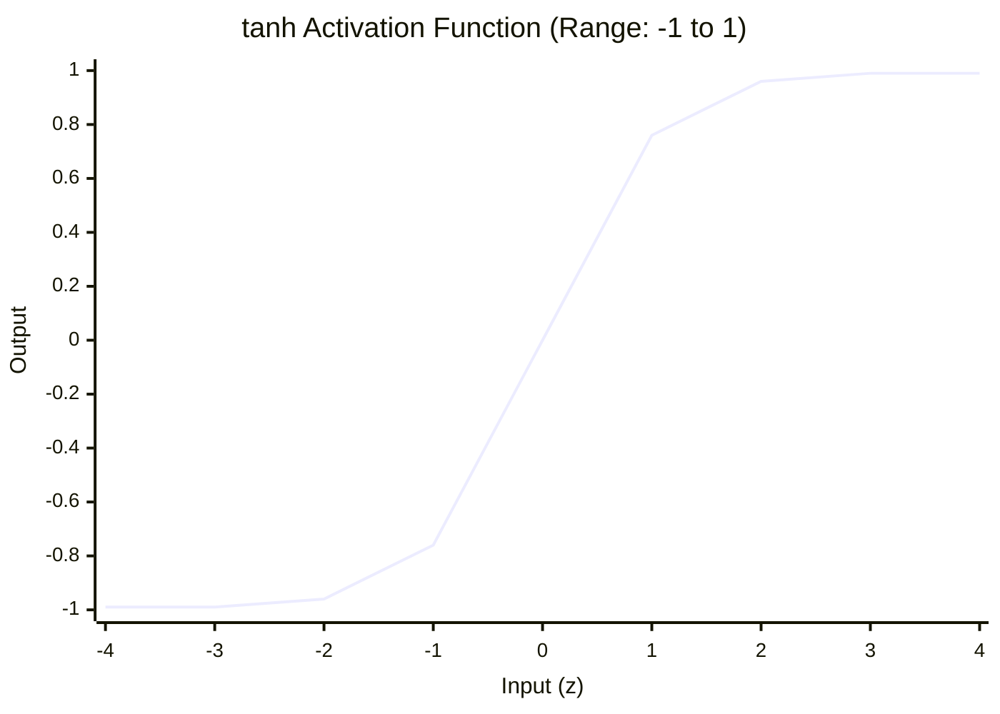

# Chapter 5: Artificial Neurons — The Building Blocks of DL

---

তুমি কি কখনো ভেবেছো — ChatGPT বা Claude-এর ভেতরে আসলে কী ঘটছে?

একদম গোড়ায় গেলে দেখবে, এগুলো কোটি কোটি ছোট ছোট কৃত্রিম নিউরনের পরিবার।

আর এই কৃত্রিম নিউরন বা Perceptron হলো Deep Learning-এর একদম বেসিক বিল্ডিং ব্লক।

ধরো, তুমি একটা বাড়ি বানাতে চাও। সেই বাড়ির একেকটা ইট হলো একেকটা Neuron। ইট না বুঝলে বাড়ি কখনো বুঝবে না। তাই আজকে আমরা এই একটা ইট — মানে একটা Neuron — ভেঙে ভেঙে বুঝবো।

এই Chapter-এ আমরা দেখবো কীভাবে Input Feature, Weight, Bias মিলে একটা Activation Function-এর ভেতর দিয়ে যায়। Sigmoid, ReLU, tanh, Softmax — সব ক্লিয়ার হয়ে যাবে।

তো চলো, মানুষের ব্রেইনের বায়োলজিক্যাল নিউরনের গল্প দিয়ে শুরু করি!


## ১. Hook: মানুষের ব্রেইনের দেখে তৈরি Synapse

আমাদের মাথায় প্রায় ৮৬ বিলিয়ন Biological নিউরন আছে।

প্রতিটি নিউরন অন্য নিউরন থেকে Electrical Signal receive করে।

যখন সেই Signal-গুলোর মিলিত ভোল্টেজ একটা নির্দিষ্ট Threshold পার করে, তখন নিউরনটি Fire করে।

মানে সিগন্যালটা পরের নিউরনে পাস হয়ে যায়।

১৯৫৭ সালে Frank Rosenblatt এই Biological নিউরনের দেখে প্রথম Mathematical Representation তৈরি করেন।

এটাকেই বলা হয় **Perceptron**।


এবার Math-এর ভাষায় বলি —

Input Signal মানে হলো তোমার Input Feature ($X_1, X_2, X_3$)।

Synaptic Strength মানে হলো Weights ($W_1, W_2, W_3$) — কোন Input কতটা গুরুত্বপূর্ণ সেটা ঠিক করে।

নিউরনের Threshold হলো Bias ($B$) — নিউরনটা কত সহজে Fire করবে সেটা ঠিক করে।

আর Firing Logic হলো Activation Function ($f$) — যেটা Output-কে একটা নির্দিষ্ট রেঞ্জে আটকে দেয়।


## ২. Core Concepts: নিউরনের ভেতরের Equation

একটা নিউরনের পুরো Math Equation হলো:

$$Y = f\left(\sum_{i=1}^{n} X_i \cdot W_i + B\right)$$

চলো এই Equation-এর প্রতিটা পার্ট ভেঙে বুঝি।

### Weights — গুরুত্বের পরিমাপ

Weight হলো ফিল্টার।

কোনো Weight-এর মান যত বেশি, Model-এর Decision-এ সেই Input-এর প্রভাব তত বেশি।

ধরো, তুমি বাড়ি কিনবে। তোমার কাছে "লোকেশন রেটিং" অনেক গুরুত্বপূর্ণ — তাই এর Weight হয়তো `০.৮`।

কিন্তু "টাইলসের রঙ" তেমন গুরুত্বপূর্ণ না — তাই এর Weight হয়তো `০.০১`।

### Bias — কখন Fire করবে সেটা ঠিক করে

Bias হলো একটা Constant।

এটা নিউরনের Sensitivity নিয়ন্ত্রণ করে।

Bias কম হলে নিউরনটা সহজে Fire করবে না।

Bias বেশি হলে সামান্য Input পেলেই Output দিয়ে দেবে।

### Activation Function — কেন দরকার?

এবার বড় প্রশ্ন —

নিউরনের ভেতরের Sum-এর মান সরাসরি Output-এ পাঠালে হয় না কেন?

কারণ Activation Function ছাড়া পুরো Neural Network কেবল একটা বিশাল Linear Equation হয়ে যাবে।

আর Linear Equation দিয়ে তুমি Image বা Text-এর মতো জটিল Non-linear Pattern কখনোই শিখতে পারবে না।

Activation Function নেটওয়ার্কে **Non-linearity** যোগ করে।

এটাই তার সবচেয়ে বড় কাজ।

এবার চলো প্রতিটা জনপ্রিয় Activation Function আলাদা করে দেখি।

#### Sigmoid

* **Equation:** $\sigma(z) = \frac{1}{1 + e^{-z}}$
* **রেঞ্জ:** $0$ থেকে $1$।
* **কখন ব্যবহার করবে:** Binary Classification-এর Output Layer-এ। যেখানে Prediction ০ বা ১-এর Probability-তে হতে হয়।
* **খারাপ দিক:** Input খুব বড় বা ছোট হলে Gradient প্রায় শূন্য হয়ে যায়। এটাকে বলে Vanishing Gradient।

#### tanh (Hyperbolic Tangent)

* **Equation:** $tanh(z) = \frac{e^z - e^{-z}}{e^z + e^{-z}}$
* **রেঞ্জ:** $-1$ থেকে $+1$।
* **কখন ব্যবহার করবে:** RNN বা Sequential Decoder-এর Hidden Layer-এ। Output Zero-centered হওয়ায় Optimizer সহজে Converge করে।

#### ReLU (Rectified Linear Unit)

* **Equation:** $f(z) = max(0, z)$
* **রেঞ্জ:** $0$ থেকে $\infty$।
* **কখন ব্যবহার করবে:** আধুনিক Deep Learning-এর Hidden Layer-এর **Default Choice**। Computationally fast আর Vanishing Gradient Problem কমায়।
* **খারাপ দিক:** Input শূন্যের নিচে গেলে Gradient পুরোপুরি Dead হয়ে যায়। এটাকে বলে Dying ReLU।

#### Softmax

* **রেঞ্জ:** $0$ থেকে $1$ (সব Output-এর Sum = ১.০)।
* **কখন ব্যবহার করবে:** Multi-class Classification বা LLM-এর Next Token Prediction-এর Last Output Layer-এ।


## ৩. Activation Function-এর Shape

Activation Function-গুলোর Graph মনে রাখো। এটা তোমার কাজে অনেক আসবে।








## ৪. Real World Example: স্মার্টওয়াচের Sleep Detection

তোমার স্মার্টওয়াচের Accelerometer থেকে তিনটা Data আসছে — Heart Rate, হাত নড়াচড়ার গতি, আর ঘড়ির সময়।

এই তিনটা Data একটা নিউরনে ঢোকে।

ঘুমের সময় Heart Rate-এর Weight অনেক High থাকে।

যদি সব Input-এর Weighted Sum, Bias-এর বাধা পার করে Sigmoid Activation পার করে — আর Output আসে `০.৮৫` —

তাহলে স্মার্টওয়াচ Decision নেয়: তুমি ঘুমিয়ে গেছো।

স্ক্রিনের লাইট অফ!


## ৫. Developer View: NumPy দিয়ে Activation Function Library
Developer Perspective

Developer হিসেবে চলো Python-এ প্রতিটা জনপ্রিয় Activation Function আর তাদের Derivative স্ক্র্যাচ থেকে Code করি।

এটা করলে Math Concept ক্রিস্টাল ক্লিয়ার হয়ে যাবে।

```python
import numpy as np

# ১. Sigmoid
def sigmoid(z):
    return 1 / (1 + np.exp(-z))

def sigmoid_derivative(z):
    s = sigmoid(z)
    return s * (1 - s)

# ২. ReLU
def relu(z):
    return np.maximum(0, z)

def relu_derivative(z):
    return np.where(z > 0, 1, 0)

# ৩. tanh
def tanh(z):
    return np.tanh(z)

def tanh_derivative(z):
    return 1 - np.tanh(z)**2

# ৪. Softmax
def softmax(z):
    exp_z = np.exp(z - np.max(z)) # np.max(z) subtracted to prevent overflow
    return exp_z / np.sum(exp_z, axis=0)

# Test রান
test_input = np.array([-2.0, 0.0, 3.0])
print("Inputs:", test_input)
print("ReLU Output:", relu(test_input))
print("Sigmoid Output:", sigmoid(test_input))
print("Softmax Probabilities:", softmax(test_input))
```


## ৬. Production Reality: Dying ReLU আর তার Solution
Production Reality

Production-এ Deep Learning Model Train করতে গিয়ে হঠাৎ দেখলে — Loss একদম Stuck।

কোনো Weight Update হচ্ছে না।

এটাই **Dying ReLU** Problem।

কারণটা সোজা — ReLU Negative Input-এ Zero Return করে।

তাই কোনো নিউরন যদি বড় Negative Input পায়, সে চিরতরে Dead হয়ে যায়।

কোনো Signal আর পাস হয় না।

**Solution কী?**

Hidden Layer-এ ReLU-র বদলে **Leaky ReLU** বা **GELU** ব্যবহার করো।

**Leaky ReLU:** $f(z) = max(0.01z, z)$

এটা Negative Input-এ পুরোপুরি Zero না দিয়ে একটু হালকা Signal পাস করতে দেয়।

ফলে নিউরন কখনো পুরোপুরি মরে যায় না।

**GELU:** আধুনিক LLM আর Transformer (GPT-4, Llama) মডেলে GELU Standard Hidden Activation হিসেবে ব্যবহার হয়।


## ৭. Common Mistake
Common Mistake

**ভুল ধারণা:** Multi-class Classification-এর Last Layer-এও ReLU বা Sigmoid বসিয়ে রাখা।

**বাস্তবতা:** যদি মডেলকে ৩ বা তার বেশি ক্লাসের মধ্যে একটা বেছে নিতে বলো (যেমন — ছবি দেখে আম, জাম নাকি কাঁঠাল বলা) — তাহলে Last Layer-এ অবশ্যই **Softmax** ব্যবহার করতে হবে।

Sigmoid বা ReLU দিলে Output-গুলোর Sum কখনো ১.০ হবে না।

ফলে Probability হিসেব করাই যাবে না।


## ৮. Mental Model: ক্লাবের সিকিউরিটি গার্ড

Activation Function-কে এভাবে ভাবো —

**সে একটা ক্লাবের কড়া সিকিউরিটি গার্ড।**

সে Input Signal-এর Weight চেক করে।

যদি Input তার পছন্দের Criteria পার করে — গেট খুলে দেয়, Signal ভেতরে ঢোকে।

আর যদি Criteria Fill না করে — গেটেই Block।

সোজা কথা।


## ৯. Mini Project: NumPy দিয়ে একটা Neuron-এর Forward Pass

চলো NumPy দিয়ে একটা Single Perceptron-এর Forward Pass স্ক্র্যাচ থেকে Code করি।

```python
import numpy as np

# ১. Input Feature: [ইউজারের বয়স, সাবস্ক্রিপশন মাস, ব্রাউজিং আওয়ার]
X = np.array([28.0, 12.0, 5.5])

# ২. Weights ও Bias (ইনিশিয়ালাইজড)
W = np.array([0.05, 0.25, -0.4])
B = 1.2

# ৩. অ্যাক্টিভেশন Function (Leaky ReLU)
def leaky_relu(z):
    return np.maximum(0.01 * z, z)

# ৪. গাণিতিক ফরোয়ার্ড পাস
# Step 1: Linear Sum Z = X * W + B
Z = np.dot(X, W) + B

# Step 2: Activation Out = leaky_relu(Z)
Out = leaky_relu(Z)

print(f"Linear Sum (Z): {Z:.4f}")
print(f"Neuron Final Output: {Out:.4f}")
```


## ১০. Interview Questions

### Beginner

**প্রশ্ন:** একটা Perceptron-এর Equation ব্যাখ্যা করো।

**উত্তর:** Equation হলো $Y = f(X \cdot W + B)$। এখানে $X$ হলো Input Feature, $W$ হলো Weight Matrix, $B$ হলো Bias আর $f$ হলো Activation Function — যেটা Output Range ফিক্স করে আর Non-linearity যোগ করে।

### Intermediate

**প্রশ্ন:** Neural Network-এ Activation Function না দিলে কী হবে?

**উত্তর:** Activation Function ছাড়া পুরো Network কেবল একটা Linear Regression Equation হিসেবে কাজ করবে। Layer যতই বাড়াও, Network কোনো Non-linear Feature (Image Object বা Text Context) শিখতে পারবে না।

### Advanced

**প্রশ্ন:** Dying ReLU কী আর Leaky ReLU কীভাবে এটা Solve করে?

**উত্তর:** ReLU-এর Input Negative হলে Output আর Gradient দুটোই Zero হয়ে যায়। নিউরন Forever Dead — কোনো Weight Update হয় না। Leaky ReLU Negative Input-এ Zero-র বদলে খুব ছোট Slope ($0.01 \cdot z$) দেয়। ফলে Backpropagation-এ Signal পাস চালু থাকে আর নিউরন Alive থাকে।


## Chapter Summary

* **Artificial Neuron** হলো Input-এর সাথে Weight-এর গুণফল আর Bias-এর যোগফল।
* **Activation Function** Non-linearity যোগ করে জটিল Pattern Learning সম্ভব করে।
* **ReLU** Hidden Layer-এর সবচেয়ে Popular Choice, আর **Softmax** Multi-class-এর Last Layer-এর Driver।


## What's Next?

একটা Neuron বুঝে ফেলেছো। দারুণ!

পরের Chapter-এ আমরা এই কোটি কোটি Neuron-কে Layer-এ Layer-এ সাজিয়ে একটা পুরো Neural Network বানাবো।

আর শিখবো Backpropagation-এর Chain Rule Math — **Chapter 6: Deep Feedforward Networks & Backpropagation**।

**Chapter 5 শেষ।**
