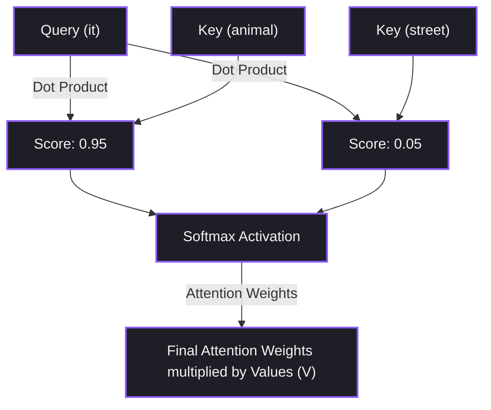

# Chapter 7: Transformers — The Architecture That Changed Everything


তুমি কি কখনো ভেবেছো — আজকে তুমি যে ChatGPT, Claude, Llama বা Midjourney ব্যবহার করছো, এদের সবার পেছনে কোন ম্যাজিক কাজ করছে?

উত্তর হলো — Transformer।

২০১৭ সালে Google-এর একটা Research Paper বের হয়। নাম ছিল *"Attention Is All You Need"*।

এই একটা Paper পুরো AI দুনিয়া ওলট-পালট করে দিয়েছে।

আগে AI Model-গুলো শব্দ একটার পর একটা পড়তো। ধীরে ধীরে। আর লম্বা বাক্য হলে আগের কথা ভুলে যেতো।

Transformer এসে বললো — "আমি সব শব্দ একসাথে পড়বো। এক নজরে পুরো বাক্য বুঝবো।"

এই Chapter-এ আমরা ঠিক সেটাই ভাঙবো।

Self-Attention কী? Multi-Head Attention কেন দরকার? আর কীভাবে এই Architecture পুরো AI Revolution-এর ভিত্তি হয়ে গেলো?

চলো একটা গল্প দিয়ে শুরু করি।


## ১. দুই ধরনের পাঠকের গল্প

তোমার সামনে একটি ৩০০ পৃষ্ঠার বই।

বলা হলো — এই বইয়ের ভেতর থেকে একটি প্রশ্নের উত্তর খুঁজে বের করো।

এখন দুটো পড়ার Style দেখো।

### Style ১ — The RNN Reader

সে বইয়ের প্রথম পাতার প্রথম শব্দ থেকে পড়া শুরু করলো।

প্রতিটা শব্দ একটার পর একটা পড়ছে।

আগের লাইনের কথা মাথায় রেখে সামনে যাচ্ছে।

কিন্তু যখন সে ১৫০ পৃষ্ঠায় পৌঁছালো, তখন প্রথম ১০ পৃষ্ঠার কথা প্রায় ভুলে গেছে।

এটাই RNN-এর সবচেয়ে বড় সমস্যা — Vanishing Memory।

### Style ২ — The Transformer Reader

সে পুরো বইটা এক সেকেন্ডে টেবিলের উপর মেলে ধরলো।

এক নজরে পুরো পৃষ্ঠার Keyword স্ক্যান করলো।

প্রতিটা শব্দের সাথে অন্যান্য শব্দের সম্পর্ক বুঝে নিলো।

নিমিষেই উত্তর খুঁজে বের করলো।

এটাই Transformer। এটাই Parallel Processing।


## ২. RNN/LSTM কেন ব্যর্থ হলো?


Transformer আসার আগে Text Processing হতো RNN আর LSTM দিয়ে।

কিন্তু দুটো বড় সমস্যা ছিল।

প্রথম সমস্যা — Parallel Processing সম্ভব ছিল না।

আগের শব্দ Process না করলে পরের শব্দে যাওয়া যেতো না।

GPU-র বিশাল ক্ষমতা অলস বসে থাকতো।

দ্বিতীয় সমস্যা — বাক্য লম্বা হলে প্রথম দিকের শব্দ ভুলে যেতো।

এটাকেই বলে Vanishing Gradient।

Transformer এই দুটো সমস্যাই একবারে সমাধান করেছে।


## ৩. Self-Attention কীভাবে কাজ করে?

Self-Attention-এর কাজ হলো — বাক্যের প্রতিটা শব্দের সাথে বাক্যের অন্যান্য শব্দের সম্পর্ক বের করা।

একটু খোলাসা করি।

ধরো একটা বাক্য:

*"The animal didn't cross the street because **it** was too tired."*

এখানে **it** বলতে কী বোঝানো হচ্ছে?

Animal? নাকি Street?

মানুষ সহজেই বোঝে — **it** মানে Animal।

কিন্তু Computer কীভাবে বুঝবে?

Self-Attention এখানেই কাজ করে।

সে বাক্যের প্রতিটা শব্দের সম্পর্ক Score Calculate করে।

দেখে — **it**-এর সাথে **animal**-এর সম্পর্ক ৯৫%।

আর **street**-এর সাথে মাত্র ৫%।

তাই Model বুঝে যায় — **it** মানে **animal**।


## ৪. Q, K, V — তিনটা Vector-এর গল্প

Self-Attention Calculate করতে প্রতিটা শব্দ তিনটা Vector-এ Convert হয়।

এটা অনেকটা Database Query-এর মতো কাজ করে।

**Query কী?**

তুমি যা খুঁজছো।

যেমন — "it" শব্দটা জানতে চাইছে: "আমি আসলে কে?"

**Key কী?**

প্রতিটা শব্দের পরিচয়পত্র।

বাক্যের অন্যান্য শব্দ বলছে: "আমি animal", "আমি street"।

**Value কী?**

প্রতিটা শব্দের আসল অর্থ বা Context।

সহজ কথায় — Query জিজ্ঞেস করে, Key পরিচয় দেয়, আর Value আসল তথ্য বহন করে।

### Attention-এর Equation

$$Attention(Q, K, V) = Softmax\left(\frac{Q \cdot K^T}{\sqrt{d_k}}\right) \cdot V$$

এখানে $\sqrt{d_k}$ হলো Scaling Factor।

এটা Gradient-কে স্থিতিশীল রাখতে সাহায্য করে।


## ৫. Multi-Head Attention কেন দরকার?

Model যদি বাক্যের দিকে শুধু এক নজরে তাকায়, তাহলে অনেক সূক্ষ্ম বিষয় মিস করতে পারে।

তাই Transformer একই সাথে একাধিক চোখ দিয়ে বাক্যের দিকে তাকায়।

এটাই Multi-Head Attention।

প্রতিটা Head আলাদা জিনিস দেখে।

একটা Head হয়তো Subject-Verb-এর সম্পর্ক দেখছে।

আরেকটা Head দেখছে Pronoun কার দিকে Point করছে।

আরেকটা Head দেখছে Time বা Location-এর সম্পর্ক।

সব Head-এর ফলাফল একসাথে জোড়া লাগিয়ে Model একটা Complete Picture পায়।


## ৬. Attention Matrix দেখে বোঝো

Attention কীভাবে দুটো শব্দের Dot Product দিয়ে Score বের করে, সেটা দেখো:




## ৭. Real World Example — Google Translate কীভাবে ভুল এড়ায়?

Google Translate-এ যখন তুমি লেখো:

*"The bank of the river is beautiful."*

এখানে **bank** মানে কী?

নদীর পার? নাকি যেখানে টাকা রাখা হয়?

Transformer Self-Attention দিয়ে **bank** আর **river**-এর সম্পর্ক ধরে ফেলে।

Score আসে ৯৮%।

তাই সঠিক বাংলা অনুবাদ হয়: *"নদীর তীরটি সুন্দর।"*

ভুল করে "ব্যাংক" বলে না।


## ৮. Developer View — PyTorch দিয়ে Self-Attention তৈরি করো

💻 Developer View

চলো PyTorch দিয়ে একটা Custom Scaled Dot-Product Attention Layer স্ক্র্যাচ থেকে তৈরি করি।

এটা $Q$, $K$, $V$ Projection করে Output দেবে।

```python
import torch
import torch.nn as nn
import torch.nn.functional as F

class ScaledDotProductAttention(nn.Module):
    def __init__(self, d_model):
        super(ScaledDotProductAttention, self).__init__()
        self.d_k = d_model
        
    def forward(self, Q, K, V):
        # Step 1: Q * K^T
        scores = torch.matmul(Q, K.transpose(-2, -1))
        
        # Step 2: Scale by sqrt(d_k)
        scores = scores / torch.sqrt(torch.tensor(self.d_k, dtype=torch.float32))
        
        # Step 3: Softmax to get Attention Weights
        attention_weights = F.softmax(scores, dim=-1)
        
        # Step 4: Multiply by V
        output = torch.matmul(attention_weights, V)
        
        return output, attention_weights

# Test রান
# Batch_size=1, Sequence_length=3, Embed_dim=4
q = torch.randn(1, 3, 4)
k = torch.randn(1, 3, 4)
v = torch.randn(1, 3, 4)

attention_layer = ScaledDotProductAttention(d_model=4)
output, weights = attention_layer(q, k, v)

print("Attention Output Shape:", output.shape) # Expected: [1, 3, 4]
print("Attention Weights Matrix:\n", weights[0])
```


## ৯. Production Reality — FlashAttention

🏭 Production Reality

Self-Attention-এর একটা বড় সমস্যা আছে।

বাক্য যত লম্বা হয়, Compute Cost আর Memory খরচ Square-এ বাড়ে।

মানে $O(N^2)$ Complexity।

বাক্য দ্বিগুণ লম্বা হলে GPU Memory খরচ হবে ৪ গুণ!

তাহলে Production-এ কী করে?

আধুনিক LLM Serving Engine যেমন vLLM, TensorRT — এরা FlashAttention ব্যবহার করে।

FlashAttention Math-এর Equation বদলায় না।

সে GPU-র দ্রুত Memory (SRAM) আর ধীর Memory (HBM)-এর মধ্যে Data Transfer Optimize করে।

ফলে Compute Speed ৩ থেকে ৫ গুণ বাড়ে।

আর Memory Footprint অনেক কমে যায়।


## ১০. Common Mistake

ভুল ধারণা:

Transformer নিজে নিজেই বোঝে কোন শব্দ আগে এসেছে, কোনটা পরে।

বাস্তবতা:

Self-Attention-এ সব শব্দ একসাথে Parallel Process হয়।

তাই Model শব্দের Order ভুলে যায়।

*"Cat chased Dog"* আর *"Dog chased Cat"* — Model-এর কাছে দুটো একই মনে হবে।

এটা সমাধান করতে Input Embedding-এর সাথে Positional Encoding যোগ করতে হয়।

Positional Encoding হলো সাইন-কোসাইন তরঙ্গের Vector।

এটা যোগ করলে Model বুঝতে পারে কোন শব্দ বাক্যের কোথায় আছে।


## ১১. Mental Model — ককটেল পার্টি

Self-Attention বুঝতে একটা সহজ উদাহরণ দিই।

ধরো তুমি একটা শোরগোলপূর্ণ ককটেল পার্টিতে আছো।

তুমি হলে Query।

ঘরের সবার কণ্ঠস্বর হলো Key।

তুমি সবার কণ্ঠ স্ক্যান করছো।

যার কণ্ঠ আর Personality তোমার সাথে সবচেয়ে বেশি মেলে, তার Attention Score সবচেয়ে বেশি।

তুমি শুধু তার কথাই শুনছো — সেটা হলো Value।

বাকি সবার কথা Noise হিসেবে Filter হয়ে যাচ্ছে।

Self-Attention ঠিক এভাবেই কাজ করে।


## ১২. Mini Project — NumPy দিয়ে Attention Score Calculate করো

চলো কোনো Framework ছাড়া শুধু NumPy দিয়ে একটা ৩ শব্দের বাক্যের Attention Matrix তৈরি করি।

```python
import numpy as np

# ৩টি শব্দের এম্বেডিংস (Sequence Length=3, Dimension=2)
# বাক্য: "I love AI"
Q = np.array([[1.0, 0.0], [0.0, 1.0], [1.0, 1.0]])
K = Q # Self-Attention এ Q এবং K সমান হয়

# ১. ডট প্রোডাক্ট স্কোর (Q * K^T)
scores = np.dot(Q, K.T)

# ২. Scaling (Dimension = 2, so sqrt(2) = 1.414)
scaled_scores = scores / np.sqrt(2)

# ৩. সফটম্যাক্স Function (প্রতিটি রো এর জন্য)
def softmax(x):
    exp_x = np.exp(x - np.max(x, axis=-1, keepdims=True))
    return exp_x / np.sum(exp_x, axis=-1, keepdims=True)

attention_matrix = softmax(scaled_scores)

print("Scratch Attention Matrix (Row sums to 1.0):")
print(attention_matrix)
```


## ১৩. Interview Questions

### Beginner

**প্রশ্ন:** কেন পুরোনো RNN/LSTM-এর বদলে এখন Transformer ব্যবহার করা হয়?

**উত্তর:** RNN/LSTM Sequential Processing-এ চলে। তাই Parallel GPU Compute করা যেতো না। আর বাক্য বড় হলে পেছনের শব্দ ভুলে যেতো। Transformer Self-Attention ব্যবহার করে সব শব্দ একসাথে Parallel Process করে। কোনো Memory ক্ষয় ছাড়াই Long Context Handle করতে পারে।

### Intermediate

**প্রশ্ন:** Self-Attention-এর $Query (Q)$, $Key (K)$ আর $Value (V)$ কী কাজ করে?

**উত্তর:** Query হলো একটা শব্দের Search Query — সে জানতে চায় অন্য শব্দগুলোর সাথে তার সম্পর্ক কী। Key হলো প্রতিটা শব্দের Identity Vector — Query-এর সাথে Dot Product করে Relation Score বের করে। আর Value হলো শব্দের আসল Information — Attention Weight দিয়ে গুণ হয়ে Final Output তৈরি করে।

### Advanced

**প্রশ্ন:** FlashAttention কীভাবে Transformer-এর $O(N^2)$ Memory সমস্যা সমাধান করে?

**উত্তর:** FlashAttention Math-এর Equation বদলায় না। এটা মূলত Memory Optimization Technique। GPU-র ধীর বড় Memory (HBM) থেকে দ্রুত ছোট On-chip Memory (SRAM)-তে Block by Block Data Load করে Computation চালায়। Softmax On-the-fly Calculate করে Memory Read/Write Overhead কমিয়ে দেয়।


## Chapter Summary

Transformer Parallel Processing সম্ভব করে AI-তে Revolutionary Speed আর Scale এনেছে।

Self-Attention বাক্যের প্রতিটা শব্দের সাথে অন্যান্য শব্দের সম্পর্ক বের করে।

$Q$, $K$, $V$ Vector-এর Dot Product আর Softmax-ই Transformer-এর মূল চালিকাশক্তি।


## What's Next?

পরের Chapter-এ আমরা Transformer-এর Input Layer ভাঙবো।

কীভাবে Raw Text ভেঙে Token তৈরি হয়? কীভাবে Token High-dimensional Embedding Vector-এ রূপ নেয়? আর Context Window কীভাবে কাজ করে?

**Chapter 8: Under the Hood — Tokens, Embeddings & Context Window**-এ দেখা হচ্ছে।

**Chapter 7 শেষ।**
