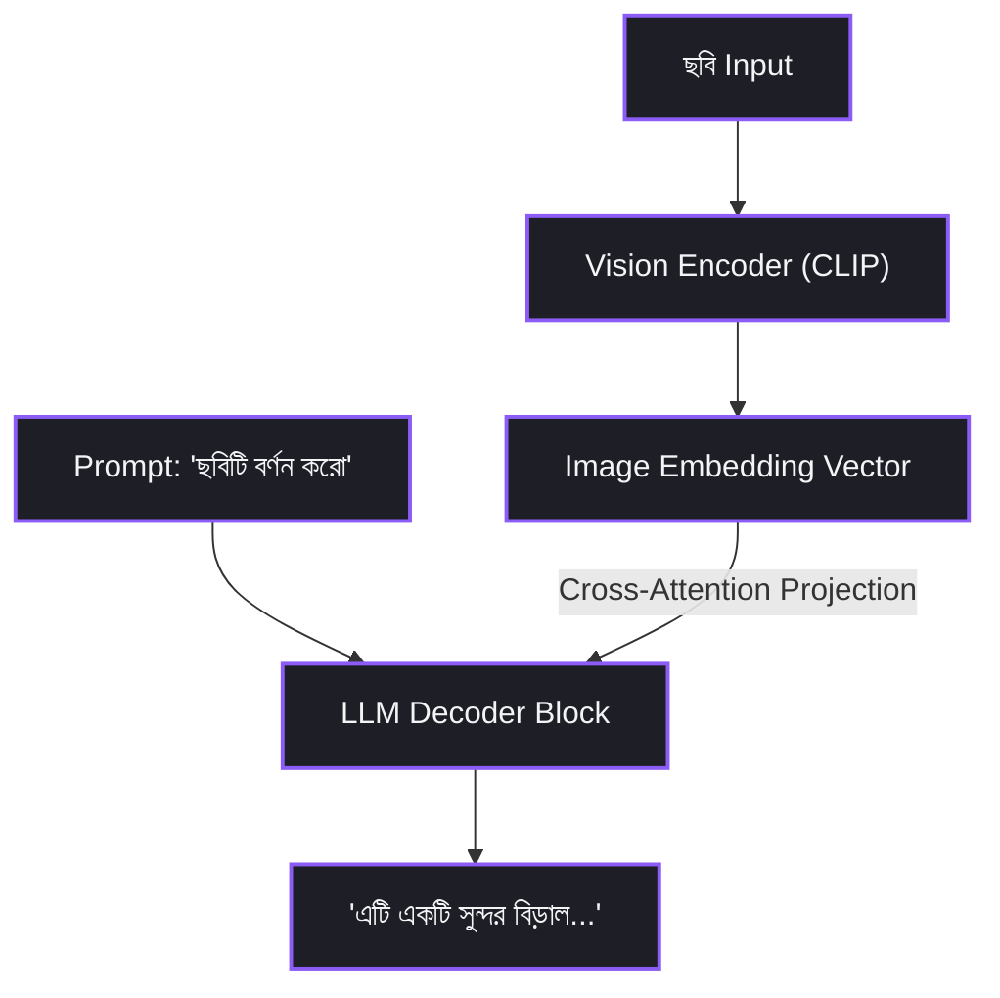

# Chapter 9: The LLM Ecosystem — Decoder-only, Encoder-only & Encoder-Decoder


ধরো তোমার ই-কমার্স সাইটে Customerদের কমেন্ট Positive না Negative সেটা বুঝতে হবে। তুমি কি এই কাজে GPT-4 API কল করবে? সেটা করলে প্রতি মাসে হাজার ডলার বিল আসবে। অথচ একটা ছোট্ট BERT Model একদম ফ্রিতে, ১ মিলি-সেকেন্ডে এই কাজটা করে দিতে পারে! সহজ কথায় — সব কাজের জন্য একই Model ব্যবহার করা চরম অপচয়।

তো চলো দেখি AI-এর তিন ধরনের Architecture কীভাবে কাজ করে — Encoder-only (BERT) যে ইনফরমেশন খুঁজে বের করে, Decoder-only (GPT/Llama) যে গল্প লেখে, আর Encoder-Decoder (T5) যে অনুবাদ করে। সাথে দেখব Vision Model, Diffusion Model আর Audio Model-এর ভেতরের Mechanism। এটা আমাদের প্রথম ৮টি তাত্ত্বিক চ্যাপ্টারের ফাইনাল ম্যাপ — এরপর থেকে সরাসরি Vector Database, RAG, Fine-Tuning আর প্রোডাকশন Blueprint-এর কাজ শুরু!


## ১. তিন কারিগরের এক অদ্ভুত গল্প

একটি ভার্চুয়াল রাজপ্রাসাদে তিনজন খুব দক্ষ কারিগর আছেন।

### প্রথম কারিগর — BERT, The Inspector

তাকে একটি সম্পূর্ণ বাক্য দিলে সে কী করে?

বাক্যের ডান-বাম, আগে-পরে সব শব্দ স্ক্যান করে।

মাঝখানে কোনো শব্দ লুকানো বা মুছে গেলে? সে সেটা perfectly উদ্ধার করে দেয়।

সে দারুণ গোয়েন্দা। দারুণ বিশ্লেষক।

কিন্তু নতুন কোনো বাক্য লিখতে পারে না।

একে বলে **Encoder-only**।

### দ্বিতীয় কারিগর — GPT, The Storyteller

সে খুব ভালো গল্প লেখক।

তাকে শুধু একটি শুরুর শব্দ বা Prompt দাও।

সে তার আগের শব্দের স্মৃতি মাথায় রেখে একের পর এক Token জেনারেট করে।

পুরো একটা উপন্যাস লিখে দিতে পারবে!

সে কেবল সামনের দিকে তাকাতে পারে। মানে Autoregressive।

একে বলে **Decoder-only**।

### তৃতীয় কারিগর — T5, The Translator

সে একটি বাক্য সম্পূর্ণ শুনে আগে অর্থটা বোঝে।

তারপর সেটাকে অন্য ভাষায় বা অন্য Format-এ convert করে Output দেয়।

যেমন বাংলা থেকে ইংরেজি অনুবাদ।

অথবা বড় আর্টিকেলের Summary তৈরি করা।

একে বলে **Encoder-Decoder**।


## ২. Model পরিবারের ভেতরের কাজ

### Encoder-only — BERT পরিবার

BERT কীভাবে কাজ করে?

সে **Bidirectional Attention** ব্যবহার করে।

মানে কী? মানে প্রতিটি Token বাক্যের বাম আর ডান — দুই দিকেই তাকাতে পারে।

সব Token একসাথে দেখে।

Train করার সময় কী হয়?

বাক্যের ১৫% শব্দ র্যান্ডমলি মুছে দেওয়া হয়।

তারপর Model-কে বলা হয় — বলো তো, মুছে যাওয়া শব্দটা কী ছিল?

এটাকে বলে Masked Language Modeling।

কোন কাজে লাগে?

Sentiment Analysis। Search Keyword Matching। Named Entity Recognition।

সহজ কথায় — যেখানে বুঝতে হয়, সেখানে BERT।


### Decoder-only — GPT আর Llama পরিবার

GPT কীভাবে কাজ করে?

সে **Causal Masked Attention** ব্যবহার করে।

মানে কী? মানে কোনো Token তার সামনের শব্দ দেখতে পায় না।

শুধু পেছনের শব্দগুলো দেখে।

আর সেগুলো থেকে পরবর্তী শব্দটা Predict করে।

এটাকে বলে Causal Language Modeling।

কোন কাজে লাগে?

Chat, Code Writing, Creative Writing।

এটাই বর্তমান AI Agent-এর মূল ব্রেইন।


### Encoder-Decoder — T5 আর BART পরিবার

এদের Structure একটু আলাদা।

Input-এর জন্য একটি আলাদা Encoder Block।

Output তৈরির জন্য একটি আলাদা Decoder Block।

দুটো মিলে কাজ করে।

কোন কাজে লাগে?

Text Summarization। Language Translation। Custom Format Conversion।


### Multi-modal AI — শুধু Text না, আরও অনেক কিছু

#### Vision-Language Models

GPT-4o বা Llama 3.2 Vision-এর কথা শুনেছো?

এরা ছবিও বোঝে, টেক্সটও বোঝে।

কীভাবে?

একটি **Vision Encoder** থাকে — যেমন CLIP।

সে ছবিকে Embedding Vector-এ convert করে।

তারপর সেই Vector একটি Projection Layer দিয়ে সরাসরি LLM Decoder-এ ঢুকে যায়।

ফলে Model ছবি আর টেক্সট — দুটোকেই একই Space-এ বুঝতে পারে।

#### Image Generation — Diffusion Models

Flux, Stable Diffusion — এদের নাম শুনেছো?

এরা কিন্তু Transformer দিয়ে সরাসরি ছবি বানায় না।

এরা কাজ করে **Denoising** পদ্ধতিতে।

প্রথমে একটা র্যান্ডম Noise নেয়। হিজিবিজি Pixel।

তারপর Text Embedding-এর সাথে মিলিয়ে ধাপে ধাপে সেই Noise সরিয়ে ফেলে।

শেষে বের হয় একটা সুন্দর ছবি।

#### Audio Models — Whisper

Whisper কীভাবে কাজ করে?

Raw Audio Frequency-কে আগে Spectrogram Image-এ convert করে।

তারপর Sequence-to-Sequence Transformer দিয়ে সেই Image থেকে সরাসরি Text বের করে।


## ৩. Vision Language Model Pipeline

ভিশন AI কীভাবে কাজ করে তা দেখলে ম্যাজিক মনে হয়।

কিন্তু আসলে এটা সাধারণ Vector Projection Layer।




## ৪. Real World Example — সেন্টিমেন্ট Classifier

তোমার একটি ই-কমার্স স্টোর আছে।

Customer-রা বারবার কমেন্ট করছে।

তোমাকে বুঝতে হবে — কমেন্টটা Positive না Negative?

### ভুল সিদ্ধান্ত

প্রতিটি Customer কমেন্টের জন্য GPT-4 API কল করা।

কী হবে?

Latency বাড়বে। বিল আকাশে উঠবে।

### সঠিক সিদ্ধান্ত

Hugging Face থেকে একটি ১০০ মিলিয়ন Parameter-এর ফ্রী **DeBERTa** Model ডাউনলোড করো।

লোকাল সার্ভারে Deploy করো।

এটি ১ মিলি-সেকেন্ডে ফ্রিতে Sentiment Classify করে দেবে।

তারপর Database-এ সেভ করে দেবে। ব্যস!


## ৫. Developer View — Hugging Face দিয়ে তিন ধরনের Task

চলো Python-এ Hugging Face `transformers` Library ব্যবহার করে তিনটি আলাদা কাজ করি।

BERT দিয়ে Classification।

GPT-2 দিয়ে Text Generation।

আর Vision Model দিয়ে Image Classification।

```python
from transformers import pipeline

# ১. ENCODER-ONLY (DeBERTa/BERT for Sentiment Analysis)
print("Loading Sentiment Classifier...")
classifier = pipeline("sentiment-analysis", model="distilbert-base-uncased-finetuned-sst-2-english")
res_sentiment = classifier("I love this AI Engineering book! It makes math so easy.")
print("Sentiment Result:", res_sentiment)

# ২. DECODER-ONLY (GPT-2 for Text Generation)
print("\nLoading Story Generator...")
generator = pipeline("text-generation", model="gpt2")
res_generator = generator("In the future, AI engineers will", max_length=30, num_return_sequences=1)
print("Generated Text:\n", res_generator[0]['generated_text'])

# ৩. VISION MODEL (Image Classification)
print("\nLoading Object Detector...")
detector = pipeline("image-classification", model="google/vit-base-patch16-224")
# Note: You can pass a local image path or URL here
# res_image = detector("https://example.com/cat.jpg")
# print("Detected Object:", res_image)
```


## ৬. Production Reality — vLLM বনাম Ollama

অনেক Developer প্রোডাকশনে কী করেন?

Classical FastAPI দিয়ে Raw Hugging Face Model লোড করে বসেন।

কী হয়?

খুব Slow হয়। Concurrent Request-এ Crash করে।

তাহলে সঠিক উপায় কী?

### vLLM

এটিতে **PagedAttention** নামে একটি Mechanism আছে।

কী করে এটা?

Operating System-এর Virtual Memory-এর মতো Model-এর KV-Cache Memory-কে Page আকারে ভাগ করে।

ফলে GPU Serving Speed ১০ গুণ বেড়ে যায়।

Concurrency-ও Drastically বাড়ে।

### Ollama / llama.cpp

CPU-তে বা Personal MacBook-এ বা Windows Computer-এ Model চালাতে চাও?

তাহলে এটাই Best Choice।

Quantized GGUF Model লোকালে Fast Run করে।


## ৭. Common Mistake

ভুল ধারণা:

GPT বা Llama-র Context Window ১২৮k Token। তাহলে ১ লাখ Token-এর Document দিলে সে ১০০% Perfect উত্তর দেবে।

বাস্তবতা:

এটাকে বলে **Lost in the Middle** সমস্যা।

গবেষণায় দেখা গেছে — Decoder Model Context-এর শুরু আর শেষ ভালো মনে রাখে।

কিন্তু ঠিক মাঝখানের Information?

সেটা মিস করে ফেলে। Filter আউট হয়ে যায়।

তাহলে উপায় কী?

প্রোডাকশনে বড় Document অন্ধভাবে Context-এ ফিড করো না।

RAG ব্যবহার করো। Re-ranking করো।

এটাই বুদ্ধিমানের কাজ।


## ৮. Mental Model — তিন লেখকের এডিটিং প্যানেল

LLM পরিবারকে একটা সহজ ছবিতে মনে রাখো।

**Encoder-only** হলো তোমার কড়া Proof-reader।

খাতার সব লেখা একসাথে দেখে বানান ভুল ধরে।

**Decoder-only** হলো সেই কবি।

খাতার ডান পৃষ্ঠা হাত দিয়ে ঢেকে রাখে।

বাম থেকে ডানে সুন্দর করে কবিতা লিখে যায়।

**Encoder-Decoder** হলো দক্ষ দোভাষী।

পুরো বাক্য মন দিয়ে শোনে। তারপর অন্য ভাষায় Translation দেয়।


## ৯. Mini Project — Next Token Probability Generator

চলো NumPy ব্যবহার করে একটি কাল্পনিক Decoder-এর শেষ Layer-এর Logits থেকে Softmax চালাই।

দেখি পরবর্তী সম্ভাব্য শব্দের Probability কত হয়।

```python
import numpy as np

# ভোকাবুলারি ম্যাপ
vocab = {0: "AI", 1: "is", 2: "magic", 3: "banana"}

# Model-এর ডিকোডার শেষ লেয়ারের রিয়েল Output স্কোর (Logits)
logits = np.array([8.2, 5.1, 9.5, -2.1])

# ১. সফটম্যাক্স Function প্রবাবিলিটি বের করার জন্য
def softmax(x):
    e_x = np.exp(x - np.max(x))
    return e_x / e_x.sum()

probabilities = softmax(logits)

# ২. সম্ভাব্যতা প্রিন্ট করো
print("Word Probability mapping:")
for idx, prob in enumerate(probabilities):
    print(f"'{vocab[idx]}' -> Probability: {prob * 100:.2f}%")

# ৩. Greedy Decoding (সর্বোচ্চ প্রবাবিলিটির শব্দ সিলেক্ট)
next_token_id = np.argmax(probabilities)
print(f"\nPredicted next token: '{vocab[next_token_id]}' with {probabilities[next_token_id]*100:.2f}% confidence!")
```


## ১০. Interview Questions

### Beginner

**প্রশ্ন:** Encoder-only আর Decoder-only-এর মধ্যে মূল তফাত কী?

**উত্তর:**

Encoder-only Model Bidirectional Attention ব্যবহার করে।

মানে বাক্যের সব Information একসাথে প্রসেস করে।

তাই Classification আর Extraction-এ Best Perform করে।

Decoder-only Model Causal Masked Attention ব্যবহার করে।

মানে শুধু আগের শব্দ দেখে পরের শব্দ Generate করে।

তাই Text Generation আর Chat-এ ব্যবহৃত হয়।

### Intermediate

**প্রশ্ন:** PagedAttention কী? vLLM-এ এটি কীভাবে Memory বাঁচায়?

**উত্তর:**

PagedAttention হলো Operating System-এর Virtual Memory-এর মতো একটি Technique।

LLM Serving-এর সময় KV-Cache Memory আগে র্যান্ডম আর Fragmented আকারে Memory Block নষ্ট করতো।

PagedAttention সেই Memory-কে Fixed Size-এর Virtual Page-এ ভাগ করে ফেলে।

ফলে Memory Wastage শূন্যে নামে।

GPU Serving Concurrency অনেক গুণ বেড়ে যায়।

### Advanced

**প্রশ্ন:** Lost in the Middle সমস্যাটি কী? RAG-কে কীভাবে প্রভাবিত করে?

**উত্তর:**

Model-এর Context Window যতই বড় হোক — সে Input-এর মাঝখানের তথ্য ভালোভাবে Attend করতে পারে না।

শুরু আর শেষে Attention বেশি থাকে।

RAG System-এ যখন অনেক Document ডাম্প করা হয়, প্রয়োজনীয় উত্তর যদি মাঝখানে পড়ে — Model Hallucinate করতে পারে।

সমাধান কী?

Cohere বা BGE Re-ranker Model ব্যবহার করে সেরা ৫টি Relevant Document শুরুতে পুশ করতে হয়।


## Chapter Summary

**BERT** — গোয়েন্দার মতো Information রিড করে আর Classify করে।

**GPT** — লেখকের মতো Autoregressive স্টাইলে Text Generate করে।

**vLLM** আর **Ollama** — প্রোডাকশন Model Serving-এর আধুনিক Gold Standard।


## What's Next?

প্রথম ৯টি Chapter-এ আমরা ML, Deep Learning, Neural Network, Backpropagation, Transformer আর LLM Ecosystem — সবকিছুর Foundation শেষ করেছি।

পরবর্তী Chapter-এ আমরা ঢুকবো **Reasoning Models — Chain of Thought, R1 & o3** তে।

চলো এগিয়ে যাই!

**Chapter 9 শেষ।**
