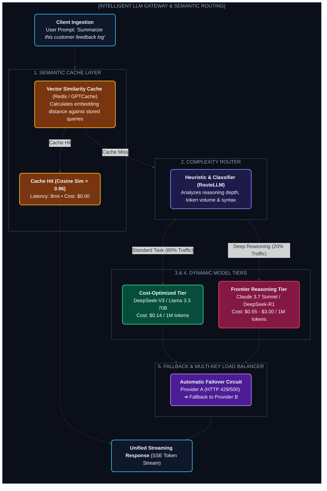

# Chapter 1: LLM Routers, Gateways & Semantic Caching (ওপেনরাউটার ও গেটওয়ে আর্কিটেকচার)

---

প্রোডাকশন লেভেলে সরাসরি একটিমাত্র প্রোভাইডারের API (যেমন শুধু OpenAI বা Anthropic) কল করা হলো আর্কিটেকচারাল সুইসাইড।

যদি OpenAI সাময়িক ডাউন হয়, রেট লিমিট শেষ হয়ে যায় বা কোনো সহজ প্রশ্নের জন্য অপ্রয়োজনীয়ভাবে প্রতি কলে $০.০৩ খরচ হতে থাকে— তবে তোমার স্টার্টআপ কস্টে ডুবে যাবে।

আধুনিক AI সিস্টেমে মডেলের সামনে একটি **Intelligent Gateway & Router (যেমন OpenRouter, OmniRouter, RouteLLM, LiteLLM)** থাকে, যা প্রতিটি প্রম্পটের জটিলতা অনুযায়ী সেরা ও সস্তা মডেলে রিকোয়েস্ট রাউট করে।

---

## ১. How OpenRouter & Multi-Provider Gateways Work



---

## ২. The 4 Superpowers of a Gateway

### ১. Semantic Caching (GPTCache / Upstash Redis)
* ব্যবহারকারী যদি হুবহু একই বাক্য না লিখে কাছাকাছি বাক্যও লেখে (যেমন: *"How to reset password?"* বনাম *"I forgot my password, how to reset?"*), ভেক্টর সিমিলারিটি ৯৬%-এর বেশি হলে ক্যাশ থেকে জিরো-কস্টে ১ মিলিসেকেন্ডে উত্তর দিয়ে দেয়।

### ২. Dynamic Cost & Complexity Routing (RouteLLM)
* একটি ছোট ক্লাসিফায়ার মডেল (বা 8B ড্রাফট মডেল) প্রম্পটের স্কোর বের করে:
  $$\text{Complexity Score} \in [0.0, 1.0]$$
* স্কোর $< 0.4$ হলে Llama-3.1-8B বা Haiku-তে পাঠায় ($০.১০/M tokens)।
* স্কোর $\ge 0.4$ হলে Claude 3.7 Sonnet বা o3-mini-তে পাঠায়।
* **ফলাফল:** কোয়ালিটি ৯৮% অক্ষুণ্ণ রেখে কোম্পানির AI বিল **৭৫% থেকে ৯০% পর্যন্ত হ্রাস পায়!**

### ৩. Unified API Abstraction (LiteLLM / OpenRouter)
* প্রম্পট ফরম্যাট একটাই থাকবে (OpenAI-compatible `chat.completions`), কিন্তু ব্যাকএন্ডে যেকোনো প্রোভাইডারে (Anthropic, Bedrock, Vertex AI, Together, Groq) রাউট হয়ে যাবে।

### ৪. Zero-Downtime Fallback Cascades
* প্রাইমারি প্রোভাইডার ডাউন হলে তাৎক্ষণিকভাবে ব্যাকআপ প্রোভাইডারে রিকোয়েস্ট ফরোয়ার্ড করা।

---

## ৩. Implementation: Minimal Multi-Model Fallback Router

```python
import time

class LLMGateway:
    def __init__(self, providers):
        self.providers = providers # [DeepSeek, Claude, OpenAI]

    def complete(self, prompt: str, is_complex: bool = False):
        # রাউটিং লজিক
        target_providers = self.providers if is_complex else [self.providers[0]]
        
        for provider in target_providers:
            try:
                print(f"📡 Attempting provider: {provider.name}...")
                response = provider.call(prompt)
                return response
            except Exception as e:
                print(f" Provider {provider.name} failed ({str(e)}). Falling back...")
                time.sleep(0.2)
                
        raise RuntimeError("All LLM providers failed in fallback chain.")
```

---
Developer Perspective
ওপেনরাউটারের সবচেয়ে বড় উদ্ভাবন হলো **Dynamic Auction Pricing & Free-Market Provider Routing**। একই ওপেন-সোর্স মডেল (যেমন DeepSeek-V3 বা Llama-3.3) ১০টি আলাদা হোস্ট প্রোভাইডারে (Together, DeepInfra, Fireworks, Novita) চলছে। ওপেনরাউটার রিয়েল-টাইমে সর্বনিম্ন লেটেন্সি এবং সর্বনিম্ন মূল্যের প্রোভাইডারে অটোমেটিক ট্রাফিক রাউট করে।

---
Production Reality
প্রোডাকশনে প্রতিটি টোকেনের কস্ট ট্র্যাক করার জন্য গেটওয়ে লেভেলে **Usage-Based Virtual Keys** দেওয়া হয়। প্রতি ক্লায়েন্ট বা ইন্টারনাল টিমের জন্য আলাদা ভার্চুয়াল কী থাকে, যার ফলে কোনো একটি টিম বাজেট লিমিট পার করলে অন্য টিমের অ্যাপ ডাউন না করে শুধু সেই কী-কে ব্লক করা যায়।

---
Common Mistake
গেটওয়ে ছাড়া সরাসরি ক্লায়েন্ট অ্যাপ্লিকেশনে OpenAI SDK হার্ডকোড করা। প্রোভাইডারের নীতি বা মডেল ডেপ্রিকেশন ঘটলে পুরো মোবাইল অ্যাপ বা ওয়েব অ্যাপ রি-রিলিজ করতে হয়। গেটওয়ের মাধ্যমে এক ক্লিকে সেন্ট্রাল কনফিগ থেকে মডেল সুইচ করা সম্ভব।

---

## Interview Flashcards

#### Beginner Level
* **প্রশ্ন:** LLM Router বা Gateway কী?
* **উত্তর:** LLM Router হলো অ্যাপ্লিকেশন এবং AI মডেলের মাঝের একটি স্মার্ট প্রক্সি। এটি প্রম্পটের জটিলতা অনুযায়ী স্বয়ংক্রিয়ভাবে সঠিক মডেলে রিকোয়েস্ট পাঠায়, ক্যাশিং করে খরচ কমায় এবং কোনো প্রোভাইডার ডাউন থাকলে অন্য প্রোভাইডারে ফলব্যাক করে।

#### Intermediate Level
* **প্রশ্ন:** Semantic Caching কীভাবে কাজ করে?
* **উত্তর:** সাধারণ ক্যাশ হুবহু স্ট্রিং ম্যাচ খোঁজে। কিন্তু Semantic Cache প্রম্পটের এম্বেডিং ভেক্টর তৈরি করে পূর্ববর্তী প্রশ্নের ভেক্টরের সাথে কোসাইন সিমিলারিটি মাপায়। অর্থ একই হলে মডেল কল না করেই ক্যাশ থেকে তাত্ক্ষণিক উত্তর দেয়।

#### Advanced Level
* **প্রশ্ন:** RouteLLM বা কস্ট-অপটিমাইজড রাউটিং কীভাবে কাজ করে?
* **উত্তর:** এটি একটি লাইটওয়েট ক্লাসিফায়ার বা প্রিফারেন্স মডেল ব্যবহার করে ইউজারের প্রম্পটের কাঠিন্য পরিমাপ করে। সহজ প্রশ্নের জন্য সস্তা ও ছোট মডেল (8B/70B) এবং জটিল গাণিতিক/লজিক্যাল প্রশ্নের জন্য বড় ফ্ল্যাগশিপ মডেলে রিকোয়েস্ট রাউট করে।
