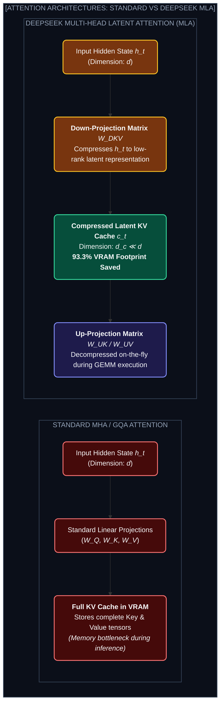
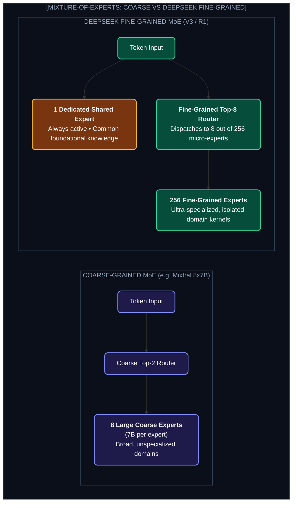

# Chapter 2: DeepSeek Architectural Mastery (ডিপসিকের স্থাপত্য বিপ্লব)

---

আমেরিকার চিপ রপ্তানি নিষেধাজ্ঞার কারণে যখন চীনের কোম্পানিগুলোর জন্য Nvidia H100/B200 ক্লাস্টার কেনা নিষিদ্ধ হয়ে গেল, তখন পশ্চিমা বিশ্ব ভেবেছিল চাইনিজ AI থমকে যাবে।

কিন্তু ডিপসিক (DeepSeek) প্রমাণ করল: **হার্ডওয়্যারের ঘাটতিকে যখন গণিত এবং চরম অ্যালগরিদমিক অপ্টিমাইজেশন দিয়ে চ্যালেঞ্জ করা হয়, তখন ইতিহাস রচিত হয়!**

যেখানে একটি ফ্রন্টিয়ার মডেল ট্রেইন করতে সিলিকন ভ্যালিতে $১০০ মিলিয়ন ডলার লাগত, DeepSeek-V3 ও DeepSeek-R1 (671B MoE) ট্রেইন করা হয়েছে মাত্র **~$৬ মিলিয়ন ডলারে!**

চলো ডিপসিকের সেই ৫টি ঐতিহাসিক আর্কিটেকচারাল উদ্ভাবন উন্মোচন করি।

---

## ১. Multi-Head Latent Attention (MLA): ৯৩% KV ক্যাশ সাশ্রয়

### MLA-র পেছনের ম্যাথমেটিক্স:
সাধারণ ট্র্যান্সফরমারে ইনফারেন্সের সময় প্রতিটি টোকেনের Key ($K$) এবং Value ($V$) সম্পূর্ণ VRAM-এ ক্যাশ করে রাখতে হয়।

DeepSeek MLA-তে $K$ এবং $V$-কে একটি ক্ষুদ্র **Latent Vector $c_t$**-এ ডাউন-প্রজেক্ট করে ক্যাশ করা হয়:
$$c_t = W_{DKV} h_t \quad (\text{where } \dim(c_t) \ll \dim(h_t))$$

ইনফারেন্সের সময় VRAM থেকে শুধু এই পুঁচকে $c_t$ রিড করা হয় এবং ম্যাট্রিক্স মাল্টিপ্লিকেশনের সময় রিয়েল-টাইমে আনপ্যাক করা হয়। 
* **ফলাফল:** KV ক্যাশের মেমোরি কনজাম্পশন **৯৩.৩% কমে যায়!** ফলে ১টি মাত্র GPU সার্ভারে আগের চেয়ে ১০ গুণ বেশি কনকারেন্ট ইউজার হ্যান্ডেল করা সম্ভব হয়।

---

## ২. DeepSeekMoE: Fine-Grained Sparse Experts

সাধারণ MoE (যেমন Mixtral 8x7B)-তে ৮টি বড় এক্সপার্ট থাকে এবং প্রতি টোকেনে ২টি এক্সপার্ট বেছে নেওয়া হয়।

ডিপসিক নিয়ে এলো **Fine-Grained Experts**:
* ৮টি বড় এক্সপার্টের বদলে **২৫৬টি ক্ষুদ্র ক্ষুদ্র এক্সপার্ট**!
* প্রতি টোকেনে ৮টি ক্ষুদ্র এক্সপার্ট অ্যাক্টিভেট হয়।
* সাথে থাকে ১টি **Dedicated Shared Expert** যা সব টোকেনের কমন ব্যাকগ্রাউন্ড নলেজ প্রসেস করে।

---

## ৩. DualPipe: Overlapping Computation & Communication

ডিস্ট্রিবিউটেড ক্লাস্টারে যখন হাজার হাজার GPU একে অপরের সাথে ডাটা আদান-প্রদান করে, তখন GPU-কে অলস বসে থাকতে হয় (Communication Overhead / Pipeline Bubble)।

DeepSeek তৈরি করেছে **DualPipe** শিডিউলার:
* Forward Chunk এবং Backward Chunk-কে বিপরীত দিক থেকে পাইপলাইনে পাঠানো হয়।
* কম্পিউটেশন যখন চলে, ঠিক সেই মুহূর্তে ব্যাকগ্রাউন্ডে ইন্টার-নোড অল-টু-অল (All-to-All) কমিউনিকেশন ওভারল্যাপ হয়ে যায়।
* **ফলাফল:** কমিউনিকেশন বাবল প্রায় **০%-এ নেমে আসে!**

---

## ৪. Multi-Token Prediction (MTP): দ্বিগুণ ইনফারেন্স স্পিড

সাধারণ ট্র্যান্সফরমার প্রতি স্টেপে মাত্র ১টি পরবর্তী টোকেন প্রেডিক্ট করে:
$$P(x_{t+1} \mid x_1, \dots, x_t)$$

DeepSeek-V3 একটি ইউনিক MTP হেড যুক্ত করেছে, যা প্রতিটি স্টেপে একসাথে **২টি টোকেন প্রেডিক্ট করে ($x_{t+1}$ এবং $x_{t+2}$)**:
1. প্রথম হেড মেইন টোকেন প্রেডিক্ট করে।
2. সাব-হেড তার পরের টোকেন অনুমান করে স্পেকুলেটিভ ডিকোডিং স্পিডআপ দেয়।
3. **ফলাফল:** জেনারেশন স্পিড **১.৮x থেকে ২x বৃদ্ধি পায়!**

---

## ৫. FP8 Mixed Precision Training: শূন্য ওভারফ্লো

সাধারণত বড় মডেল ট্রেইনিংয়ে BF16 বা FP16 ব্যবহার করা হয়। ডিপসিক তাদের সম্পূর্ণ ৬৭১ বিলিয়ন প্যারামিটারের মডেল ট্রেইন করেছে **FP8 (8-bit Floating Point)** ফরম্যাটে!
* মেমোরি ব্যান্ডউইথ খরচ ৫০% কমে গেছে।
* যাতে সংখ্যা আন্ডারফ্লো বা ওভারফ্লো না হয়, সেজন্য ডিপসিক নিয়ে এসেছে **Tile-wise ও Block-wise Fine-Grained Quantization Scaling**।

---

## 🎯 Final Takeaway for AI Engineers

> **ডিপসিকের শিক্ষা:** AI ইঞ্জিনিয়ারিং মানে কেবল আরও বেশি GPU কেনা নয়। গণিত, কার্নেল অপ্টিমাইজেশন এবং হার্ডওয়্যার-সচেতন অ্যালগরিদম ডিজাইন করে কম্পিউট খরচ ৯৫% পর্যন্ত কমিয়ে আনা সম্ভব!
