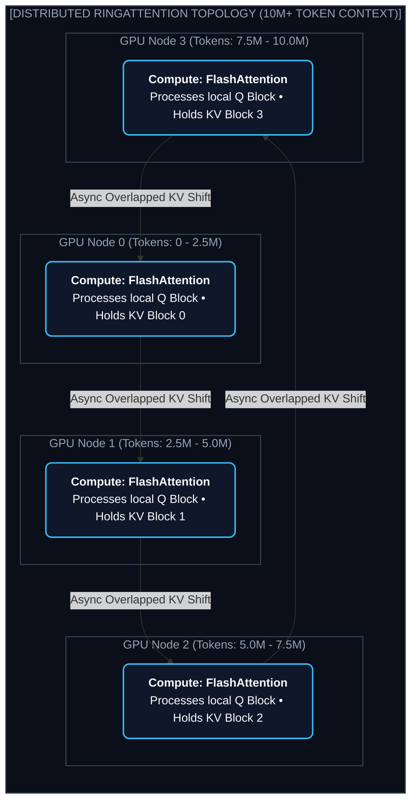
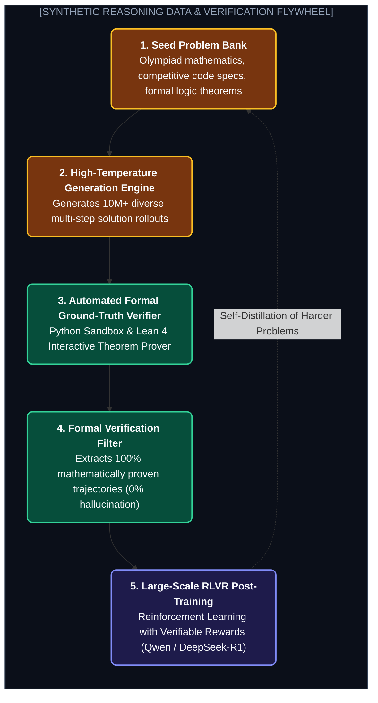
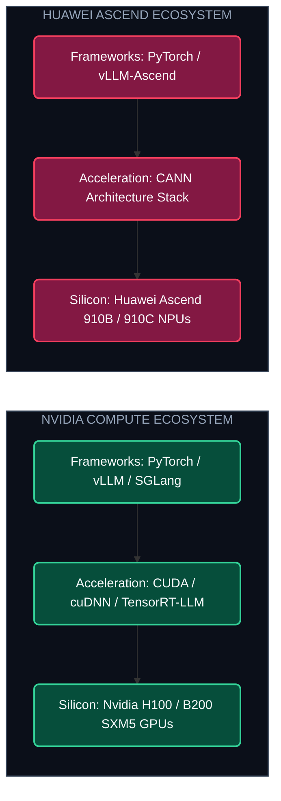

# Chapter 3: Extreme Context & Chinese AI Innovation (১০ মিলিয়ন কনটেক্সট ও কুডা-মুক্ত সিলিকন)

---

এক বছর আগেও ১০০k কনটেক্সট উইন্ডোকে মনে হতো এক অবিশ্বাস্য অর্জন।

কিন্তু আজ মুনশট AI (Moonshot AI)-এর **Kimi k3** এবং আলিবাবার **Qwen** মডেলগুলো ২ মিলিয়ন থেকে শুরু করে **১০ মিলিয়ন টোকেন (10M Tokens)** কনটেক্সট উইন্ডোতে নিরবচ্ছিন্নভাবে কাজ করছে!

১০ মিলিয়ন টোকেন মানে কী?

এর মানে হলো শেক্সপিয়ারের সমগ্র রচনাবলী, একটি কোম্পানির ৫০টি বার্ষিক রিপোর্ট অথবা ১ লাখ লাইনের সম্পূর্ণ এন্টারপ্রাইজ কোডবেস একসাথে একটিমাত্র প্রম্পটে দিয়ে দেওয়া!

কীভাবে তারা এই অসম্ভবকে সম্ভব করল? এবং কীভাবে চীনের AI ল্যাবগুলো এনভিডিয়ার CUDA ছাড়াই স্বয়ংসম্পূর্ণ ইকোসিস্টেম গড়ে তুলল?

---

## ১. The 10-Million Token Architecture: Moonshot Kimi

### কোর টেকনোলজি:
1. **RingAttention:** সম্পূর্ণ ১০ মিলিয়ন টোকেনের সিকোয়েন্সকে একাধিক GPU-র মধ্যে সার্কুলার রিং আকারে ভাগ করে দেওয়া হয়। প্রতিটি নোড লোকাল অ্যাটেনশন হিসেব করতে করতেই নেটওয়ার্ক দিয়ে তার পাশের নোডকে KV ব্লক পাঠিয়ে দেয়। ফলে কোনো সিঙ্গেল GPU-তে মেমোরি ক্র্যাশ করে না।
2. **Dynamic YaRN (Yet another RoPE extensioN):** রোটারি পজিশনাল এম্বেডিংয়ের হাই-ফ্রিকোয়েন্সি ডাইমেনশন অক্ষুণ্ণ রেখে স্কেলিং ফ্যাক্টর দিয়ে ১০ মিলিয়ন ডাইমেনশন পর্যন্ত এক্সটেন্ড করা।
3. **100% Needle-in-a-Haystack:** ১০ মিলিয়ন শব্দের সাগরে একটিমাত্র গোপন বাক্য লুকিয়ে রাখলেও কিমি ১০০% নিখুঁতভাবে তা খুঁজে বের করতে পারে।

---

## ২. Alibaba Qwen: The Synthetic Data & Coding Engine

আলিবাবার **Qwen 2.5 & Qwen 2.5-Coder** আজ বিশ্বের অন্যতম শীর্ষ কোডিং ও ম্যাথ মডেল।

---

## ৩. Overcoming CUDA: Huawei Ascend 910C & CANN Architecture

আমেরিকার চিপ নিষেধাজ্ঞার পর চীন তৈরি করেছে নিজস্ব চিপ ও সফটওয়্যার স্ট্যাক: **Huawei Ascend 910B/910C NPU** এবং **CANN (Compute Architecture for Neural Networks)**।

* **CANN Compiler:** পিওর PyTorch কোডকে কনভার্ট করে হুয়াওয়ের NPU-তে অপ্টিমাইজড ভেক্টর কোড হিসেবে এক্সেকিউট করে।
* আজ চীনের প্রায় ৫০% ক্লাউড ডাটা সেন্টারে কুডার বিকল্প হিসেবে CANN প্ল্যাটফর্মে মডেল ট্রেইনিং ও ইনফারেন্স চলছে।

---
Developer Perspective
১০ মিলিয়ন কনটেক্সট উইন্ডো পাওয়ার মানে এই নয় যে তুমি সব ডেটা এক প্রম্পটে ঢালবে। ইনপুট টোকেন যত বাড়বে, First-Token Latency (TTFT) তত বাড়বে। তাই ১০ মিলিয়ন কনটেক্সট ব্যবহার করার সময় সার্ভারে **Chunked Prefill** এবং **Prompt Caching** অন রাখা বাধ্যতামূলক।

---
Production Reality
প্রোডাকশনে Qwen-2.5-Coder-32B আজ গ্লোবালি শীর্ষ ওপেন-সোর্স কোডিং মডেল। অনেক এন্টারপ্রাইজ কোম্পানি প্রোপাইটরি কোডের গোপনীয়তা রক্ষার জন্য তাদের ইন্টারনাল সার্ভারে Qwen-2.5-Coder সেলফ-হোস্ট করে গিটহ্যাব কোপাইলটের শতভাগ বিকল্প হিসেবে ব্যবহার করছে।

---
Common Mistake
লং কনটেক্সট টেস্ট করার সময় শুধু টেক্সটের শুরুতে বা শেষে ডেটা দেওয়া। মডেলের আসল পরীক্ষা হলো কনটেক্সটের ঠিক মাঝখানে (যেমন ৩.৫ মিলিয়ন নম্বর টোকেনে) ডেটা রেখে টেস্ট করা (Lost in the Middle Test)।

---

## Interview Flashcards

#### Beginner Level
* **প্রশ্ন:** Kimi এবং Qwen মডেলের প্রধান বিশেষত্ব কী?
* **উত্তর:** কিমি তার অসাধারণ লং-কনটেক্সট ইঞ্জিনের জন্য পরিচিত যা ১০ মিলিয়ন টোকেন পর্যন্ত তথ্য প্রসেস করতে পারে। আর Qwen তার ওপেন-সোর্স কোডিং, গণিত এবং মাল্টিমোডাল দক্ষতায় বিশ্বের অন্যতম সেরা।

#### Intermediate Level
* **প্রশ্ন:** RingAttention কীভাবে লং-কনটেক্সটে মেমোরি সমস্যার সমাধান করে?
* **উত্তর:** RingAttention সম্পূর্ণ সিকোয়েন্সকে একাধিক GPU-র মধ্যে ভাগ করে একটি সার্কুলার রিং বাফারে অ্যাসিনক্রোনাসলি KV ব্লক আদান-প্রদান করে। ফলে কোনো একক GPU-র VRAM উপচে পড়ে না।

#### Advanced Level
* **প্রশ্ন:** Huawei CANN কী এবং কেন এটি গুরুত্বপূর্ণ?
* **উত্তর:** CANN হলো হুয়াওয়ের ডিপ লার্নিং সফটওয়্যার স্ট্যাক যা এনভিডিয়ার CUDA-র সমকক্ষ। এটি হুয়াওয়ের Ascend NPU চিপসেটের ওপর PyTorch ও অন্যান্য ফ্রেমওয়ার্কের কোড অপ্টিমাইজডভাবে চালাতে ব্যবহৃত হয়।
