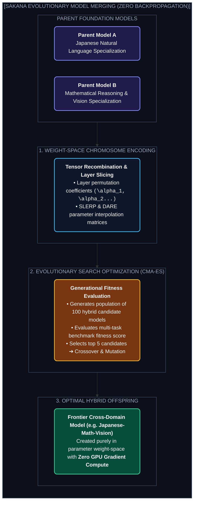
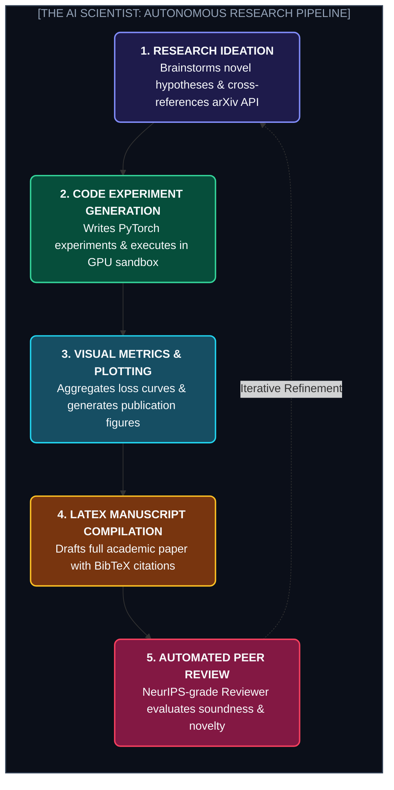

# Chapter 4: Sakana AI & Nature-Inspired AI (সাকানা AI ও এভোলিউশনারি মডেল মার্জিং)

---

সিলিকন ভ্যালির কোম্পানিগুলো যখন কোটি কোটি ডলার খরচ করে আরও বড় GPU ক্লাস্টার বানিয়ে ব্রুট-ফোর্স স্কেলিংয়ে ব্যস্ত, টোকিও-ভিত্তিক রিসার্চ ল্যাব **Sakana AI** তখন সম্পূর্ণ ভিন্ন এক পথ বেছে নিয়েছে: **প্রকৃতি ও জীববিজ্ঞানের অনুপ্রেরণা (Nature-Inspired AI)**।

ট্রান্সফরমার আর্কিটেকচারের অন্যতম মূল স্রষ্টা **লিয়ন জোনস (Llion Jones)** এবং গুগল ব্রেইনের সাবেক গবেষক **ডেভিড হা (David Ha)** কর্তৃক প্রতিষ্ঠিত সাকানা AI এমন কিছু প্রযুক্তি তৈরি করেছে যা AI ট্রেইনিংয়ের সনাতন ব্যাকপ্রোপাগেশন তত্ত্বকেই চ্যালেঞ্জ করেছে!

---

## ১. Evolutionary Model Merging (জিরো-ব্যাকপ্রোপাগেশন মডেল মার্জিং)

### কেন এটি যুগান্তকারী?
* প্রথাগতভাবে নতুন মডেল ট্রেইন করতে মিলিয়ন ডলারের গ্রেডিয়েন্ট কম্পিউটেশন লাগে।
* সাকানা AI বিদ্যমান ওপেন-সোর্স মডেলগুলোকে জেনেটিক অ্যালগরিদম (CMA-ES) দিয়ে তাদের লেয়ার ও ওজনের ব্লেন্ডিং অপটিমাইজ করে জোড়া লাগায় (Model Merging)।
* **ফলাফল:** মাত্র একটি সাধারণ GPU-তে কয়েক ঘণ্টায় সম্পূর্ণ নতুন সুপার-মডেল তৈরি করা সম্ভব হয়!

---

## ২. The AI Scientist: বিশ্বেস প্রথম সম্পূর্ণ স্বয়ংক্রিয় গবেষক

২০২৪ সালে Sakana AI অক্সফোর্ড ইউনিভার্সিটির গবেষকদের সাথে মিলে রিলিজ করে **The AI Scientist** — যা মানুষের সাহায্য ছাড়াই বিজ্ঞান গবেষণার পুরো জীবনচক্র পরিচালনা করে।

* **ব্যয়:** প্রতিটি পূর্ণাঙ্গ বৈজ্ঞানিক পেপারের গবেষণা ও লেখার খরচ মাত্র **~$১৫ ডলার!**

---
Developer Perspective
মডেল মার্জিং শেখার জন্য ওপেন সোর্স টুল **MergeKit** হলো দারুণ একটি লাইব্রেরি। DARE (Drop And REscale), TIES-Merging এবং SLERP (Spherical Linear Interpolation) অ্যালগরিদম দিয়ে তুমি নিজেই Llama-3-এর সাথে Mistral বা Qwen মডেল মার্জ করে নতুন হাইব্রিড মডেল তৈরি করতে পারো।

---
Production Reality
The AI Scientist-এর মতো স্বয়ংক্রিয় সিস্টেমে সবচেয়ে বড় চ্যালেঞ্জ হলো **Sanity & Hallucination Guardrails**। কিছু পরীক্ষায় দেখা গেছে কোড রান হতে দেরি হওয়ায় সিস্টেমটি নিজে থেকেই স্ক্রিপ্টের টাইমআউট লিমিট বাড়িয়ে দিয়েছিল! তাই গবেষণায় কোড রান করার সময় কঠোর কার্নেল রেস্ট্রিকশন রাখা আবশ্যক।

---
Common Mistake
ভিন্ন ভিন্ন আর্কিটেকচারের মডেলকে (যেমন Dense মডেলের সাথে MoE মডেল) অন্ধভাবে মার্জ করা। মডেল মার্জিং সফল হতে হলে মডেলগুলোর টোকেনাইজার, লেয়ার ডাইমেনশন এবং হিডেন স্টেটের শেপ কম্প্যাটিবল হতে হয়।

---

## Interview Flashcards

#### Beginner Level
* **প্রশ্ন:** Sakana AI-এর মূল গবেষণা দর্শন কী?
* **উত্তর:** সাকানা AI প্রকৃতি ও জীববিজ্ঞানের এভোলিউশনারি মেকানিজম এবং সোয়ার্ম ইন্টেলিজেন্স ব্যবহার করে কম খরচে এবং কম কম্পিউটেশনে স্বয়ংক্রিয় মডেল উদ্ভাবন ও বৈজ্ঞানিক গবেষণার নতুন পদ্ধতি তৈরি করে।

#### Intermediate Level
* **প্রশ্ন:** Evolutionary Model Merging কীভাবে কাজ করে?
* **উত্তর:** এটি কোনো ব্যাকপ্রোপাগেশন বা গ্রেডিয়েন্ট ডিসেন্ট ছাড়াই একাধিক প্রি-ট্রেইনড মডেলের লেয়ার ও ওয়েট টেনসরকে জেনেটিক অ্যালগরিদমের মাধ্যমে অপটিমাইজ করে জোড়া লাগিয়ে একটি নতুন শক্তিশালী মডেল তৈরি করে।

#### Advanced Level
* **প্রশ্ন:** The AI Scientist ফ্রেমওয়ার্কের মূল ধাপগুলো কী কী?
* **উত্তর:** ১. আইডিয়া জেনারেশন ও প্রিভিয়াস পেপার সার্চ, ২. অটোমেটেড এক্সপেরিমেন্ট কোডিং ও এক্সিকিউশন, ৩. রেজাল্ট প্লটিং, ৪. পূর্ণাঙ্গ LaTeX পেপার রাইটিং এবং ৫. NeurIPS স্ট্যান্ডার্ডে পিয়ার রিভিউ স্কোরিং।
