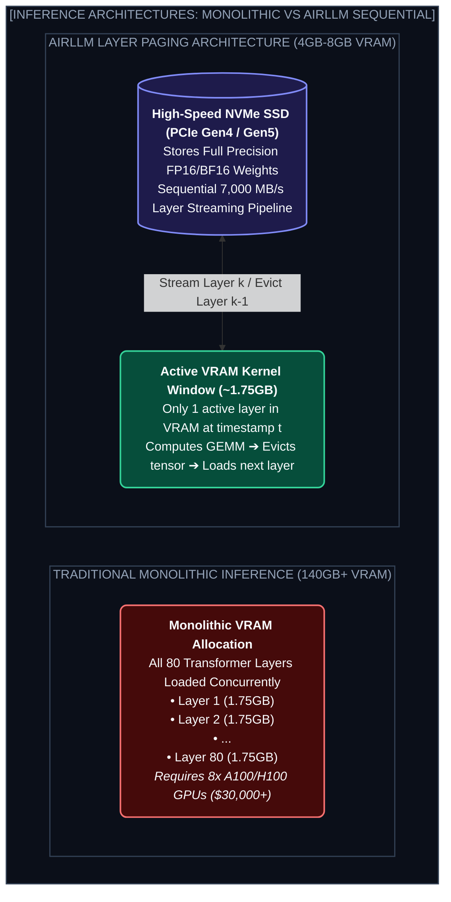

# Chapter 5: AirLLM — Running 70B/405B on 4GB-8GB GPUs (লো-রিসোর্স আল্ট্রা-লার্জ মডেল রানটাইম)

---

একটি Llama-3-70B মডেল চালাতে সাধারণ নিয়মে কমপক্ষে **১৪০ গিগাবাইট (140GB) VRAM** প্রয়োজন। আর Llama-3.1-405B চালাতে প্রয়োজন **৮১০ গিগাবাইট VRAM** — যার জন্য লাখ টাকার ৮টি A100/H100 GPU ক্লাস্টার লাগে।

কিন্তু যদি তোমার কাছে থাকে মাত্র একটি সাধারণ ল্যাপটপ বা একটি **৪GB/8GB VRAM-এর RTX 3060/4060 গ্রাফিক্স কার্ড**?

তুমি কি এই দানবীয় ৪০০ বিলিয়ন প্যারামিটারের মডেল চালাতে পারবে?

উত্তর হলো: **হ্যাঁ, ১০০% পারবে! আর এই ম্যাজিকের নাম হলো AirLLM!**

---

## ১. The Core Insight: Layer-by-Layer Sequential Streaming

একটি ট্রান্সফরমার নিউরাল নেটওয়ার্কে ৮০টি লেয়ার পরপর সাজানো থাকে ($Layer_1 \to Layer_2 \to \dots \to Layer_{80}$).

সাধারণ ইনফারেন্স ইঞ্জিনে ৮০টি লেয়ারের সব প্যারামিটার একসাথে VRAM-এ লোড করে রাখতে হয়।

কিন্তু কোনো এক নির্দিষ্ট মিলি-সেকেন্ডে GPU কেবল **একটিমাত্র লেয়ারের ম্যাট্রিক্স ক্যালকুলেশন** করে! বাকি ৭৯টি লেয়ার সেই মুহূর্তে অলস বসে থাকে!



---

## ২. How AirLLM Achieves Zero Accuracy Loss

অনেক ক্ষেত্রে বড় মডেলকে ছোট করতে গিয়ে ৪-বিট বা ২-বিট কোয়ান্টাইজেশন করা হয়, যাতে মডেলের বুদ্ধি ও যুক্তি দেওয়ার ক্ষমতা কমে যায়।

AirLLM-এর সবচেয়ে বড় সৌন্দর্য হলো: **এখানে মডেলের ওজনে ১% ও বিকৃতি ঘটে না!**
1. ডিস্ক (SSD) থেকে $Layer_k$-এর সম্পূর্ণ ও নিখুঁত ওয়েট VRAM-এ লোড হয়।
2. টোকেনের হিডেন স্টেট প্রসেস হয়।
3. ক্যালকুলেশন শেষ হওয়ামাত্র সেই মেমোরি রিলিজ করে ডিস্ক থেকে $Layer_{k+1}$ লোড করা হয়।
4. VRAM-এ সবসময় মাত্র ১টি লেয়ারের জন্য জায়গা লাগে (মাত্র ~১.৫ গিগাবাইট)!

---

## ৩. Running 70B Locally with AirLLM in 4 Lines of Code

```python
from airllm import AutoModel

# HuggingFace থেকে সরাসরি Llama 3 70B লোড করা
model = AutoModel.from_pretrained("meta-llama/Meta-Llama-3-70B-Instruct")

input_text = ["Explain quantum entanglement in 2 simple sentences."]
input_tokens = model.tokenizer(input_text, return_tensors="pt", padding=True)

# জেনারেশন লুপ (ডিস্ক থেকে লেয়ার স্ট্রিম করে কাজ করবে)
generation_output = model.generate(
    input_tokens['input_ids'].cuda(),
    max_new_tokens=50,
    use_cache=True
)

output_text = model.tokenizer.decode(generation_output[0])
print(output_text)
```

---

## ৪. The Engineering Trade-off: Speed vs Affordability

| মেথড | VRAM প্রয়োজন | গতি (Tokens/sec) | কোয়ালিটি লস |
| :--- | :--- | :--- | :--- |
| **8x H100 Cluster** | 640 GB | 150+ tok/s | 0% (Full FP16) |
| **4-bit GGUF/llama.cpp** | 40 GB | 20-30 tok/s | ~2-5% Perplexity drop |
| **AirLLM (4GB GPU)** | **4 GB** | 1-3 tok/s | **0% (Pure Precision)** |

AirLLM কিছুটা ধীরগতির (প্রতি সেকেন্ডে ১-৩ টোকেন), কিন্তু যারা অফলাইন প্রসেসিং, ডেটাসেট জেনারেশন বা লোকাল রিসার্চের জন্য লাখ টাকার ক্লাস্টার অ্যাফোর্ড করতে পারে না— তাদের জন্য এটি একটি জীবনরক্ষাকারী প্রযুক্তি!

---
Developer Perspective
AirLLM-এর সর্বোচ্চ স্পিড পেতে হলে ডেটা অবশ্যই একটি দ্রুতগতির **NVMe Gen4 বা Gen5 SSD (7000 MB/s Read Speed)**-তে রাখতে হবে। সাধারণ SATA SSD বা হার্ডডিস্কে চালালে ডিস্ক I/O বটলনেকের কারণে গতি খুব কমে যাবে।

---
Production Reality
প্রোডাকশন ব্যাচ প্রসেসিং এবং সিন্থেটিক ডেটা জেনারেশনে AirLLM খুব জনপ্রিয়। অনেক কোম্পানি হাজার হাজার পেপার অফলাইনে সামারাইজ বা ডেটাসেট তৈরি করার জন্য ক্লাউড বিল না বাড়িয়ে তাদের সাধারণ অফিস ডেস্কটপে সারারাত AirLLM স্ক্রিপ্ট চালিয়ে রাখে।

---
Common Mistake
রিয়েল-টাইম কাস্টমার চ্যাটবটে AirLLM ব্যবহার করা। যেহেতু প্রতি লেয়ার ডিস্ক থেকে লোড হয়, এর লেটেন্সি লাইভ চ্যাটের জন্য উপযুক্ত নয়। লাইভ চ্যাটের জন্য vLLM বা Ollama/GGUF ব্যবহার করা উচিত, আর হাই-প্রিসিশন ব্যাচ টাস্কে AirLLM চালানো উচিত।

---

## Interview Flashcards

#### Beginner Level
* **প্রশ্ন:** AirLLM কী এবং এর প্রধান সুবিধা কী?
* **উত্তর:** AirLLM হলো একটি অভিনব ইনফারেন্স ইঞ্জিন যা সাধারণ ৪GB বা ৮GB VRAM-এর কনজিউমার GPU-তেও ৭০B বা ৪০৫B-এর মতো বিশাল LLM কোনো কোয়ালিটি লস ছাড়া চালাতে পারে।

#### Intermediate Level
* **প্রশ্ন:** AirLLM কীভাবে মেমোরি বাঁচায়?
* **উত্তর:** সব লেয়ার একসাথে VRAM-এ না রেখে AirLLM ডিস্ক (SSD) থেকে একেকটি লেয়ারের ওজন GPU-তে স্ট্রিম করে, কম্পিউটেশন শেষ হলে মেমোরি ক্লিয়ার করে পরবর্তী লেয়ার লোড করে।

#### Advanced Level
* **প্রশ্ন:** Quantization (GGUF/AWQ) এবং AirLLM-এর মূল পার্থক্য কী?
* **উত্তর:** কোয়ান্টাইজেশনে ওজনের প্রিসিশন (16-bit থেকে 4-bit) কমিয়ে মেমোরিতে ফিট করানো হয় যার ফলে কিছুটা কোয়ালিটি কমে। AirLLM ওজনের প্রিসিশন অক্ষুণ্ণ রেখে লেয়ার-বাই-লেয়ার সিকোয়েনশিয়াল এক্সিকিউশন করে, ফলে কোয়ালিটি ১০০% বজায় থাকে কিন্তু গতি কমে।
