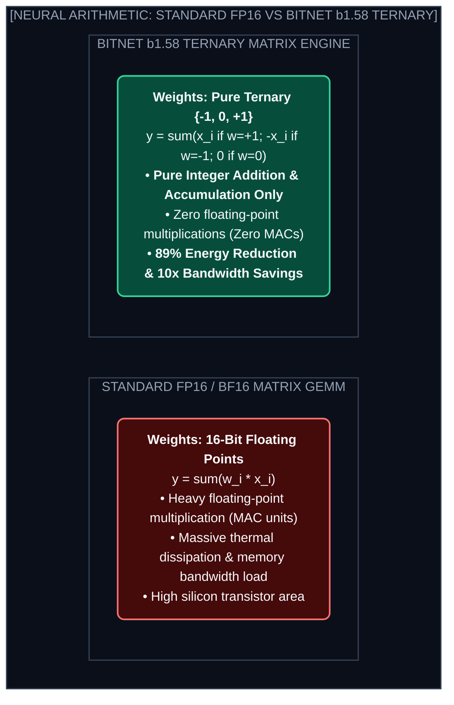
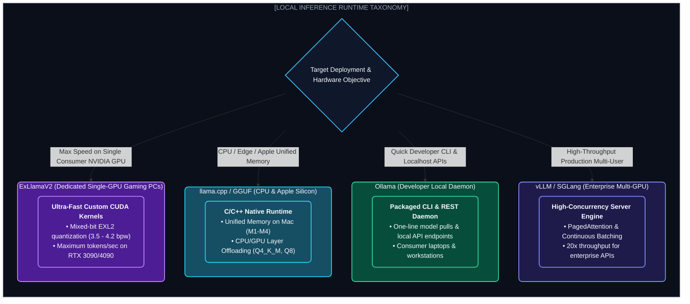

# Chapter 6: 1-Bit AI (BitNet b1.58) & Local Engines (১-বিট AI ও লোকাল ইনফারেন্স)

---

কম্পিউটার সায়েন্সে গত ৭০ বছর ধরে একটি মৌলিক সত্য ছিল: নিউরাল নেটওয়ার্ক মানেই হলো কোটি কোটি কোটি **ফ্লোটিং-পয়েন্ট মাল্টিপ্লিকেশন (Floating-Point Multiplications / FP16)**।

আর এই গুণ (Multiply) করার জন্যই প্রয়োজন পড়ে হাজার ওয়াটের বিশাল Nvidia GPU।

কিন্তু ২০২৪ সালে মাইক্রোসফট রিসার্চ একটি বৈপ্লবিক পেপার প্রকাশ করে: **"The Era of 1-bit LLMs (BitNet b1.58)"**।

তারা প্রমাণ করেছে: **একটি ট্রান্সফরমার মডেলের প্রতিটি ওজন কেবল $\{-1, 0, 1\}$ এই তিনটি মান ধারণ করতে পারে! আর এর ফলে নিউরাল নেটওয়ার্কে কোনো গুণের দরকারই পড়ে না— সম্পূর্ণ কম্পিউটেশন সম্পন্ন হয় সাধারণ যোগ ও বিয়োগ (Integer Addition) দিয়ে!**

---

## ১. BitNet b1.58: The Addition-Only Neural Network

### কেন এর নাম 1.58 Bit?
বাইনারি সিস্টেমে $1 \text{ bit} = 2 \text{ states } (0 \text{ or } 1)$। 
টারনারি সিস্টেমে ৩টি স্টেট $\{-1, 0, 1\}$ প্রকাশ করতে প্রয়োজন:
$$\log_2(3) \approx 1.58496 \text{ bits}$$

* **মেমোরি সেভিং:** ১৬-বিট মডেলের তুলনায় মেমোরি ব্যান্ডউইথ **১০ গুণ কমে যায়!**
* **এনার্জি এফিশিয়েন্সি:** গুণের বদলে যোগ হওয়ায় সাধারণ মোবাইল ফোনের CPU-তেও এটি অবিশ্বাস্য দ্রুতগতিতে চলে।

---

## ২. The Local Inference Engine Stack (লোকাল রানটাইম তুলনা)

---

## ৩. GGUF vs AWQ vs EXL2: কোয়ান্টাইজেশন গাইড

1. **GGUF (llama.cpp):** সম্পূর্ণ মডেলকে একটিমাত্র সিঙ্গেল ফাইলে প্যাক করে রাখে। CPU ও GPU-র মধ্যে লেয়ার স্প্লিট (Offloading) করার জন্য এটি পৃথিবীর সবচেয়ে জনপ্রিয় ও সহজ ফরম্যাট।
2. **AWQ (Activation-aware Weight Quantization):** মডেলের গুরুত্বপূর্ণ ১% ওজনকে রক্ষা করে বাকি ৯৯% ওজনকে ৪-বিটে কম্প্রেস করে। GPU টেন্সর কোরে এর গতি সর্বোচ্চ।
3. **EXL2:** ভেরিয়েবল বিট-রেট (যেমন 3.5 bpw, 4.2 bpw) সাপোর্ট করে, যার ফলে ২৪GB VRAM-এর একটি সাধারণ RTX 3090-তে ৭০B মডেল অনায়াসে চালানো যায়।

---
Developer Perspective
ম্যাকবুকের (Apple Silicon M1/M2/M3/M4) **Unified Memory Architecture** লোকাল AI ইঞ্জিনিয়ারদের জন্য এক স্বর্গরাজ্য। যেহেতু CPU এবং GPU একই মেমোরি পুল শেয়ার করে, তাই ১২৮GB র‍্যামের একটি Mac Studio-তে কোনো ডেডিকেটেড লাখ টাকার ক্লাস্টার ছাড়াই পূর্ণ ৭০B/১২০B মডেল অন-ডিভাইস রান করা যায়!

---
Production Reality
প্রোডাকশনে যখন সার্ভার লেভেলে হাজার হাজার কনকারেন্ট রিকোয়েস্ট আসে, তখন `Ollama` বা `llama.cpp` ব্যবহার করা যাবে না। সার্ভার স্কেলিংয়ের জন্য **vLLM** বা **SGLang** ব্যবহার করতে হবে, কারণ এদের **PagedAttention** ও **Continuous Batching** ইঞ্জিন কনকারেন্ট থ্রুপুট ২০ গুণ বাড়িয়ে দেয়।

---
Common Mistake
মডেলকে অতিমাত্রায় ছোট করতে গিয়ে $Q2\_K$ (২-বিট) কোয়ান্টাইজেশন ব্যবহার করা। ৩-বিটের নিচে নামলে মডেলের লজিক্যাল রিজনিং প্রায় ভেঙে পড়ে (Severe Perplexity Degradation)। প্রোডাকশন ও লোকাল ব্যবহারে সবসময় **$Q4\_K\_M$ বা $Q5\_K\_M$** ব্যালান্সড কোয়ান্টাইজেশন বেছে নেওয়া উচিত।

---

## Interview Flashcards

#### Beginner Level
* **প্রশ্ন:** BitNet b1.58 কী এবং কেন এটি বিশেষ?
* **উত্তর:** BitNet b1.58 হলো মাইক্রোসফটের উদ্ভাবিত ১.৫৮-বিট মডেল যেখানে সব ওজন কেবল $\{-1, 0, 1\}$ থাকে। এটি জটিল ফ্লোটিং-পয়েন্ট গুণের বদলে কেবল সাধারণ যোগ ও বিয়োগ ব্যবহার করে ৯০% কম এনার্জিতে মডেল চালাতে পারে।

#### Intermediate Level
* **প্রশ্ন:** GGUF ফরম্যাট কেন এত জনপ্রিয়?
* **উত্তর:** GGUF হলো এমন একটি ফাইল ফরম্যাট যা মডেলের আর্কিটেকচার, টোকেনাইজার এবং কোয়ান্টাইজড ওজন একটি সিঙ্গেল ফাইলে ধারণ করে। এটি CPU ও GPU-তে মেমোরি শেয়ার করে সহজে লোকালে মডেল চালাতে সাহায্য করে।

#### Advanced Level
* **প্রশ্ন:** Continuous Batching (vLLM) কীভাবে সাধারণ ব্যাচিংয়ের চেয়ে উন্নত?
* **উত্তর:** সাধারণ ব্যাচিংয়ে সব প্রম্পট শেষ না হওয়া পর্যন্ত নতুন প্রম্পট নেওয়া যায় না। Continuous Batching প্রতিটি জেনারেশন স্টেপে শেষ হওয়া রিকোয়েস্ট রিলিজ করে নতুন রিকোয়েস্ট ইনসার্ট করে, ফলে GPU কোনো সময় অলস থাকে না।
