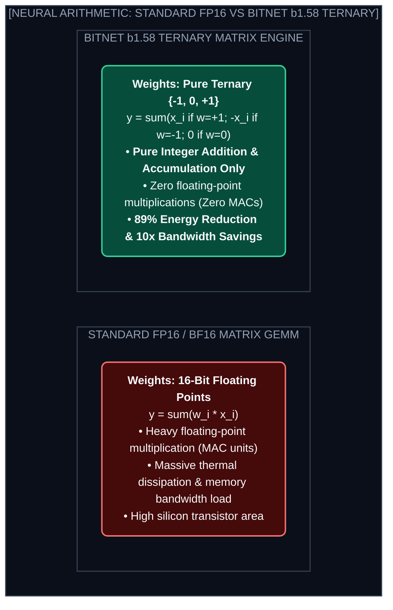
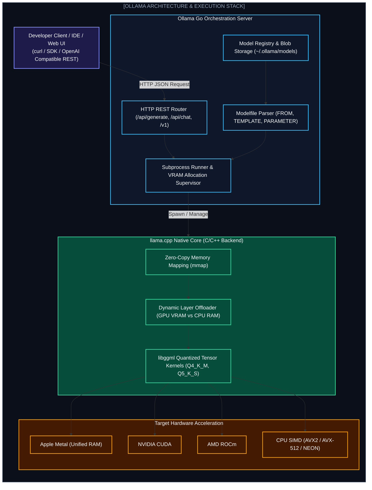
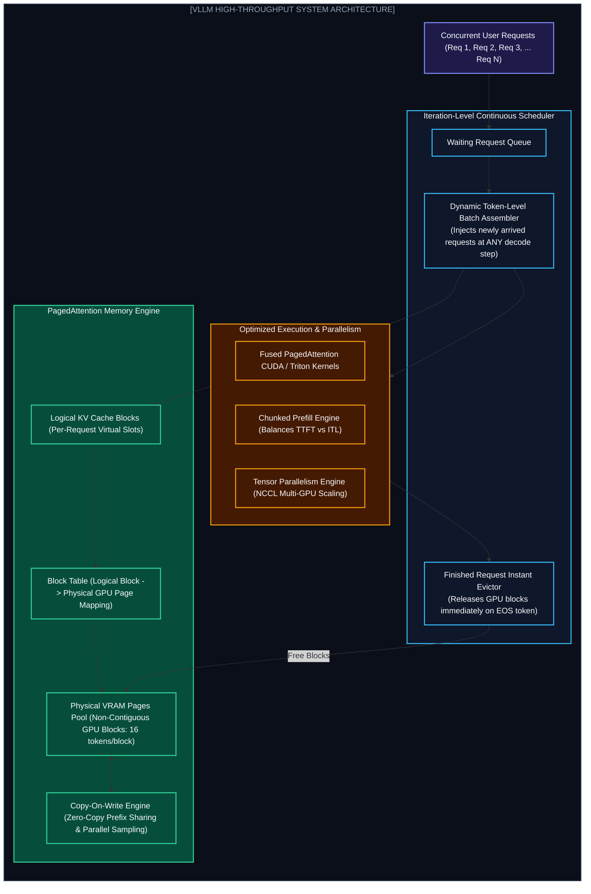
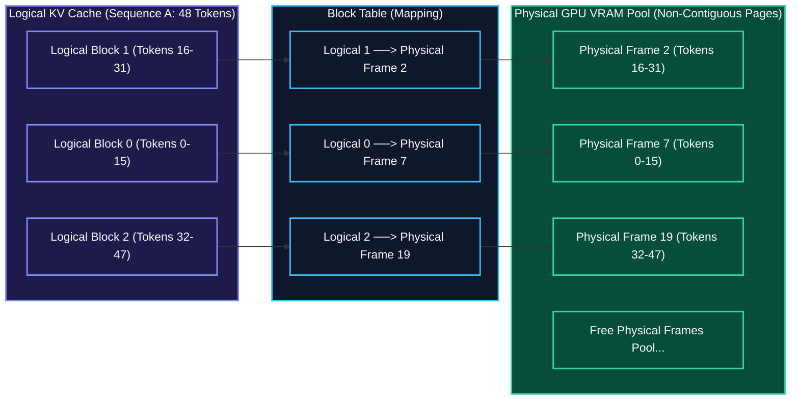
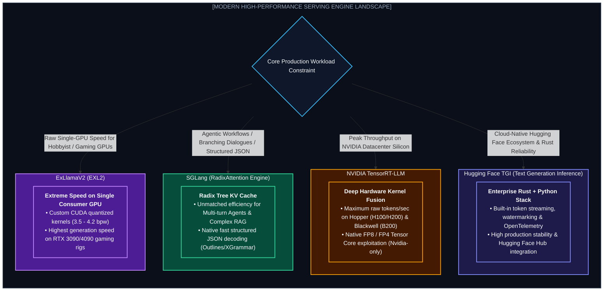
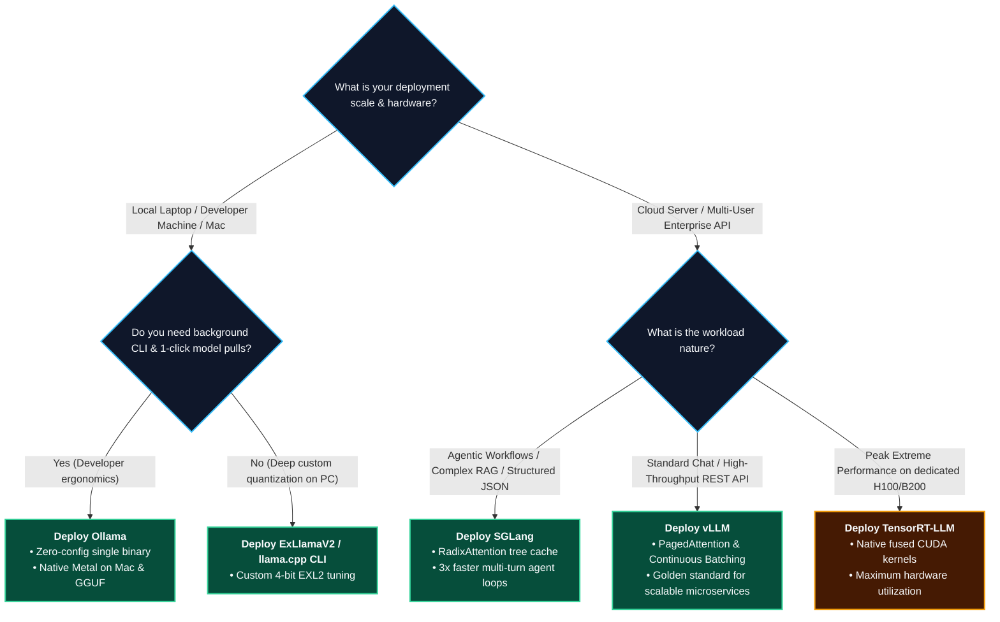

# Chapter 6: 1-Bit AI & Modern Serving Engines: Ollama vs vLLM (১-বিট AI ও আধুনিক ইনফারেন্স সার্ভিং ইঞ্জিন)

---

কম্পিউটার সায়েন্সে গত ৭০ বছর ধরে একটি মৌলিক সত্য প্রতিষ্ঠিত ছিল: নিউরাল নেটওয়ার্ক মানেই হলো কোটি কোটি **ফ্লোটিং-পয়েন্ট মাল্টিপ্লিকেশন (Floating-Point Multiplications / FP16)**।

আর এই মাল্টিপ্লিকেশন সম্পাদন করার জন্যই ডাটা সেন্টারে প্রয়োজন পড়ে হাজার ওয়াটের বিশাল Nvidia GPU ক্লাস্টার।

কিন্তু আধুনিক AI ইঞ্জিনিয়ারিং দ্রুত দুটি ভিন্ন ফ্রন্টে রূপান্তরিত হচ্ছে:
1. **মডেল আর্কিটেকচার অপ্টিমাইজেশন:** মাইক্রোসফট রিসার্চের উদ্ভাবিত **BitNet b1.58 (1-bit LLMs)**, যেখানে গুণের পরিবর্তে সম্পূর্ণ কম্পিউটেশন সম্পন্ন হয় সাধারণ যোগ ও বিয়োগ (Integer Addition) দিয়ে।
2. **ইনফারেন্স সার্ভিং ইঞ্জিন রেভল্যুশন:** একই মডেল কীভাবে সার্ভ করা হচ্ছে—লোকাল মেশিনে **Ollama (llama.cpp)** দিয়ে, নাকি প্রোডাকশন ক্লাস্টারে **vLLM (PagedAttention & Continuous Batching)** ও **SGLang (RadixAttention)** দিয়ে।

এই অধ্যায়ে আমরা ১-বিট কম্পিউটেশনের মেকানিক্স থেকে শুরু করে আধুনিক সার্ভিং ইঞ্জিনগুলোর ভেতরের আর্কিটেকচার, মেমোরি ম্যানেজমেন্ট এবং প্রোডাকশন স্কেলিং পুঙ্খানুপুঙ্খভাবে ব্যবচ্ছেদ করব।

---

## ১. BitNet b1.58: The Addition-Only Neural Network



### কেন এর নাম 1.58 Bit?
বাইনারি সিস্টেমে $1 \text{ bit} = 2 \text{ states } (0 \text{ or } 1)$। 
টারনারি সিস্টেমে ৩টি স্টেট $\{-1, 0, 1\}$ গাণিতিকভাবে ধারণ করতে তথ্য তত্ত্ব (Information Theory) অনুযায়ী প্রয়োজন:
$$\log_2(3) \approx 1.58496 \text{ bits}$$

* **জিরো মাল্টিপ্লিকেশন (Zero MACs):** যখন ওজন $+1$, তখন ইনপুট সরাসরি যোগ হয়। যখন $-1$, তখন বিয়োগ হয়। যখন $0$, তখন কম্পিউটেশন সম্পূর্ণ স্কিপ করা হয়। কোনো ফ্লোটিং-পয়েন্ট মাল্টিপ্লায়ার সার্কিট সক্রিয়ই হয় না।
* **মেমোরি সেভিং:** ১৬-বিট মডেলের তুলনায় মেমোরি ব্যান্ডউইথ **১০ গুণ কমে যায়!**
* **এনার্জি এফিশিয়েন্সি:** গুণের বদলে যোগ হওয়ায় সাধারণ মোবাইল ফোনের CPU কিংবা ব্যাটারি-চালিত IoT ডিভাইসেও এটি অবিশ্বাস্য দ্রুতগতিতে চলে।

---

## ২. How Ollama Works Under the Hood (লোকাল রানটাইম ও অন-ডিভাইস ইঞ্জিন)

লোকাল কম্পিউটারে এক ক্লিকে LLM চালানোর সবচেয়ে জনপ্রিয় সমাধান হলো **Ollama**। কিন্তু ইঞ্জিনিয়ার হিসেবে বুঝতে হবে: **Ollama নিজে কোনো ইনফারেন্স ইঞ্জিন নয়, এটি একটি হাই-লেভেল অর্কেস্ট্রেশন ডেমনের (Go daemon) মোড়কে প্যাক করা C++ ইঞ্জিন।**



### ১. Go Daemon Orchestrator
Ollama ব্যাকগ্রাউন্ডে একটি ব্যাকএন্ড সার্ভিস চালায় যা HTTP পোর্ট `11434`-এ রিকোয়েস্ট গ্রহণ করে। এটি মডেলের প্রম্পট টেমপ্লেট ফরম্যাটিং, চ্যাট হিস্ট্রি ট্র্যাকিং, এবং মডেল ফাইল ডাউনলোডের ব্লব আর্কিটেকচার নিয়ন্ত্রণ করে।

### ২. The GGUF Format
Ollama মডেল স্টোর করে **GGUF (GPT-Generated Unified Format)** ফাইলে। এটি প্রাচীন GGML-এর উত্তরসূরি:
* **সিঙ্গেল ফাইল প্যাকেজিং:** টোকেনাইজার ভোকাবুলারি, হাইপারপ্যারামিটার, আর্কিটেকচার মেটাডাটা এবং কোয়ান্টাইজড টেনসর ওজন—সব একটিমাত্র ফাইলে সংরক্ষিত থাকে।
* **এন্ডিয়াননেস ও মেটাডাটা সেফটি:** ভিন্ন আর্কিটেকচারের চিপে (যেমন x86 বনাম ARM) সরাসরি বাইট-কম্প্যাটিবল।

### ৩. Zero-Copy Memory Mapping (`mmap`)
সাধারণত কোনো প্রোগ্রাম ৮GB মডেল লোড করতে গেলে `fread()` দিয়ে সম্পূর্ণ ফাইল RAM-এ কপি করতে কয়েক সেকেন্ড বা মিনিট সময় নেয়। 
Ollama এবং `llama.cpp` অপারেটিং সিস্টেমের **`mmap()` (Memory Map)** সিস্টেম কল ব্যবহার করে। এর ফলে:
* মডেল ফাইলটি ডিস্ক থেকে সরাসরি ভার্চুয়াল অ্যাড্রেস স্পেসে ম্যাপ হয়।
* ফাইলটি এক ক্লিকেই "লোডেড" মনে হয়। OS পেজ ক্যাশ কেবল সেই পেজগুলো মেমোরিতে রিড করে যেগুলোর ওজন কম্পিউটেশনের সময় প্রয়োজন হয়।

### ৪. Dynamic Layer Offloading (`--n-gpu-layers`)
যদি একটি Llama-3-8B মডেল চালানোর জন্য ৬GB VRAM প্রয়োজন হয়, কিন্তু আপনার ল্যাপটপে ডেডিকেটেড GPU আছে মাত্র ৪GB, তখন Ollama মডেলের মোট ৩২টি লেয়ারের মধ্যে ২০টি লেয়ার GPU-তে পাঠায় এবং বাকি ১২টি লেয়ার সাধারণ CPU RAM-এ রেখে দেয়।
> **ট্রেডঅফ:** লেয়ার স্প্লিট চলাকালীন CPU ও GPU-র মধ্যে ইন্টারমিডিয়েট অ্যাক্টিভেশন টেনসর আদান-প্রদান করতে PCI-e বাসের মধ্য দিয়ে যেতে হয়, যা লেটেন্সি উল্লেখযোগ্যভাবে বাড়িয়ে দেয়।

### ৫. The Modelfile Abstraction
Docker যেমন `Dockerfile` দিয়ে কন্টেইনারাইজেশন সহজ করেছে, Ollama তেমনি `Modelfile` দিয়ে মডেল কাস্টমাইজেশন সহজ করেছে:

```dockerfile
FROM llama3:8b
PARAMETER temperature 0.2
PARAMETER top_p 0.9
SYSTEM """
You are a senior Linux kernel engineer. Answer concisely with technical precision.
"""
```

---

## ৩. How vLLM Works Under the Hood (এন্টারপ্রাইজ হাই-থ্রুপুট সার্ভিং ইঞ্জিন)

যদি আপনার অ্যাপ্লিকেশনে একসাথে ১০০ জন বা ১০০০ জন ব্যবহারকারী প্রম্পট পাঠান, তাহলে Ollama ব্যবহার করলে সার্ভার অবিলম্বে ক্র্যাশ করবে অথবা কিউতে আটকে গিয়ে রেসপন্স টাইম মিনিট ছাড়িয়ে যাবে।

প্রোডাকশন গ্রেড সার্ভিংয়ের জন্য ইউনিভার্সিটি অব ক্যালিফোর্নিয়া বার্কলে (UC Berkeley) তৈরি করে **vLLM**। এর মূল জাদু লুকিয়ে আছে দুটি যুগান্তকারী উদ্ভাবনে:
1. **PagedAttention (ভার্চুয়াল মেমোরি পেজিং)**
2. **Continuous Batching (ইটারেশন-লেভেল ডাইনামিক শিডিউলিং)**



---

### ১. The Root Problem: The KV-Cache Memory Wall & Fragmentation
একটি LLM যখন টোকেন জেনারেট করে (Autoregressive Generation), তখন প্রতিটি নতুন টোকেনের জন্য পূর্ববর্তী সব টোকেনের Key এবং Value ভেক্টরগুলো GPU মেমোরিতে জমিয়ে রাখতে হয়—যাকে বলা হয় **KV-Cache**।

গতানুগতিক Hugging Face বা FastAPI সার্ভারে কী সমস্যা হতো?
* **কনটিগুয়াস মেমোরি অ্যালোকোশন (Contiguous Allocation):** একটি মডেলের ম্যাক্সিমাম কনটেক্সট যদি ৪,০৯৬ টোকেন হয়, তবে কোনো ব্যবহারকারী প্রম্পট পাঠানোর সাথে সাথেই সিস্টেম তার জন্য ৪,০৯৬ টোকেনের সমপরিমাণ মেমোরি একনাগাড়ে অগ্রিম রিজার্ভ করে রাখত।
* **ইন্টারনাল ফ্র্যাগমেন্টেশন (Internal Fragmentation):** ব্যবহারকারী যদি মাত্র ১০০ টোকেনের উত্তর পেয়ে থেমে যায়, তবে বাকি ৩,৯৯৬ টোকেনের জন্য বরাদ্দকৃত পুরো VRAM স্রেফ অলস পড়ে থাকত!
* **রেজারভেশন ফ্র্যাগমেন্টেশন (Reservation Waste):** জেনারেশন শেষ না হওয়া পর্যন্ত মেমোরি রিলিজ করা যেত না।

> **বাস্তব ফলাফল:** ঐতিহ্যবাহী সার্ভারে একটি ২৪GB বা ৮০GB GPU-র **৬০% থেকে ৮০% মেমোরি কেবল মেমোরি ফ্র্যাগমেন্টেশনের কারণে অপচয় হতো!** ফলে একটি বিশাল GPU-তে একসাথে ২ থেকে ৪টির বেশি রিকোয়েস্ট হ্যান্ডেল করা যেত না।

---

### ২. PagedAttention: Operating System Virtual Memory for LLMs
vLLM এই সমস্যার সমাধান করেছে অপারেটিং সিস্টেমের **Paging Mechanism** থেকে অনুপ্রেরণা নিয়ে।



* **লজিক্যাল ব্লক বনাম ফিজিক্যাল ব্লক:** vLLM সিকোয়েন্সের KV-Cache কে ছোট ছোট নির্দিষ্ট আকারের ব্লকে (সাধারণত ১৬ বা ৩২ টোকেন) ভাগ করে।
* **ব্লক টেবিল (Block Table):** মেমোরি একনাগাড়ে (Contiguous) থাকার কোনো প্রয়োজন নেই। লজিক্যাল ব্লকগুলো GPU VRAM-এর যেকোনো জায়গায় ছড়িয়ে ছিটিয়ে থাকা ফিজিক্যাল ব্লকে ম্যাপ করা হয়।
* **জিরো ফ্র্যাগমেন্টেশন:** যখন নতুন টোকেন তৈরি হয়ে বর্তমান ব্লকটি পূর্ণ হয়, কেবল তখনই মেমোরি পুল থেকে নতুন একটি ফিজিক্যাল ব্লক বরাদ্দ করা হয়। এর ফলে মেমোরি অপচয় নেমে আসে **৪%-এর নিচে!**
* **কপি-অন-রাইট (Copy-on-Write / CoW):** আপনি যদি একই প্রম্পটের ৪টি ভিন্ন ভ্যারিয়েন্ট জেনারেট করতে চান (Parallel Sampling), তবে প্রম্পটের সাধারণ প্রিফিক্স ব্লকগুলোর মেমোরি ৪ বার ডুপ্লিকেট হয় না! চারটি সিকোয়েন্সই একই ফিজিক্যাল ব্লক শেয়ার করে। আউটপুট যখন আলাদা হওয়া শুরু করে, ঠিক তখন নতুন ব্লক তৈরি হয়।

---

### ৩. Continuous Batching (Iteration-Level Scheduling)

গতানুগতিক **Static Batching** বনাম আধুনিক **Continuous Batching**-এর পার্থক্য লক্ষ্য করুন:

```
[TRADITIONAL STATIC BATCHING]
Request 1 (10 tokens):  [===Done===] ............ IDLE GPU BUBBLE ............
Request 2 (500 tokens): [====================================================]
Result: Request 1 শেষ হওয়া সত্ত্বেও Request 2 শেষ না হওয়া পর্যন্ত ব্যাচ আটকে থাকে!

[VLLM CONTINUOUS / ITERATION-LEVEL BATCHING]
Step t:   Req 1 [Tok] | Req 2 [Tok] | Req 3 [Tok]
Step t+1: Req 1 [EOS] -> Instant Evict! -> Req 4 [New Prompt Prefill] Injected!
Step t+2: Req 4 [Tok] | Req 2 [Tok] | Req 3 [Tok]
Result: প্রতি টোকেন জেনারেশনের পর ব্যাচ রিশিডিউল হয়। জিরো GPU আইডল টাইম!
```

* **নো হেড-অব-লাইন ব্লকিং:** ছোট রিকোয়েস্টগুলোকে বড় রিকোয়েস্টের জন্য অপেক্ষা করতে হয় না।
* **কনকারেন্ট থ্রুপুট ২০ গুণ বৃদ্ধি:** GPU কম্পিউট কোর কোনো মুহূর্তেই অলস (Idle) বসে থাকে না।

---

### ৪. Chunked Prefill & Automatic Prefix Caching (APC)
1. **Chunked Prefill:** ইনফারেন্সে দুটি ফেজ থাকে—**Prefill** (প্রম্পট প্রসেসিং, যা Compute-bound) এবং **Decode** (টোকেন জেনারেশন, যা Memory-bandwidth bound)। যদি মাঝখানে কেউ ৮,০০০ টোকেনের বিশাল প্রম্পট পাঠায়, তবে চলমান চ্যাটবটগুলোর টাইপিং স্পিড সাময়িকভাবে ফ্রিজ হয়ে যেত। Chunked Prefill বড় প্রম্পটকে ৫১২ টোকেনের চাঙ্কে ভাগ করে ডিকোড টোকেনগুলোর সমান্তরালে শিডিউল করে, ফলে Inter-Token Latency মসৃণ থাকে।
2. **Automatic Prefix Caching (APC):** আপনি যদি একটি সিস্টেম প্রম্পট (যেমন: *"You are an expert customer agent for Company X..."*) হাজার হাজার ব্যবহারকারীর জন্য বারবার ব্যবহার করেন, vLLM স্বয়ংক্রিয়ভাবে সেই সিস্টেম প্রম্পটের KV-ব্লকগুলো ক্যাশে রেখে দেয়। নতুন ব্যবহারকারীর জন্য প্রথম টোকেন আসার সময় (TTFT) প্রায় শূন্যে নেমে আসে!

---

## ৪. Head-to-Head Architectural Comparison: Ollama বনাম vLLM

| মাত্রা (Dimension) | Ollama (via llama.cpp) | vLLM (Enterprise Serving) |
| :--- | :--- | :--- |
| **মূল উদ্দেশ্য** | লোকাল ডেভেলপার এক্সপেরিয়েন্স, পার্সোনাল ল্যাপটপ, জিরো কনফিগ | হাই-কনকারেন্সি প্রোডাকশন API ক্লাস্টার, এন্টারপ্রাইজ স্কেল |
| **আন্ডারলাইং কোর** | Go Daemon + C/C++ `llama.cpp` + `ggml` | Python Runtime + Custom C++/CUDA PagedAttention Kernels |
| **মেমোরি আর্কিটেকচার** | GGUF + `mmap()` + লেয়ার-ওয়াইজ CPU/GPU অফলোডিং | নন-কনটিগুয়াস PagedAttention ব্লক পুল ও ব্লক টেবিল |
| **ব্যাচিং মেকানিজম** | প্রধানত সিরিয়াল / সিঙ্গেল-ইউজার কিউ (Slot Based) | Iteration-Level Continuous Batching (Orca-Style) |
| **টার্গেট হার্ডওয়্যার** | Mac (Apple Silicon Metal), কনজিউমার PC, সাধারণ CPU | ডাটা সেন্টার ক্লাস্টার (Nvidia A100, H100, L40S, AMD MI300X) |
| **অনুকূল কনকারেন্সি** | ১ থেকে ৩ জন ব্যবহারকারী | শত শত থেকে হাজার হাজার সমান্তরাল কনকারেন্ট ব্যবহারকারী |
| **প্রিফিক্স ক্যাশিং** | বেসিক সিঙ্গেল-সেশন ক্যাশ | ডাইনামিক Automatic Prefix Caching (APC) ও CoW |
| **মাল্টি-GPU স্কেলিং** | পাইপলাইন প্যারালালে লেয়ার স্প্লিট (লিমিটেড) | নেটিভ টেনসর প্যারালালেজম (Tensor Parallelism via NCCL/Ray) |
| **সেটআপ জটিলতা** | `curl -fsSL https://ollama.com/install.sh` (এক কমান্ড) | Python ভেনভ, CUDA ড্রাইভার, ডকার কন্টেইনার, Ray অর্কেস্ট্রেশন |

---

## ৫. The Extended Serving Landscape: SGLang, TensorRT-LLM, TGI, ExLlamaV2

২০২৫–২০২৬ সালে শুধু Ollama আর vLLM-এই জগৎ সীমাবদ্ধ নয়। আধুনিক AI ইনফ্রাস্ট্রাকচারে আরও কিছু বিশেষায়িত ইঞ্জিন আধিপত্য বিস্তার করছে:



### ১. SGLang & RadixAttention (এজেন্টিক AI-এর নতুন রাজা)
* **কেন SGLang vLLM-কে চ্যালেঞ্জ জানাচ্ছে?** vLLM-এর PagedAttention মেমোরি পেজ তৈরি করে ঠিকই, কিন্তু যখন কোনো এজেন্ট একাধিক ব্র্যাঞ্চে টুল কলিং করে, বা চ্যাটে বারবার আগের হিস্ট্রি রেফার করে, তখন ক্যাশ ম্যাচ করা কঠিন হয়।
* **Radix Tree:** SGLang সম্পূর্ণ KV-Cache কে একটি **Radix Tree (ট্রি ডাটা স্ট্রাকচার)** আকারে সাজিয়ে রাখে। ফলে চ্যাট ট্রির যেকোনো সাব-ব্রাঞ্চ স্বয়ংক্রিয়ভাবে রিইউজ হয়।
* **ফলাফল:** মাল্টি-টার্ন এজেন্টিক ওয়ার্কফ্লো এবং স্ট্রাকচার্ড JSON জেনারেশনে SGLang vLLM-এর চেয়েও **২ থেকে ৫ গুণ দ্রুত** পারফর্ম করে।

### ২. NVIDIA TensorRT-LLM
* এটি এনভিডিয়ার নিজস্ব অফিসিয়াল হাইপার-অপ্টিমাইজড লাইব্রেরি।
* **কার্নেল ফিউশন:** একাধিক ম্যাট্রিক্স গুণ এবং অ্যাক্টিভেশন লেয়ারকে একটিমাত্র ফিউজড CUDA কার্নেলে রূপান্তর করে।
* এনভিডিয়ার লেটেস্ট Hopper (H100) বা Blackwell (B200)-এর FP8 ও FP4 টেনসর কোরের সর্বোচ্চ পিক থ্রুপুট বের করে আনতে এটি অতুলনীয়।

---

## ৬. Key Serving Metrics & Memory Sizing Formulas (গণিত ও ক্যালকুলেশন)

প্রোডাকশন সিস্টেম ডিজাইন করার সময় প্রতিটি AI আর্কিটেক্টকে তিনটি মূল মেট্রিক্স পরিমাপ করতে হয়:
1. **TTFT (Time to First Token):** প্রম্পট পাঠানোর পর প্রথম টোকেনটি আসতে কত মিলিসেকেন্ড সময় লাগল (Prefill Latency)।
2. **ITL (Inter-Token Latency) / TPOT (Time Per Output Token):** প্রথম টোকেনের পর পরবর্তী প্রতিটি টোকেন জেনারেট হওয়ার মধ্যবর্তী সময় (যেমন: প্রতি টোকেনে ২০ms মানে ৫০ tokens/sec)।
3. **System Throughput:** সমস্ত সমান্তরাল ব্যবহারকারী মিলিয়ে সার্ভার প্রতি সেকেন্ডে মোট কতগুলো টোকেন প্রডিউস করছে ($\text{tokens/sec/GPU}$)।

---

### গাণিতিক সূত্র: KV-Cache মেমোরি হিসাব
মডেলের প্যারামিটার সাইজ ছাড়াও কনকারেন্ট ব্যবহারকারীদের জন্য কতটুকু GPU VRAM লাগবে, তা নিচের সূত্রের মাধ্যমে নিখুঁতভাবে নির্ধারণ করা যায়:

$$\text{KV Cache Size per Token} = 2 \times n_{\text{layers}} \times n_{\text{kv\_heads}} \times d_{\text{head}} \times \text{Precision Bytes}$$

* $2$ ফ্যাক্টরটি এসেছে Key এবং Value—এই দুটি আলাদা ম্যাট্রিক্সের কারণে।
* $n_{\text{layers}}$: মডেলের মোট ট্রান্সফরমার লেয়ার সংখ্যা।
* $n_{\text{kv\_heads}}$: Grouped-Query Attention (GQA)-তে ব্যবহৃত KV হেড সংখ্যা।
* $d_{\text{head}}$: প্রতিটি হেডের ডাইমেনশন সাইজ।
* $\text{Precision Bytes}$: FP16 হলে ২ বাইট, FP8 হলে ১ বাইট।

---

#### বাস্তব উদাহরণ: Llama 3 8B (FP16 Serving)
* লেয়ার সংখ্যা ($n_{\text{layers}}$) = $32$
* KV হেড সংখ্যা ($n_{\text{kv\_heads}}$) = $8$ (GQA)
* হেড ডাইমেনশন ($d_{\text{head}}$) = $128$
* প্রিসিশন = $2 \text{ bytes (FP16)}$

প্রতি টোকেনের জন্য প্রয়োজনীয় KV মেমোরি:
$$\text{Bytes/Token} = 2 \times 32 \times 8 \times 128 \times 2 = 131,072 \text{ bytes} \approx 128 \text{ KB / Token}$$

**যদি ১০০ জন কনকারেন্ট ব্যবহারকারী প্রত্যেকে ৪,০৯৬ টোকেন কনটেক্সট ব্যবহার করেন:**
$$\text{Total KV Cache} = 100 \times 4096 \times 128 \text{ KB} = 52,428,800 \text{ KB} \approx 52.4 \text{ GB VRAM}!$$

> **আর্কিটেকচারাল লেসন:** Llama 3 8B মডেলটির ওজন নিজে মাত্র ১৬ GB! কিন্তু ১০০ জন কনকারেন্ট ইউজার হ্যান্ডেল করতে কেবল KV-Cache-এর জন্যই প্রয়োজন পড়ে অতিরিক্ত **৫২.৪ GB VRAM**! 
> এই কারণেই vLLM-এর মতো PagedAttention ইঞ্জিন ছাড়া কনকারেন্ট প্রোডাকশন অসম্ভব।

---

## ৭. Production Decision Flowchart & Architecture Guidelines



---

Developer Perspective
ম্যাকবুকের (Apple Silicon M1–M4) **Unified Memory Architecture** লোকাল ইঞ্জিনিয়ারদের জন্য গেম-চেঞ্জার। যেহেতু CPU এবং GPU একই হাই-ব্যান্ডউইথ মেমোরি পুল শেয়ার করে, তাই ১২৮GB র‍্যামের একটি সাধারণ Mac Studio-তে কোনো লাখ টাকার ডেডিকেটেড ক্লাস্টার ছাড়াই পূর্ণ ৭০B/১২০B মডেল Ollama ও Metal দিয়ে অনায়াসে চালানো যায়!

---

Production Reality
কখনই প্রোডাকশন সার্ভারে কনকারেন্ট কাস্টমার ফেসিং চ্যাটবটের জন্য `Ollama` ব্যবহার করবেন না। Ollama ইন্টারনালি রিকোয়েস্টগুলোকে সিরিয়ালাইজ বা স্লট কিউ করে রাখে। ফলে ২০ জন রিকোয়েস্ট পাঠালে ১৯ জন ব্যবহারকারীর স্ক্রিনে চ্যাটবট ফ্রিজ হয়ে বসে থাকবে। মাল্টি-ইউজার প্রোডাকশনে সবসময় **vLLM** অথবা **SGLang** ব্যবহার করতে হবে।

---

Common Mistake
ক্লাউড GPU ভাড়া করার সময় অধিকাংশ ইঞ্জিনিয়ার কেবল মডেল সাইজের মেমোরি হিসাব করেন (যেমন: ৭০B FP16 মডেলের জন্য ১৪০GB VRAM ধরে দুটি ৮০GB A100 নিয়ে নেন)। কিন্তু তারা ভুলে যান যে ২০ জন কনকারেন্ট ব্যবহারকারীর লং-কনটেক্সট KV-Cache হ্যান্ডেল করতে আরও ৬০–৮০GB VRAM প্রয়োজন! ফলাফল: প্রোডাকশনে প্রথম দিনেই `CUDA Out of Memory (OOM)` ক্র্যাশ।

---

## Interview Flashcards

#### Beginner Level
* **প্রশ্ন:** Ollama এবং vLLM-এর মূল পার্থক্য কী?
* **উত্তর:** Ollama তৈরি হয়েছে মূলত লোকাল ডেভেলপার মেশিনে সহজে একটি সিঙ্গেল কমান্ডে GGUF মডেল রান করার জন্য (সিঙ্গেল-ইউজার ফোকাসড)। অন্যদিকে vLLM তৈরি হয়েছে এন্টারপ্রাইজ ক্লাউড সার্ভারে হাজার হাজার সমান্তরাল ব্যবহারকারীকে হাই-থ্রুপুটে মডেল সার্ভ করার জন্য, যার মূলে রয়েছে PagedAttention ও Continuous Batching।

#### Intermediate Level
* **প্রশ্ন:** PagedAttention কীভাবে মেমোরি ফ্র্যাগমেন্টেশন দূর করে?
* **উত্তর:** ঐতিহ্যবাহী সার্ভার প্রতিটি সিকোয়েন্সের জন্য একটানা কনটিগুয়াস মেমোরি অগ্রিম রিজার্ভ করে রাখত, যা ৬০-৮০% মেমোরি অপচয় করত। PagedAttention ভার্চুয়াল মেমোরি পেজিংয়ের মতো KV-Cache কে ছোট ছোট নির্দিষ্ট ব্লকে (১৬ টোকেন) ভাগ করে এবং ব্লক টেবিলের মাধ্যমে ছড়িয়ে থাকা ফিজিক্যাল GPU পেজে ম্যাপ করে। টোকেন জেনারেট হওয়ার সাথে সাথে কেবল প্রয়োজনীয় পেজ বরাদ্দ হওয়ায় মেমোরি অপচয় ৪%-এর নিচে নেমে আসে।

#### Advanced Level
* **প্রশ্ন:** Continuous Batching কীভাবে কাজ করে এবং SGLang-এর RadixAttention কেন vLLM-এর চেয়ে এজেন্টিক লুপে এগিয়ে?
* **উত্তর:** Continuous Batching প্রতিটি একক টোকেন ইটারেশন স্টেপে ডাইনামিক শিডিউলিং চালায়—যেকোনো রিকোয়েস্ট শেষ হওয়ার সাথে সাথে তা মেমোরি রিলিজ করে এবং কিউ থেকে নতুন রিকোয়েস্ট ব্যাচে প্রবেশ করায়, ফলে GPU কখনও অলস থাকে না। আর SGLang পুরো KV-ক্যাশকে একটি Radix Tree ডাটা স্ট্রাকচারে মেইনটেইন করে। মাল্টি-টার্ন এজেন্টিক ওয়ার্কফ্লোতে যখন একাধিক ব্র্যাঞ্চিং বা ডায়ালগ হিস্ট্রি থাকে, Radix Tree নিখুঁতভাবে প্রিফিক্স ম্যাচ করে মেমোরি রিইউজ করে, যা vLLM-এর লিনিয়ার ক্যাশিংয়ের চেয়ে অনেক দ্রুত কাজ করে।
