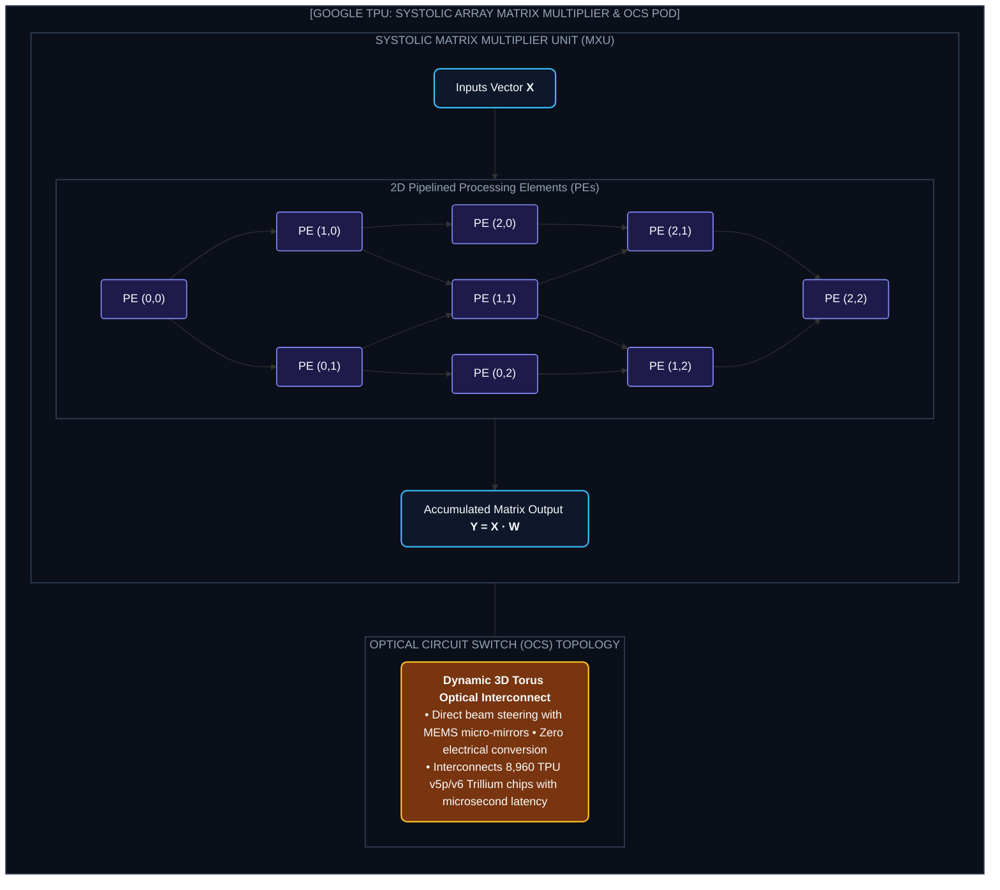
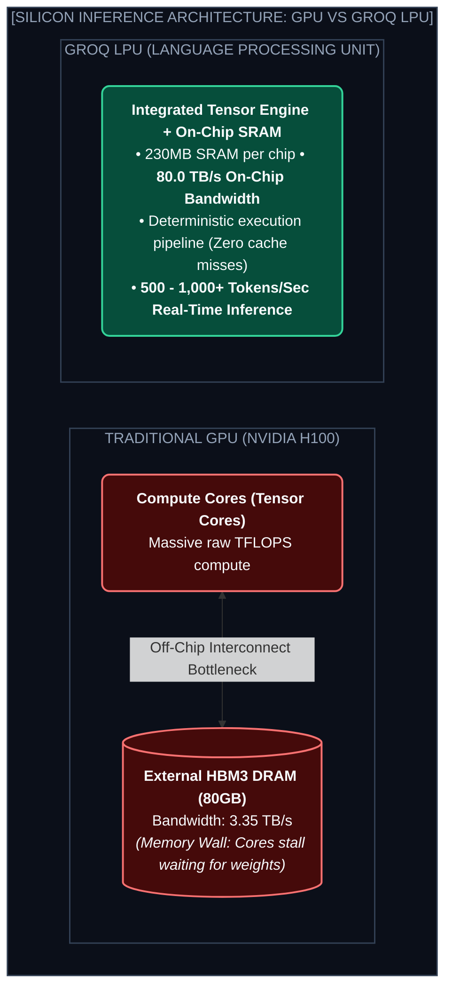

# Chapter 7: Hardware Accelerators: Google TPU, Groq LPU & Custom Chips (এআই সিলিকন বিপ্লব)

---

AI জগতে এতদিন একটি ব্র্যান্ডের নামই একচ্ছত্রভাবে উচ্চারিত হতো: **Nvidia**।

কিন্তু Nvidia GPU মূলত তৈরি হয়েছিল কম্পিউটার গেমসের থ্রি-ডি গ্রাফিক্স রেন্ডার করার জন্য; পরে তাতে টেন্সর কোর জুড়ে দিয়ে AI ট্রেইনিংয়ে ব্যবহার শুরু হয়।

আজ শীর্ষ টেক জায়ান্টরা আর সাধারণ GPU-র ওপর নির্ভর করছে না। তারা বানাচ্ছে **Custom AI Silicon & Accelerators (Domain-Specific ASICs)**।

গুগলের **TPU v6 Trillium**, গ্রকের **Groq LPU** এবং সেরেব্রাসের **Wafer-Scale Engine (WSE-3)** কীভাবে AI ইনফ্রাস্ট্রাকচারের ভবিষ্যৎ বদলে দিচ্ছে? চলো দেখি।

---

## ১. Google TPU: The Systolic Array & Optical Circuit Switches

গুগলের নিজস্ব **Tensor Processing Unit (TPU)** হলো ডিপ লার্নিংয়ের অন্যতম প্রাচীন ও শক্তিশালী ASIC আর্কিটেকচার।

* **XLA (Accelerated Linear Algebra):** গুগলের কম্পাইলার যা পাইথন/JAX কোডকে সরাসরি ম্যাট্রিক্স হার্ডওয়্যার অপারেশনে ফিউজ করে।

---

## ২. Groq LPU: The 500+ Tokens/Sec Speed Monster

কেন обычный GPU ইনফারেন্সের সময় ধীরগতির হয়? 

কারণ GPU-তে থাকে **HBM (High Bandwidth Memory)**। প্রতি টোকেন প্রেডিক্ট করতে ওজনগুলো DRAM চিপ থেকে GPU কোরে টেনে আনতে হয় (The Memory Wall Problem)।

### Groq-এর ৩টি ইউনিক আর্কিটেকচারাল স্তম্ভ:
1. **Zero External DRAM:** কোনো বাহ্যিক র‍্যাম নেই। সম্পূর্ণ মডেল অন-চিপ **SRAM**-এ লোড থাকে যার ব্যান্ডউইথ **৮০ টেরাবাইট/সেকেন্ড!**
2. **Deterministic Execution:** কোনো রানটাইম ক্যাশ মিস বা ব্রাঞ্চ প্রেডিকশন নেই; কম্পাইলার ন্যানোসেকেন্ডে জানে কোন টোকেন কখন কোন ট্রানজিস্টরে যাবে।
3. **ফলাফল:** প্রতি সেকেন্ডে **৫০০ থেকে ১০০০+ টোকেন জেনারেশন স্পিড!** মানুষের চোখের পলক ফেলার আগেই পুরো পেজ টেক্সট স্ক্রিনে ভেসে ওঠে!

---

## ৩. Cerebras Wafer-Scale Engine (WSE-3)

একটি সাধারণ চিপ সিলিকন ওয়েফার কেটে ছোট আকারে তৈরি করা হয়। 

সেরেব্রাস পুরো **৩০০ মিমি সিলিকন ওয়েফারকে একটিমাত্র অখণ্ড চিপ** হিসেবে ব্যবহার করে!
* **৪ ট্রিলিয়ন ট্রানজিস্টর** এবং **৯,০০,০০০ AI কোর** একটি সিঙ্গেল ওয়েফারে!
* চিপের এক প্রান্ত থেকে অন্য প্রান্তে ডাটা চলাচলের ব্যান্ডউইথ সাধারণ অপটিক্যাল কেবলের চেয়ে হাজার গুণ দ্রুত।

---
Developer Perspective
গুগল টিপিইউ-তে কাজ করার জন্য **JAX** ফ্রেমওয়ার্ক হলো সুপারহিরো। PyTorch-এর চেয়ে JAX-এর `jax.jit` (Just-In-Time Compilation) এবং `jax.vmap` (Auto-Vectorization) টিপিইউ-র সিস্টোলিক অ্যারেগুলোকে শতভাগ এফিশিয়েন্সিতে ব্যবহার করতে পারে।

---
Production Reality
Groq LPU যেমন সুপার-ফাস্ট, তেমনি এর কিছু হার্ডওয়্যার লিমিটেশন রয়েছে। যেহেতু প্রতি চিপে মাত্র ২৩০MB অন-চিপ SRAM থাকে, একটি ৭০B মডেল চালাতে প্রায় ৫০০-৬০০টি Groq চিপের র‍্যাক লাগে। তাই গ্রক মূলত **Ultra-Low Latency Inference (Voice Agents, Live Translation)**-এর জন্য সেরা, আর ট্রেনিংয়ের জন্য Google TPU ও Nvidia GPU আদর্শ।

---
Common Mistake
মনে করা যে সব AI মডেল সব চিপে একই পারফর্ম করবে। ট্রান্সফরমার ইনফারেন্স হলো **Memory-Bandwidth Bound** (যেখানে Groq ও Cerebras জেতে), আর প্রিটেইনিং হলো **Compute-Flops Bound** (যেখানে Nvidia B200 ও Google TPU v6 জেতে)। কাজের ধরন অনুযায়ী চিপ বেছে নিতে হয়।

---

## Interview Flashcards

#### Beginner Level
* **প্রশ্ন:** Groq LPU কেন সাধারণ GPU-র চেয়ে এত দ্রুত টেক্সট জেনারেট করে?
* **উত্তর:** গ্রক এলপিইউ বাহ্যিক ধীরগতির DRAM মেমোরি ব্যবহার না করে সরাসরি আল্ট্রা-ফাস্ট On-Chip SRAM ব্যবহার করে। এর মেমোরি ব্যান্ডউইথ ৮০ TB/s হওয়ায় এটি প্রতি সেকেন্ডে ৫০০-১০০০+ টোকেন আউটপুট দিতে পারে।

#### Intermediate Level
* **প্রশ্ন:** Google TPU-র Systolic Array কীভাবে কাজ করে?
* **উত্তর:** সিস্টোলিক অ্যারেতে ডেটা ও ওজনের মান হৃদস্পন্দনের মতো একটি সেল থেকে পাশের সেলে প্রবাহিত হয়। ফলে প্রতিবার ইন্টারমিডিয়েট ভ্যালু প্রধান মেমোরিতে রিড/রাইট করতে হয় না, যা বিদ্যুৎ ও সময় সাশ্রয় করে।

#### Advanced Level
* **প্রশ্ন:** Optical Circuit Switches (OCS) কেন এআই ক্লাস্টারে ব্যবহৃত হয়?
* **উত্তর:** OCS অপটিক্যাল লেজার এবং মাইক্রো-মিরর ব্যবহার করে আলোর গতিতে ইন্টার-নোড কানেকশন তৈরি করে। ইলেকট্রিক্যাল সিগন্যালে কনভার্ট না করায় কোনো ডাটা লস ও লেটেন্সি ছাড়াই হাজার হাজার TPU নোড ডাইনামিকালি কানেক্ট করা যায়।
