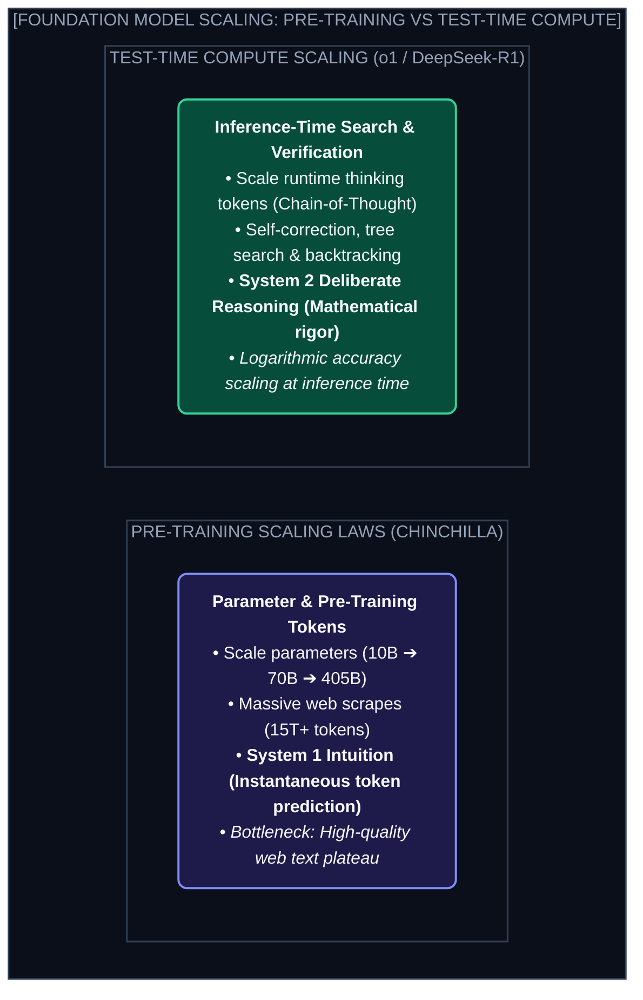
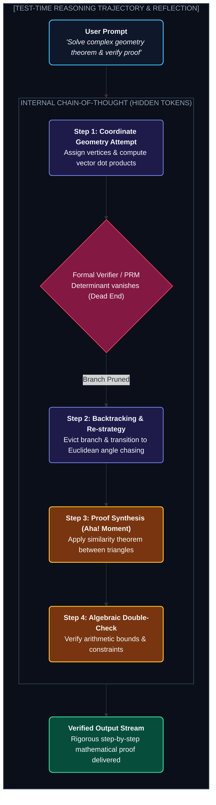
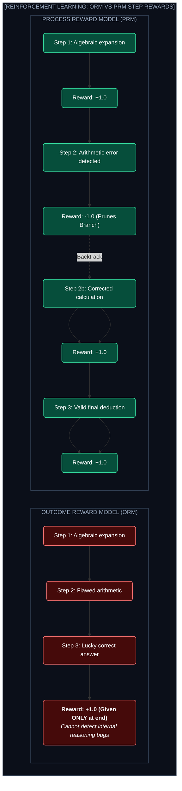

# Chapter 8: Test-Time Compute & Inference Scaling Laws (টেস্ট-টাইম কম্পিউট ও রিজনিং মডেল)

---

গত এক দশক ধরে AI জগতের একমাত্র মূলমন্ত্র ছিল: **"Pre-Training Scaling Laws" (Chinchilla Laws)**। 

মডেল আরও বড় করো, ট্রিলিয়ন ট্রিলিয়ন আরও টেক্সট ডেটা ঢালো, আর হাজার হাজার GPU দিয়ে বেশি সময় ট্রেইন করো— মডেল আরও স্মার্ট হবে।

কিন্তু ২০২৪-২০২৫ সালে এসে এই প্রিটেইনিং স্কেলিং ল দেওয়ালে ধাক্কা খেয়েছে। ইন্টারনেটের হাই-কোয়ালিটি হিউম্যান ডেটা প্রায় শেষ!

তাহলে AI কীভাবে আরও বেশি বুদ্ধিমান ও লজিক্যাল হবে?

এখানেই শুরু হয়েছে AI ইতিহাসের নতুন অধ্যায়: **"Inference-Time / Test-Time Compute Scaling" (OpenAI o1/o3 এবং DeepSeek-R1-এর যুগ)**।

---

## ১. Pre-Training vs Test-Time Compute Scaling

* **System 1 (Fast Thinking):** সাধারণ LLM কোনো প্রশ্ন পেলেই তৎক্ষণাৎ পরবর্তী টোকেন প্রেডিক্ট করে ফেলে।
* **System 2 (Deep Reasoning):** মানুষ যেমন কঠিন গণিত বা কোডিং সমস্যার সামনে বসে ৫ মিনিট চিন্তা করে, রাফ খাতায় কাটাকাটি করে, ভুল হলে পেছনে ফিরে আসে (Backtracking)— রিজনিং মডেলগুলোও ঠিক একইভাবে হাজার হাজার **Internal Thinking Tokens** জেনারেট করে সমাধান খোঁজে।

---

## ২. Inside DeepSeek R1 & OpenAI o1 Reasoning Process

যখন তুমি DeepSeek-R1 বা o1-কে একটি জটিল অলিম্পিয়াড গণিত বা কার্নেল বাগ দাও, সে ব্যাকগ্রাউন্ডে কী করে?

---

## ৩. Process Reward Models (PRMs) vs Outcome Reward Models (ORMs)

---

## ৪. Reinforcement Learning with Verifiable Rewards (RLVR)

DeepSeek-R1-Zero গবেষণায় তারা কোনো হিউম্যান লেবেলড ডেটা বা Supervised Fine-Tuning (SFT) ছাড়া **পিওর রিইনফোর্সমেন্ট লার্নিং (Pure RL)** চালিয়েছে।
* মডেলকে গাণিতিক সমস্যা ও পাইথন স্যান্ডবক্স দেওয়া হয়েছে।
* কোড রান করে টেস্ট পাস করলে $+1$ রিওয়ার্ড, টেস্ট ফেইল করলে $-1$ পেনাল্টি।
* **The "Aha!" Moment:** কয়েক হাজার ইটারেশনের পর মডেল নিজে থেকেই নিজের ভুল ধরতে শুরু করেছে, একাধিক বিকল্প সমাধান চিন্তা করা শুরু করেছে এবং মানুষের শেখানো ছাড়াই স্বতঃস্ফূর্তভাবে রিজনিং শিখে নিয়েছে!

---
Developer Perspective
ইনফারেন্স-টাইম স্কেলিংয়ের ফলে প্রম্পট ইঞ্জিনিয়ারিংয়ের কৌশল সম্পূর্ণ বদলে গেছে। আগে আমরা লিখতাম *"Think step by step" (Few-Shot CoT)*। কিন্তু o1 বা R1-এর মতো নেটিভ রিজনিং মডেলে অতিরিক্ত স্টেপ-বাই-স্টেপ প্রম্পট দেওয়া বারণ! এদের সরাসরি মূল প্রশ্ন ও কনস্ট্রেইন্টগুলো দিয়ে দিতে হয়; মডেল নিজে থেকেই তার অপ্টিমাল থিঙ্কিং বাজেট নির্ধারণ করে নেয়।

---
Production Reality
প্রোডাকশনে টেস্ট-টাইম কম্পিউট মডেল ব্যবহার করার সময় **Reasoning Token Budget Limit (`max_thinking_tokens`)** নির্ধারণ করা খুব জরুরি। কোনো জটিল লুপে পড়ে মডেল যদি ১০,০০০ থিঙ্কিং টোকেন জেনারেট করে বসে, তবে কস্ট ও লেটেন্সি অনেক বেড়ে যাবে। তাই এন্টারপ্রাইজ সিস্টেমে সহজ টাস্কে সাধারণ মডেল এবং কেবল মিশন-ক্রিটিক্যাল লজিক্যাল টাস্কে রিজনিং মডেল ব্যবহার করতে হয়।

---
Common Mistake
রিজনিং মডেলকে সাধারণ ক্রিয়েটিভ টেক্সট রাইটিং বা ট্রান্সলেশনে ব্যবহার করা। ক্রিয়েটিভ কাজে চিন্তা করার চেয়ে ভাষাগত স্বতঃস্ফূর্ততা বেশি প্রয়োজন। রিজনিং মডেলের আসল জাদু হলো গণিত, অ্যালগরিদম, সিকিউরিটি অডিট এবং জটিল মাল্টি-স্টেপ লজিক্যাল পাজলে।

---

## Interview Flashcards

#### Beginner Level
* **প্রশ্ন:** Test-Time Compute Scaling কী?
* **উত্তর:** প্রিটেইনিংয়ে বিলিয়ন ডলার খরচ করে মডেল বড় করার পরিবর্তে ইনফারেন্সের সময় মডেলকে বেশি সময় ও টোকেন খরচ করে গভীরভাবে চিন্তা (Reasoning) করতে দেওয়ার মাধ্যমে সঠিক ফলাফল বের করার আধুনিক পদ্ধতি।

#### Intermediate Level
* **প্রশ্ন:** Process Reward Model (PRM) কেন Outcome Reward Model (ORM)-এর চেয়ে শক্তিশালী?
* **উত্তর:** ORM কেবল চূড়ান্ত উত্তরের ওপর ভিত্তি করে নম্বর দেয়, ফলে ভুল লজিকে আসা কাকতালীয় সঠিক উত্তরও পুরস্কৃত হয়। PRM প্রতিটি যুক্তি ও সমীকরণের পদক্ষেপে আলাদাভাবে যাচাই করে রিওয়ার্ড দেয়, যা নিখুঁত রিজনিং নিশ্চিত করে।

#### Advanced Level
* **প্রশ্ন:** DeepSeek-R1-Zero-তে মানুষের সুপারভিশন ছাড়া কীভাবে "Aha Moment" বা সেলফ-রিফ্লেকশন তৈরি হলো?
* **উত্তর:** Verifiable Rewards (যেমন কোড এক্সিকিউশন ও কম্পাইলার টেস্ট)-এর ওপর ভিত্তি করে লার্জ-স্কেল পিওর রিইনফোর্সমেন্ট লার্নিং (RLVR) চালানোর ফলে মডেল ভুল উত্তরের পেনাল্টি এড়াতে নিজে থেকেই ভুল লজিক ব্যাকট্র্যাক করা ও পুনরায় ভিন্নভাবে চিন্তা করার ক্ষমতা অর্জন করে।
