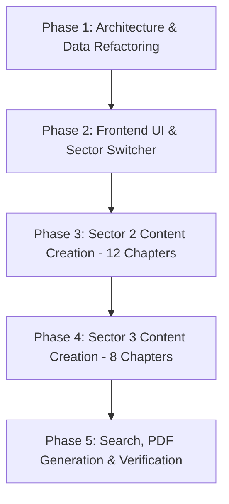

# 🧠 AI Engineering Handbook — Project Memory & Implementation Blueprint

---

## 📌 Project Overview & Architectural Vision
This project transforms the **AI Engineering Handbook** into a state-of-the-art **3-Sector Interactive E-Book & Documentation Portal**:

1. **Sector 1 — Core AI & Generative AI Engineering** (Foundations, Math, Deep Learning, Transformers, LLMs, Prompting, Vector DBs, RAG, Fine-Tuning, System Arch).
2. **Sector 2 — Autonomous AI Agents & Agentic Systems** (Cognitive Loops, ReAct, Function Calling, MCP, Memory Systems, Multi-Agent Swarms, Frameworks, HITL, Production Blueprints).
3. **Sector 3 — Frontier AI Breakthroughs, Hardware & Infrastructure** (OpenRouter, DeepSeek MLA/MoE, Kimi Long-Context, Sakana Evolutionary AI, AirLLM, BitNet 1-Bit AI, TPU/Groq Silicon, OpenAI o1/o3 Test-Time Compute Scaling).

---

## 🎨 UI & Frontend Design Tokens (Sector Identities)

To provide clear visual cues and prevent cognitive fatigue across the 3 sectors, each sector has a distinct color identity and icon badge:

| Sector | Title | Primary Accent | Gradient Glow | Icon | Scope |
| :--- | :--- | :--- | :--- | :--- | :--- |
| **Sector 1** | Core AI & GenAI | `#06B6D4` (Cyan) | `linear-gradient(135deg, #8B5CF6, #06B6D4)` | `fa-brain` | Ch 1 – Ch 33 (Mapped) |
| **Sector 2** | AI Agents & Swarms | `#10B981` (Emerald) | `linear-gradient(135deg, #10B981, #06B6D4)` | `fa-robot` | Agent Ch 1 – Ch 12 |
| **Sector 3** | Frontier & Infra | `#F59E0B` (Amber/Gold) | `linear-gradient(135deg, #EC4899, #F59E0B)` | `fa-bolt-lightning` | Frontier Ch 1 – Ch 8 |

---

## 📚 Complete 3-Sector Syllabus Specification

### 🔵 Sector 1: Core AI & Generative AI Engineering
* **Part 1 — AI Foundations & Mental Models**: Ch 1 (Paradigm Shift), Ch 2 (Core Mechanics)
* **Part 2 — Machine Learning**: Ch 3 (Math of Learning), Ch 4 (Generalization & Sweet Spot)
* **Part 3 — Deep Learning & Neural Networks**: Ch 5 (Artificial Neurons), Ch 6 (Deep Networks & Backprop)
* **Part 4 — Modern AI Foundations**: Ch 7 (Transformers & Attention), Ch 8 (Tokens, Embeddings & Context)
* **Part 5 — LLMs & Reasoning**: Ch 9 (LLM Ecosystem), Ch 10 (Reasoning Models R1 & o3)
* **Part 6 — Prompt Engineering**: Ch 11 (Fundamentals), Ch 12 (Advanced Prompting & Structured Outputs)
* **Part 7 — AI Data Layer**: Ch 13 (Vector & Distance Metrics), Ch 14 (Vector Databases & Indexing)
* **Part 8 — RAG Systems**: Ch 15 (RAG Fundamentals), Ch 16 (Advanced Retrieval & Hybrid Search)
* **Part 9 — Model Fine-Tuning**: Ch 17 (SFT & Dataset Prep), Ch 18 (PEFT, LoRA & QLoRA), Ch 19 (RLHF, DPO & Safety Tuning)
* **Part 10 — Production AI**: Ch 23 (Constitutional Safety), Ch 24 (Observability), Ch 25 (Cost Optimization)
* **Part 11 — Real AI Products**: Ch 26 (Multi-Session Memory), Ch 27 (Enterprise PDF Search), Ch 29 (AI SaaS & Billing)
* **Part 12 — AI System Architectures**: Ch 32 (Fundamentals), Ch 33 (Enterprise Architecture)
* **Part 13 — Career & Appendix**: Ch 30 (Career Roadmap), Ch 31 (Mental Models)

---

### 🟢 Sector 2: Autonomous AI Agents & Agentic Systems
* **Part 1 — Agentic Foundations & Cognitive Loops**
  * `agent_ch1.md`: **Agent Architecture & Cognitive Loops** (Chatbot vs Agent, ReAct Pattern, Plan-and-Solve, Reflection & Self-Correction).
* **Part 2 — Tools, Function Calling & MCP**
  * `agent_ch2.md`: **Function Calling & Tool Contracts** (Schema Definition, Zod/Pydantic validation, Execution Sandboxes, Error Recovery).
  * `agent_ch3.md`: **Model Context Protocol (MCP) Deep Dive** (Host-Client-Server Architecture, Building Custom MCP Tools, Local & Remote Resources).
* **Part 3 — Memory & Stateful Workflows**
  * `agent_ch4.md`: **Multi-Layer Agent Memory** (Short-term context, Episodic & Semantic Long-term memory, Mem0/Zep graphs).
  * `agent_ch5.md`: **State Machines & Resumable Workflows** (Graph state machines, Checkpointing, Time-travel debugging, Human interruption).
* **Part 4 — Multi-Agent Systems & Frameworks**
  * `agent_ch6.md`: **Multi-Agent Collaboration Patterns** (Supervisor-Worker, Router, Swarms, Debate Networks, Inter-agent message protocols).
  * `agent_ch7.md`: **Agent Frameworks Compared** (LangGraph, CrewAI, AutoGen, OpenAI Swarm, PydanticAI, Agno).
* **Part 5 — Production Reliability, HITL & Evals**
  * `agent_ch8.md`: **Human-in-the-Loop (HITL) & Safety Guardrails** (Approval Breakpoints, Dangerous Action Interceptors, Infinite Loop Prevention, Token Budgeting).
  * `agent_ch9.md`: **Agent Observability & Evals** (Tracing with LangSmith & Phoenix, Step-efficiency, Success-rate benchmarks).
* **Part 6 — Real-World Agent Blueprints**
  * `agent_ch10.md`: **Blueprint 1: Autonomous Coding Agent** (Devin/Claude Code-style Workspace scanner, Diff patcher, Test-and-heal loop).
  * `agent_ch11.md`: **Blueprint 2: Deep Research & Web Browsing Agent** (Query expansion, Headless browser navigation, Citation extraction, Synthesis).
  * `agent_ch12.md`: **Blueprint 3: Enterprise Multi-Agent Operations Swarm** (Triage Agent → SQL Data Agent → Customer Support Dispatcher).

---

### 🟣 Sector 3: Frontier AI Breakthroughs, Hardware & Infrastructure
* **Part 1 — LLM Routing & Gateway Infrastructure**
  * `frontier_ch1.md`: **LLM Routers & Gateways** (OpenRouter architecture, OmniRouter, RouteLLM semantic cost-routing, Semantic Caching with GPTCache/Redis, Multi-key fallbacks).
* **Part 2 — Beating the GPU Shortage (Chinese AI Lab Innovations)**
  * `frontier_ch2.md`: **DeepSeek Architectural Mastery (V3, V4 & R1)** (Multi-Head Latent Attention - MLA, DeepSeekMoE fine-grained routing, DualPipe communication overlap, Multi-Token Prediction - MTP, Native FP8 mixed precision training).
  * `frontier_ch3.md`: **Extreme Context & Reasoning (Kimi k3, Qwen 2.5/3, GLM 5)** (Moonshot Kimi's 2M-10M token RingAttention, Qwen math/code synthetic data flywheel, Huawei Ascend & CANN non-CUDA stacks).
* **Part 3 — Nature-Inspired & Evolutionary AI**
  * `frontier_ch4.md`: **Sakana AI & Evolutionary Model Merging** (Zero-backprop genetic model merging, The AI Scientist autonomous research pipeline from idea to LaTeX & review, Swarm intelligence).
* **Part 4 — Extreme Low-Resource & Consumer Inference**
  * `frontier_ch5.md`: **AirLLM: Running 70B/405B Models on 4GB-8GB GPUs** (Layer-wise sequential execution, Disk-to-VRAM streaming, Memory paging without accuracy loss).
  * `frontier_ch6.md`: **1-Bit AI & Local Inference Engines** (BitNet b1.58 addition-only neural networks, GGUF/llama.cpp, AWQ/EXL2 quantization benchmarks).
* **Part 5 — AI Silicon Wars Beyond Nvidia**
  * `frontier_ch7.md`: **Hardware Accelerators: Google TPU, Groq LPU & Custom Chips** (Google TPU v5p/v6 Trillium & Optical Circuit Switches, Groq SRAM LPU 500+ tok/s architecture, Cerebras Wafer-Scale WSE-3, Apple Unified Memory).
* **Part 6 — Frontier Paradigms & Test-Time Scaling**
  * `frontier_ch8.md`: **Test-Time Compute & Inference Scaling Laws** (Why pre-training scaling laws hit a wall, OpenAI o1/o3 & DeepSeek R1 reasoning tokens, Process Reward Models - PRMs, Reinforcement Learning with Verifiable Rewards - RLVR).

---

## 🚀 5-Phase Implementation Roadmap

### Phase 1: Architecture & Data Structure Refactoring
- [ ] Define the unified `bookSectors` schema in `index.html`.
- [ ] Maintain backward-compatibility for existing 33 chapters in Sector 1.
- [ ] Set up clean file naming and directory structure for Sector 2 (`agent_ch1.md` ... `agent_ch12.md`) and Sector 3 (`frontier_ch1.md` ... `frontier_ch8.md`) inside `handbook/`.

### Phase 2: Frontend UI & Sector Switcher (`index.html`)
- [ ] Implement a sticky 3-segment pill switcher on top of the sidebar.
- [ ] Add smooth sector transition animations.
- [ ] Dynamic accent badge on the top navbar based on current active sector.
- [ ] Sector-aware progress bars & completion checklists stored in `localStorage`.
- [ ] E-Book PDF Download modal update: option to download Full Book, or individual Sector PDF.

### Phase 3: Sector 2 (AI Agents) Content Generation
- [ ] Write rich, production-grade Bengali + English chapters (`agent_ch1.md` to `agent_ch12.md`).
- [ ] Include Mermaid architecture diagrams, code implementations (Python/TypeScript), Developer Views, and Flashcard Interview Questions in every chapter.

### Phase 4: Sector 3 (Frontier Breakthroughs & Infra) Content Generation
- [ ] Write detailed, technical chapters (`frontier_ch1.md` to `frontier_ch8.md`).
- [ ] Deep-dive into formulas, architecture comparisons, ASCII/Mermaid visual maps, and benchmark tables.

### Phase 5: Search Engine, PDF Testing & Final Verification
- [ ] Update instant search engine to scan all 3 sectors seamlessly with sector tags.
- [ ] Test keyboard navigation (`ArrowLeft` / `ArrowRight`) across sectors.
- [ ] Test full book PDF & sector PDF generation.
- [ ] Verify mobile responsiveness and bottom preferences sheet.
